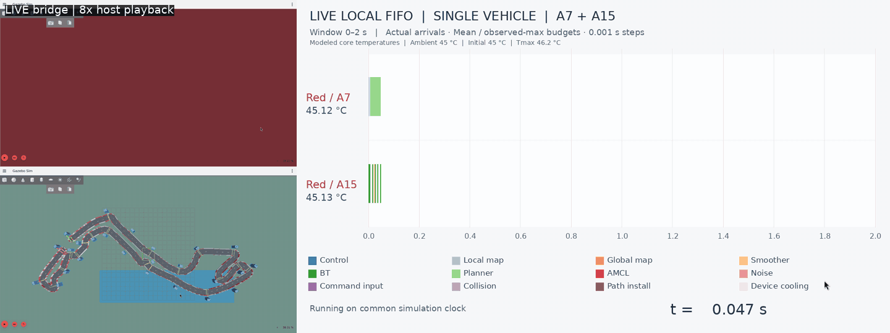
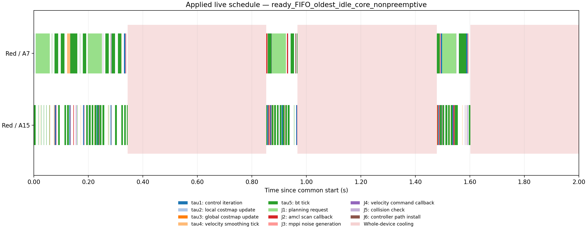

# Nav2 Monaco - Real-Time Scheduling and Modeling

A ROS 2 / Nav2 testbed for **modeling task scheduling on heterogeneous vehicle and edge resources, and comparing scheduling algorithms**. The goal is to study how scheduling affects navigation while keeping the route and navigation algorithms fixed.

This is a **personal project**, driven by my interest in real-time systems and robotics. It uses **Navigation2 (Nav2)** and the upstream minimal TurtleBot simulation for navigation, sensors and differential-drive dynamics, with a custom circuit and vehicle appearance.

The map is **inspired by the overall shape of the Formula 1 Monaco circuit**. Its dimensions and details are adapted for this simulation. In the default scene, one moving vehicle visits 19 checkpoints and the finish; 25 static blue server cabinets with antennas mark roadside edge locations, including start/finish and infill endpoints.

The current implementation includes extracted task parameters, explicit job dependencies, A7/A15 compute and thermal models, and a local FIFO baseline coupled to one running Nav2 stack through a 1 ms lockstep bridge. The next step is to compare baseline scheduling algorithms; edge offloading is a later extension.

## Circuit dimensions

**Map: 50.45 × 22.30 m · Road width: 1.30 m · Centreline: approximately 125.96 m**


## Recorded FIFO bridge preview

**8× host-recording playback — displayed eight times faster than the recording.** The visible clock shows simulation time; physics pauses while actual Nav2 calculations execute on the host.

One red vehicle uses the replaceable **ready FIFO / oldest-idle-core** baseline on a modeled **A7 + A15**, at maximum frequency/voltage. Physics and modeled hardware share **1 ms** steps, and the live Gantt uses **2 s** windows. The following camera remains approximately 0.75 m behind the vehicle; the overview and live per-core temperatures appear alongside it.

| Endpoint | A7 / A15 cores | Initial / ambient (°C) | Tmax (°C) | Tbalance (°C) |
| --- | --- | --- | ---: | ---: |
| Vehicle | 1 / 1 | 45 / 45 | 46.2 | 45.6 |
| RSU | 2 / 2 | 45 / 45 | 46.5 | 46.0 |

Ordinary idle powers are **0.05 / 0.15 W** per A7/A15 core; cooling powers are separately **0.005 / 0.015 W**. Pink bands indicate whole-device cooling. It suspends modeled CPU progress and withholds new results; Gazebo's actuator retains the last applied motor command.



This bounded recording travels **11.010 m** in **26.580 s** of active simulation and passes one checkpoint, with no navigation abort. It stops at the requested distance. Validation verifies **32,658** common clock steps, **1,627** actual jobs, **1,366** selected dependency edges and **1,355** output-release events at their exact modeled finish, with **zero validation errors** and **zero unresolved selected inputs**. All **71 unit tests** pass. This is functional validation rather than a full-course or scheduling-performance comparison.

## Scheduling and communication model

Actual Nav2 callback entries create jobs. All current task families have HI criticality; each job selects the measured mean budget when its complete actual CPU demand is at or below the reference mean, otherwise the observed-maximum budget. Outputs remain buffered until selected modeled work, selected dependencies and thermal conditions complete.

FIFO priority and oldest-idle-core assignment are one policy class. Another policy can replace both through explicit scheduling hooks. Five paired frequency/voltage levels are available per core; a job may change levels during execution without resetting its remaining work. Omitted DVFS selections use maximum; after a job consumes its LO work, its remainder uses maximum.



Communication has a **5 m send-time request radius** and an extensible cost function returning **0 s** by default. Accepted results can return after the vehicle leaves coverage. Both request and result use the same cost interface. The local baseline does not offload jobs yet. There are 25 RSUs, each with its own four-core server template; the maximum consecutive RSU separation is **9.596 m**. The driving route and original RSU poses are preserved.

**The next goal is to compare scheduling baselines and a proposed policy**, including DVFS and thermal effects, on the same route and modeled hardware.

[Bridge semantics](docs/live-bridge.en.md) · [Policy and communication interfaces](docs/scheduling-interfaces.en.md) · [DVFS semantics and candidate baselines](docs/live-dvfs.en.md) · [Current validation](docs/figures/current-bridge/validation.json) · [Task model](docs/task-execution.en.md)

## Main tools

| Tool | Use |
| --- | --- |
| ROS 2 Jazzy and Navigation2 | Robot communication, localization, planning and control |
| Gazebo Harmonic and RViz | Physics, sensors and visualization |
| Python, NumPy and Matplotlib | Hardware models, live scheduling and scientific figures |
| C++17, Gazebo Transport and Unix sockets | Native Nav2 output gates and acknowledged physics stepping |
| FFmpeg | Dual-camera recording and GIF generation |
| Ubuntu 24.04, WSL2 and WSLg | Development and graphical simulation environment |

## Run locally

Ubuntu 24.04 / WSL2 with ROS 2 Jazzy, Gazebo Harmonic and WSLg:

```bash
sudo bash scripts/install_wsl.sh
bash scripts/launch_monaco.sh
# In a second terminal:
bash scripts/run_monaco.sh
```

An optional [four-vehicle preview](docs/four-vehicle-preview.en.md) adds a transverse starting row on a locally widened apron.

See the [project guide](docs/project-guide.en.md) for setup, recording, measurements and upstream attribution. The simulation builds on [Navigation2](https://github.com/ros-navigation/navigation2) and its [minimal TurtleBot simulation](https://github.com/ros-navigation/nav2_minimal_turtlebot_simulation).
