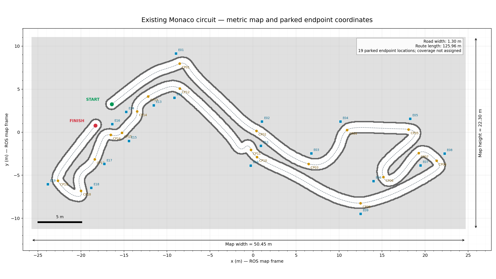
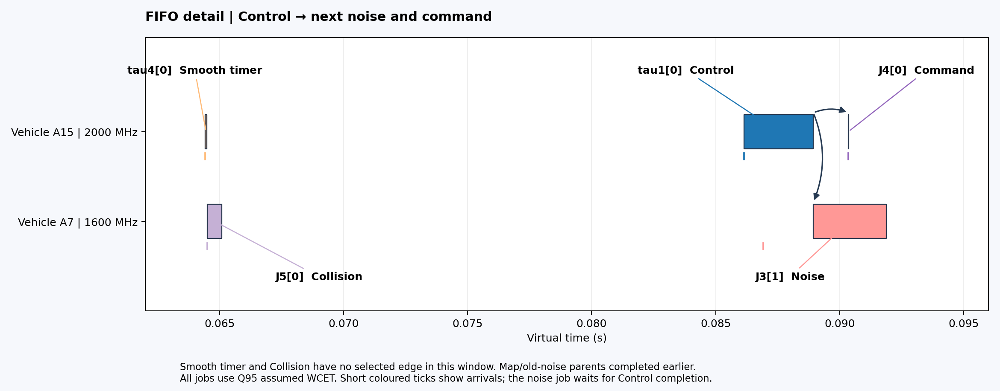

# Nav2 Monaco — Real-Time Scheduling and Modeling

A ROS 2 / Nav2 testbed for **modeling task scheduling on heterogeneous vehicle and edge resources, and comparing scheduling algorithms**. The goal is to study how scheduling affects navigation while keeping the route and navigation algorithms fixed.

This is a **personal project**, driven by my interest in real-time systems and robotics. It uses **Navigation2 (Nav2)** and the upstream minimal TurtleBot simulation for navigation, sensors and differential-drive dynamics, with a custom circuit and vehicle appearance.

The map is **inspired by the overall shape of the Formula 1 Monaco circuit**. Its dimensions and details are adapted for this simulation. One moving vehicle visits 19 checkpoints and the finish; 19 static blue server cabinets with antennas mark edge locations.

The current implementation includes extracted task parameters, explicit job dependencies, A7/A15 compute and thermal models, and a standalone local FIFO baseline. Connecting modeled completion times to the running ROS system and comparing additional scheduling algorithms are the next steps.

## Circuit dimensions

**Map: 50.45 × 22.30 m · Road width: 1.30 m · Centreline: approximately 125.96 m**



## Complete navigation run

**4× playback — displayed four times faster than the recorded run.**

Actual Gazebo footage from start to finish: approximately 0.75 m behind the vehicle on the left, and a fixed overview on the right.

Verified mission: **20/20 ordered targets**, **353.9 s** mission wall time and **zero recoveries**.


## Initial FIFO scheduling example

**Standalone model replay.** This Gantt shows a short initial interval on the vehicle's A7 and A15, using the selected 95%-ECDF execution budgets. Children wait for their selected parents to finish. This replay runs independently of the navigation footage above; live ROS integration is the next stage.



[Full 0.586 s Gantt](docs/figures/task-fifo/local-fifo-gantt.png) · [Selected job DAG](docs/figures/task-fifo/selected-job-dag.svg) · [Task model and equations](docs/task-execution.en.md)

## Main tools

| Tool | Use |
| --- | --- |
| ROS 2 Jazzy and Navigation2 | Robot communication, localization, planning and control |
| Gazebo Harmonic and RViz | Physics, sensors and visualization |
| Python, NumPy and Matplotlib | Task models, scheduling replay and scientific figures |
| FFmpeg | Dual-camera recording and GIF generation |
| Ubuntu 24.04, WSL2 and WSLg | Development and graphical simulation environment |

## Run locally

Ubuntu 24.04 / WSL2 with ROS 2 Jazzy, Gazebo Harmonic and WSLg:

```bash
sudo bash scripts/install_wsl.sh
bash scripts/launch_monaco.sh
# In a second terminal:
bash scripts/run_monaco.sh
```

See the [project guide](docs/project-guide.en.md) for setup, recording, measurements and upstream attribution. The simulation builds on [Navigation2](https://github.com/ros-navigation/navigation2) and its [minimal TurtleBot simulation](https://github.com/ros-navigation/nav2_minimal_turtlebot_simulation).
