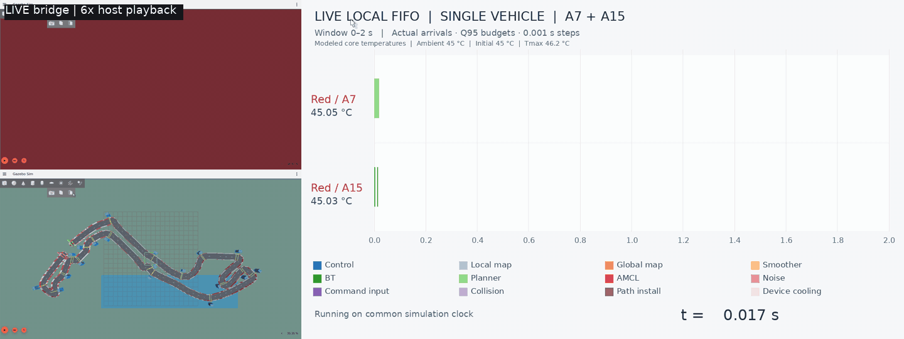
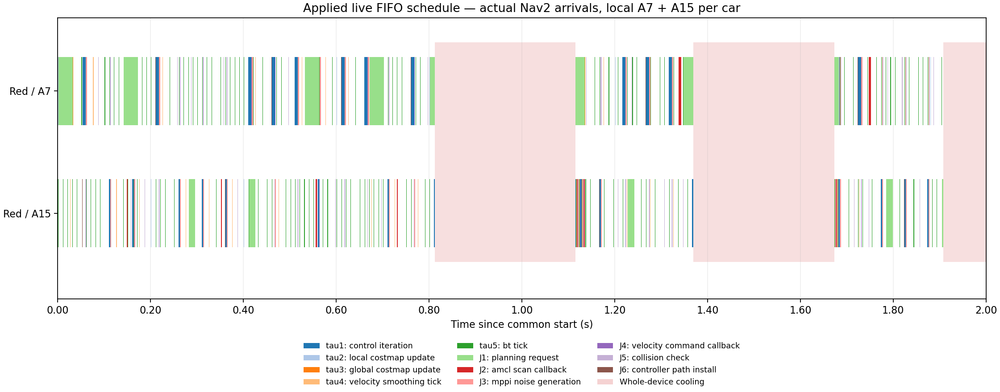

# Nav2 Monaco - Real-Time Scheduling and Modeling

A ROS 2 / Nav2 testbed for **modeling task scheduling on heterogeneous vehicle and edge resources, and comparing scheduling algorithms**. The goal is to study how scheduling affects navigation while keeping the route and navigation algorithms fixed.

This is a **personal project**, driven by my interest in real-time systems and robotics. It uses **Navigation2 (Nav2)** and the upstream minimal TurtleBot simulation for navigation, sensors and differential-drive dynamics, with a custom circuit and vehicle appearance.

The map is **inspired by the overall shape of the Formula 1 Monaco circuit**. Its dimensions and details are adapted for this simulation. In the default scene, one moving vehicle visits 19 checkpoints and the finish; 19 static blue server cabinets with antennas mark edge locations.

The current implementation includes extracted task parameters, explicit job dependencies, A7/A15 compute and thermal models, and a local FIFO baseline coupled to one running Nav2 stack through a 1 ms lockstep bridge. The next step is to compare baseline scheduling algorithms; edge offloading is a later extension.

## Circuit dimensions

**Map: 50.45 × 22.30 m · Road width: 1.30 m · Centreline: approximately 125.96 m**


## Live FIFO bridge preview

**6× host-recording playback — displayed six times faster than the recording.** The visible clock shows simulation time; the bridge pauses physics while real callbacks calculate.

One red vehicle uses local ready FIFO on a modeled **A7 + A15**, with **1 ms** shared physics/hardware steps and a **2 s** rolling Gantt. The rear-following camera is approximately 0.75 m behind the vehicle; the fixed overview and live per-core temperatures are shown alongside it.

Ambient and initial core temperatures are **45 °C**, with **Tmax = 46.2 °C** and **Tbalance = 45.8 °C**. Ordinary idle powers are **0.05 / 0.15 W** for A7/A15; cooling powers are separately **0.005 / 0.015 W**. Pink bands indicate whole-device cooling. Cooling withholds new computation results and commands; Gazebo's actuator and physics continue with the last applied motor command.



This bounded preview travels **11.006 m** in **25.011 s** of active simulation, passing one checkpoint with zero recoveries and no navigation abort. It intentionally stops at the distance target. Validation checked **31,085** matching physics/hardware steps, **3,117** actual jobs, **2,372** selected precedence edges and **2,501** live thermal samples, with **zero validation errors**. All **47 unit tests** pass.

## Applied local scheduling

Jobs arrive from actual Nav2 callback entries; nominal periods are scheduler metadata, rather than synthetic release generators. Selected parents must finish before a child starts. Ready FIFO chooses the core that has been idle longest. Real callbacks calculate on the host, while their modeled Q95 budgets determine when results can be released.



The local FIFO bridge is implemented and validated for this preview. **The next goal is to compare baseline scheduling algorithms** on the same route and modeled hardware, using common measurements and checking their effects on navigation. Edge offloading remains a later extension.

[Bridge semantics and reproduction](docs/live-bridge.en.md) · [Validation results](docs/figures/live-bridge/validation.json) · [Task model](docs/task-execution.en.md) · [Earlier standalone FIFO replay](docs/figures/task-fifo/local-fifo-detail.png)

## Main tools

| Tool | Use |
| --- | --- |
| ROS 2 Jazzy and Navigation2 | Robot communication, localization, planning and control |
| Gazebo Harmonic and RViz | Physics, sensors and visualization |
| Python, NumPy and Matplotlib | Hardware models, live scheduling and scientific figures |
| C++17, Gazebo Transport and Unix sockets | Native Nav2 output gates and acknowledged physics stepping |
| FFmpeg | Dual-camera recording and GIF generation |
| Ubuntu 24.04, WSL2 and WSLg | Development and graphical simulation environment |

## Run locally

Ubuntu 24.04 / WSL2 with ROS 2 Jazzy, Gazebo Harmonic and WSLg:

```bash
sudo bash scripts/install_wsl.sh
bash scripts/launch_monaco.sh
# In a second terminal:
bash scripts/run_monaco.sh
```

An optional [four-vehicle preview](docs/four-vehicle-preview.en.md) adds a transverse starting row on a locally widened apron.

See the [project guide](docs/project-guide.en.md) for setup, recording, measurements and upstream attribution. The simulation builds on [Navigation2](https://github.com/ros-navigation/navigation2) and its [minimal TurtleBot simulation](https://github.com/ros-navigation/nav2_minimal_turtlebot_simulation).
