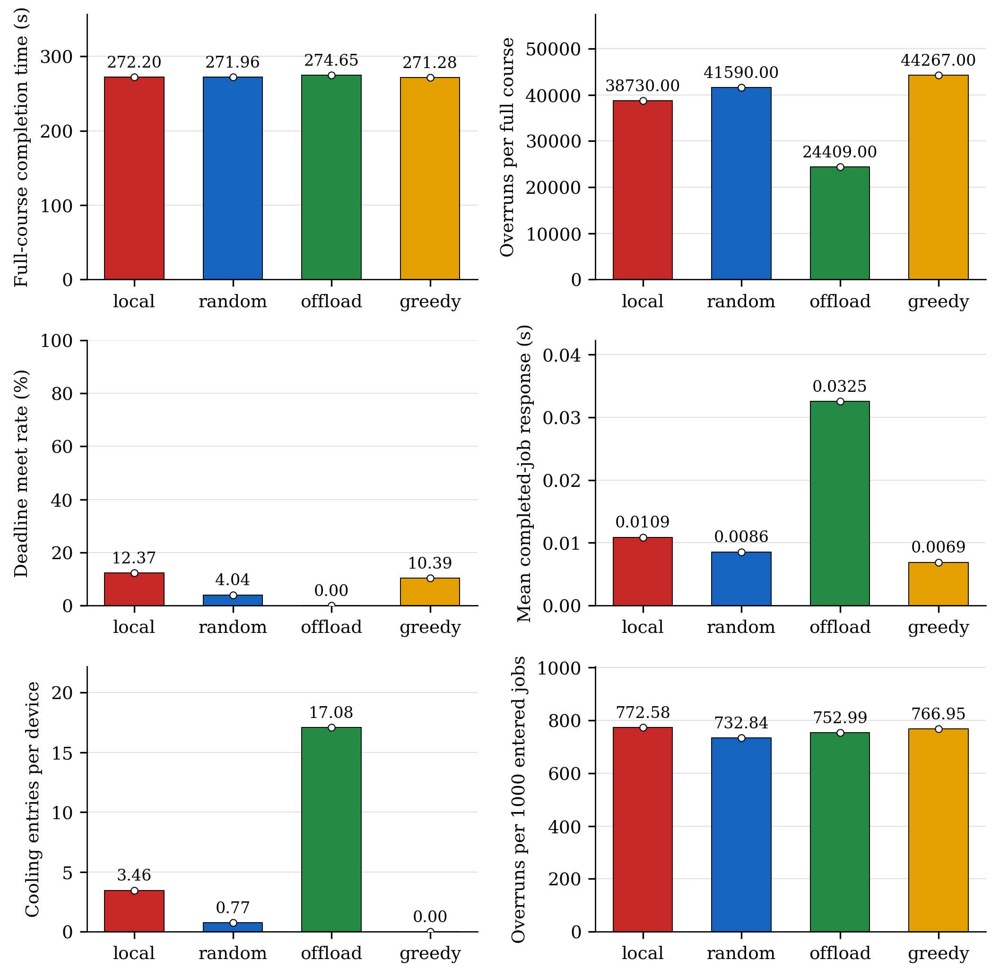
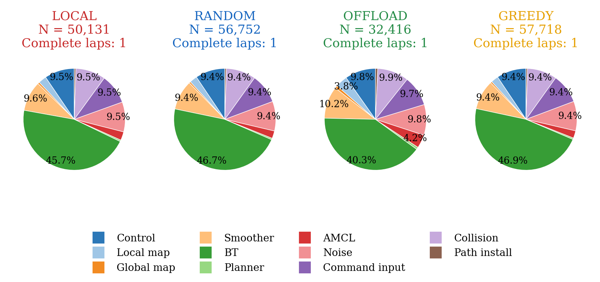
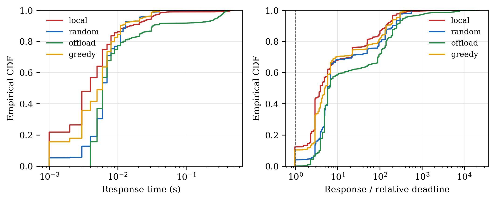
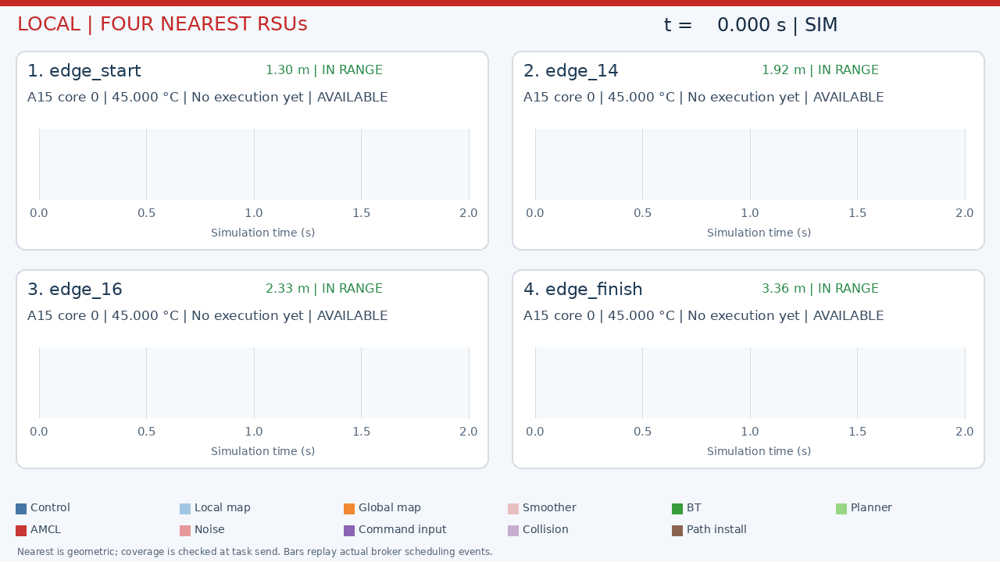
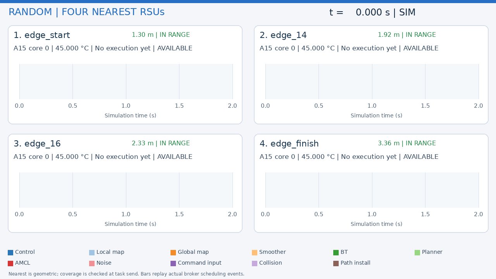
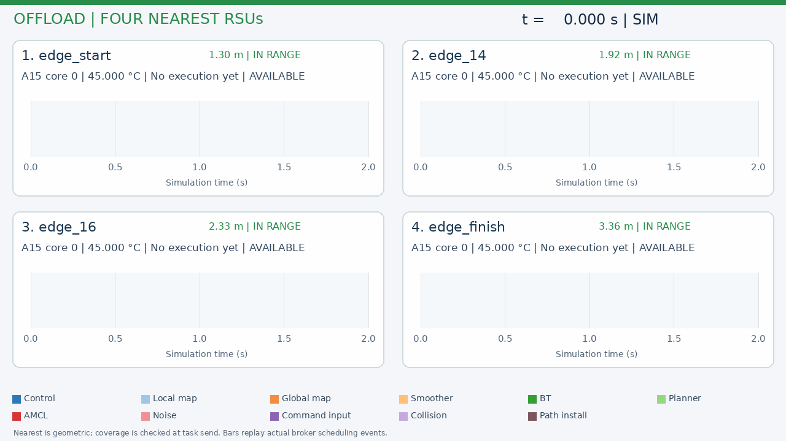
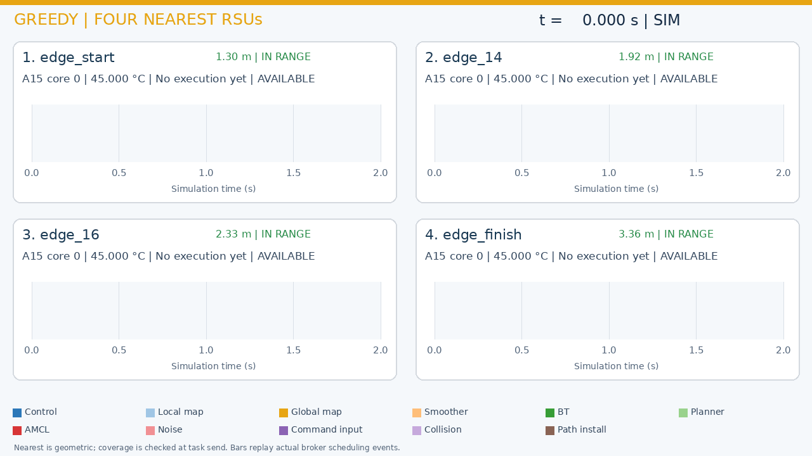

# Nav2 Monaco - Real-Time Scheduling and Modeling

A ROS 2 / Nav2 testbed for **modeling task scheduling on heterogeneous vehicle and edge resources, and comparing scheduling algorithms**. The goal is to study how scheduling affects navigation while keeping the route and navigation algorithms fixed.

This is a **personal project**, driven by my interest in real-time systems and robotics. It uses **Navigation2 (Nav2)** and the upstream minimal TurtleBot simulation for navigation, sensors and differential-drive dynamics, with a custom circuit and vehicle appearance.

The map is **inspired by the overall shape of the Formula 1 Monaco circuit**. Its dimensions and details are adapted for this simulation. In the default scene, one moving vehicle visits 19 checkpoints and the finish; 25 static blue server cabinets with antennas mark roadside edge locations, including start/finish and infill endpoints.

The current implementation includes extracted task parameters, explicit job dependencies, A7/A15 compute and thermal models, and four device-placement baselines coupled to one running Nav2 stack through a 1 ms lockstep bridge: `local` (red), nearest covered RSU `offload` (green), `random` (blue), and minimum-temperature `greedy` (amber-yellow). Every device uses FIFO / shortest predicted finish-time core queues. The current experiment uses one A7 in the vehicle, one A15 per RSU, and the middle frequency/voltage point during normal execution, with a shared device-wide maximum-frequency reaction after overrun.

## Circuit dimensions

**Map: 50.45 × 22.30 m · Road width: 1.30 m · Centreline: approximately 125.96 m**


## Full-course scheduling comparison

**PARTIAL** — audited complete traversals in balanced blocks: local: 1, random: 1, offload: 1, greedy: 1.
The fixed cutoff limited the comparison to one complete balanced block; the planned three comparison repetitions were not reached.

Completed local calibration laps: 3. The protocol requires three complete laps to freeze pooled mean CPU demand for LO and the observed maximum for HI. Calibration uses sealed measured CPU work at the middle operating point; subsequent comparisons use the fixed dual budgets. The four policies run in balanced local → random → offload → greedy blocks.

The vehicle has **one A7**, each of **25 RSUs has one A15**, and physics and hardware share **1 ms** steps. Normal execution uses the middle frequency/voltage point. Overrun boosts the entire affected device to maximum until its last active overrun finishes. Children wait for selected parent results and their transfers. A 5 m task-upload radius applies at send time.







Bars show full-course run means and dots individual runs. Sample-SD whiskers are drawn only when a policy has at least two full runs. Response averages completed jobs; due unfinished jobs count as deadline misses. Cooling entries count whole-device transitions, with separate A7/A15 evidence retained. Different job counts can arise from scheduling changing closed-loop motion, mission duration and native event arrivals.

| Policy | Runs | Mean completion (s) | DMR (%) | Mean response (s) |
|---|---:|---:|---:|---:|
| local | 1 | 272.2020 | 12.3696 | 0.0109 |
| random | 1 | 271.9620 | 4.0369 | 0.0086 |
| offload | 1 | 274.6460 | 0.0000 | 0.0325 |
| greedy | 1 | 271.2830 | 10.3902 | 0.0069 |

greedy completed the course fastest (271.283 s), while local had the highest deadline meet rate (12.37%). greedy had the lowest mean completed-job response (6.89 ms). These are descriptive results from the completed runs.

For offload, the observed task-upload delay alone exceeded the relative deadline for 32,180/32,416 evaluated jobs (99.27%). Deadlines are derived from HI work on a maximum-frequency A15 and exclude communication and cooling. The 1 ms execution lattice adds another timing floor, so low DMR can coexist with successful navigation; overlapping deadline diagnostics are not additive causal counts.

Task totals and family shares differ across policies. Output availability can change native callback arrivals and closed-loop motion; host CPU variability also affects the later LO/HI budget choice. The reference budgets, deadlines, map and hardware stayed fixed. Per-job traces, per-device A7/A15 cooling and all failed attempts remain available locally.

Only one complete balanced block finished before the 08:00 Tehran cutoff, against three planned blocks. Each policy therefore has N = 1: sample standard deviations are undefined and no SD whiskers are drawn. These data do not establish statistical significance.

An initial random traversal failed exact output-gate auditing and was excluded. A postcompletion mutex-wait defect was corrected before its accepted rerun. The earlier accepted local and calibration runs passed their exact-gate audits; per-trial source hashes preserve the correction boundary. One successful local recording needed presentation-only recovery, with its original physical and audit evidence unchanged. The report retains the recovery and interruption details.

[English mathematical report](docs/full-course-comparison.en.md) · [Vector figures](docs/figures/full-course-comparison/full-course-comparison.pdf) · [Per-run results](docs/figures/full-course-comparison/per-run.csv) · [Task shares](docs/figures/full-course-comparison/task-family-shares.csv) · [A7/A15 cooling evidence](docs/figures/full-course-comparison/cooling-by-device.csv) · [Deadline lower bounds](docs/figures/full-course-comparison/deadline-floor-diagnostics.csv) · [Per-family results](docs/figures/full-course-comparison/task-metrics-per-run.csv) · [Calibration statistics](docs/figures/full-course-comparison/calibration-statistics.csv)

## Full-course vehicle recordings

**8× simulation-time playback — the recordings are displayed eight times faster than simulation time.** Real chase/overview camera images are sampled against retained clock pairs. The chase camera remains approximately 0.75 m behind the vehicle. The live Gantt uses 2 s windows.

### Local


### Random


### Offload


### Greedy


## Four nearest RSUs for each policy

Each recording shows the four currently nearest RSUs, their identifiers, distances, actual modeled A15 schedules, temperatures and cooling state. Panels follow geometric proximity, including endpoints outside the 5 m task-upload range. **8× simulation-time playback.**

### Local RSUs



### Random RSUs



### Offload RSUs



### Greedy RSUs



[Bridge semantics](docs/live-bridge.en.md) · [Scheduling and communication interfaces](docs/scheduling-interfaces.en.md) · [Task model](docs/task-execution.en.md)

The next step is to compare additional scheduling policies and a proposed algorithm on the same circuit, hardware and frozen task parameters.

## Main tools

| Tool | Use |
| --- | --- |
| ROS 2 Jazzy and Navigation2 | Robot communication, localization, planning and control |
| Gazebo Harmonic and RViz | Physics, sensors and visualization |
| Python, NumPy and Matplotlib | Hardware models, live scheduling and scientific figures |
| C++17, Gazebo Transport and Unix sockets | Native Nav2 output gates and acknowledged physics stepping |
| FFmpeg | Dual-camera recording and GIF generation |
| Ubuntu 24.04, WSL2 and WSLg | Development and graphical simulation environment |

## Run the coupled scheduler

```bash
source scripts/environment.sh
python3 scripts/build_live_bridge.py
python3 scripts/run_live_bridge.py --placement local --full-course --seconds 1200 --views --output artifacts/live-bridge/local-full-course
```

Choose `local`, `random`, `offload` or `greedy` for placement and a new output directory for each run. The 1200 s limit is a safety cap; a successful full-course mission stops at the finish. Run one simulation at a time. The default parameter and deadline files are the frozen calibration inputs used in this comparison.

## Run locally

Ubuntu 24.04 / WSL2 with ROS 2 Jazzy, Gazebo Harmonic and WSLg:

```bash
sudo bash scripts/install_wsl.sh
bash scripts/launch_monaco.sh
# In a second terminal:
bash scripts/run_monaco.sh
```

An optional [four-vehicle preview](docs/four-vehicle-preview.en.md) adds a transverse starting row on a locally widened apron.

See the [project guide](docs/project-guide.en.md) for setup, recording, measurements and upstream attribution. The simulation builds on [Navigation2](https://github.com/ros-navigation/navigation2) and its [minimal TurtleBot simulation](https://github.com/ros-navigation/nav2_minimal_turtlebot_simulation).
