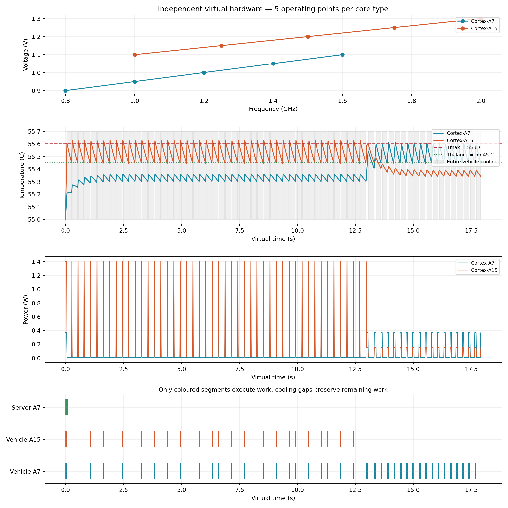

# Independent heterogeneous compute model

This module validates virtual CPU timing, per-core dispatch, active power and device-wide thermal cooling independently of ROS. Jobs have synthetic computational demand in Mcycles and explicit resource assignments. No measured ROS task is converted into cycles, no task graph is loaded, and no result is delayed or delivered to the robot at this stage.

## Configuration

Edit `config/abstract_compute.json`. Processor counts describe each endpoint, not the number of vehicles or servers in the Gazebo scene. The standalone demo builds one vehicle endpoint and one server endpoint.

| Endpoint class | Cortex-A7 cores | Cortex-A15 cores | Serial lanes per core |
|---|---:|---:|---:|
| Vehicle | 1 | 1 | 1 |
| Server | 2 | 2 | 1 |

| Level ID | A7 frequency (MHz) | A7 voltage (V) | A15 frequency (MHz) | A15 voltage (V) |
|---|---:|---:|---:|---:|
| 0 | 800 | 0.90 | 1000 | 1.10 |
| 1 | 1000 | 0.95 | 1250 | 1.15 |
| 2 | 1200 | 1.00 | 1500 | 1.20 |
| 3 | 1400 | 1.05 | 1750 | 1.25 |
| 4 | 1600 | 1.10 | 2000 | 1.30 |

Level IDs are zero based. Default assignment selects level 4. Frequency and voltage are linearly interpolated between configured endpoints when the number of levels changes. An invalid level ID uses the configured default. A default assignment is resolved before execution so it cannot inherit the previous job's selected level.

| Parameter | A7 | A15 |
|---|---:|---:|
| Relative throughput coefficient, eta | 1.0 | 1.8 |
| Active reference power intercept (W) | 0.15 | 0.55 |
| Active reference power activity slope (W) | 0.40 | 1.55 |
| Reference leakage (W) | 0.05 | 0.15 |
| Leakage temperature coefficient (1/K) | 0.015 | 0.020 |
| Ordinary idle power per core (W) | 0.05 | 0.15 |
| Cooling power per core (W) | 0.005 | 0.015 |
| Thermal capacitance range (J/K) | 0.08–0.12 | 0.12–0.18 |
| Ambient thermal resistance range (K/W) | 5–7 | 4–6 |

Each endpoint samples independent per-core capacitance/resistance and a chip coupling coefficient in [0.07, 0.11] W/K. A fixed `physical_seed` makes a hardware realization reproducible for comparisons. Core coordinates describe normalized floorplan cells; they are unrelated to the circuit coordinates in metres.

Current ambient temperature is 45 C; each core starts at 45 C through the separate `initial_temperature_c` parameter. The leakage reference temperature is 35 C, vehicle Tmax is 46.2 C and Tbalance is 45.6 C; server Tmax is 46.5 C and Tbalance is 46.0 C. The thermal base epoch is 0.1 s and the control period is 0.005 s. Cooling power is distinct from ordinary idle power.

## CPU timing and dispatch

For computational demand W in Mcycles, frequency f in MHz and relative throughput eta, pure active execution time is

    C_active = W / (eta * f) seconds.

One core executes one job at a time. Different cores and endpoints execute concurrently. Assignment `(device_id, core_id, level_id)` and plan rank are external inputs; automatic placement is not implemented here. `VirtualScheduler` provides pure compute timing. `ThermalScheduler` additionally models power, temperature and cooling delays.

On an idle core, only jobs whose release and external readiness times have arrived are eligible. Eligible HI jobs precede eligible LO jobs; ties use plan rank and then job ID. A newly ready HI job does not interrupt a running job. An unready job does not block another eligible job. All `Job` objects default to class 0; this does not assign criticality to any ROS task. No dependency is inferred from execution order.

The serial reservation API also supports preview and earliest-gap placement without mutating the timeline during preview. Runtime execution uses actual readiness rather than enforcing a planned start timestamp.

## Power and temperature

For activity alpha in [0, 1], the power model uses

    P_reference = b0 + b1 * alpha
    P_dynamic = max(P_reference - P_leak_reference, 0)
                * (V / Vmax)^2 * (f / fmax)
    P_leak(T) = P_leak_reference * exp(gamma * (T - T_reference))
    P_active = P_dynamic + P_leak(T).

Idle and cooling use their separately configured constant powers. The synthetic demo uses alpha=0.5; activity factors have not been extracted for ROS jobs.

The coupled RC system is

    Cth * dT/dt = P + Tamb * g_ambient - B * T
    g_ambient[i] = 1 / R_ambient[i]
    B[i,i] = g_ambient[i] + sum(j != i, g[i,j])
    B[i,j] = -g[i,j], i != j
    g[i,j] = g0 * exp(-lambda * (ManhattanDistance[i,j] - 1)).

For constant power within a subinterval,

    T_infinity = solve(B, P + Tamb * g_ambient)
    T(t+dt) = T_infinity + exp(-inv(Cth) * B * dt) * (T(t) - T_infinity).

Active leakage is reevaluated at each subinterval boundary. Release, completion and control boundaries split integration. This is a numerical power/thermal model, not instruction-level processor emulation.

When any core reaches its maximum at a control tick, **every core on that endpoint enters cooling**. Assigned running jobs retain the core and remaining work; no CPU progress occurs during cooling and queued work remains queued. The endpoint resumes only when **all** cores are at or below their balance thresholds. Other endpoints continue independently. Completion is handled before a coincident control decision. No job dropping or mode-switch policy is enabled.

The guard samples temperatures every 0.005 s, so Tmax is a trigger threshold, not a continuously enforced hard cap: a small overshoot may occur before the next tick. The model does not clamp temperatures to conceal this effect.

An equilibrium check rejects cooling settings that cannot reach Tbalance. With the selected seeded realization, all-cooling equilibria are approximately 45.0475/45.0709 C on the vehicle and 45.0472/45.0475/45.0670/45.0664 C on the server. They are below the respective 45.6 C / 46.0 C balance thresholds. Total cooling power is 0.020 W for a vehicle and 0.040 W for a server.

## Validation and demonstration

Run from the repository root:

```bash
python3 scripts/validate_abstract_compute.py
python3 scripts/demo_abstract_compute.py
python3 scripts/render_metric_map.py
```

Validation covers 22 tests, including 4,000 seeded random jobs, analytically known execution times, gap reservations, readiness and priority, serial and parallel execution, active/idle/cooling power, a closed-form single-core RC solution, coupled-matrix invariants, device-wide pause/recovery, preservation of work and independence of endpoints. The saved test result is `docs/evidence/abstract-compute-validation.json`.

The retained standalone demo below used ambient/initial 55 C, Tmax 55.6 C and Tbalance 55.45 C. The current [live bridge trial](live-bridge.en.md) uses the settings above. That earlier demo completes 3 synthetic jobs. Vehicle A15 work needs 1.0 s of active CPU time and finishes at virtual time 12.975 s; vehicle A7 work needs 2.25 s of active CPU time and finishes at 17.915 s because of cooling. The server test job finishes at 0.1 s while the vehicle is cooling. There are 65 vehicle cooling entries and 65 recoveries. These numbers validate the standalone model and are not robot mission performance measurements.



Detailed runtime traces remain under ignored `artifacts/abstract-compute/`. Outputs include power and temperature, without energy integration or aging. The standalone hardware module has no ROS imports or message transport. Separate [communication and scheduling interfaces](scheduling-interfaces.en.md) support the live testbed.

## Metric map for subsequent communication design


| Quantity | Value |
|---|---:|
| Occupancy-map canvas width | 50.45 m |
| Occupancy-map canvas height | 22.30 m |
| Map resolution | 0.05 m/pixel |
| Map x extent | -25.75 to 24.70 m |
| Map y extent | -11.25 to 11.05 m |
| Route centreline x span | 44.3841 m |
| Route centreline y span | 16.2772 m |
| Route centreline length | 125.9645 m |
| Shortest drivable start-to-finish path | 122.0273 m |
| Road width | 1.30 m |
| Direct start-to-finish distance | 2.9961 m |
| Parked endpoint locations | 19 |

The map is rendered directly from the existing occupancy image; no scenario geometry is changed. Axes and endpoint coordinates are in the ROS `map` frame. `docs/evidence/metric-map-locations.csv` contains start, finish, all checkpoint and parked endpoint coordinates. Dimensions are also available in `docs/evidence/metric-map-dimensions.json`. Coverage radius, signal model and link rates remain unassigned.

## Task-model integration update

The extracted primary task budgets and explicit selected job dependencies now feed the standalone local FIFO scheduler. See [the task execution model](task-execution.en.md). Live ROS result gating remains deferred. The combined validation suite now contains 34 passing tests, including 500 additional random DAG jobs.
