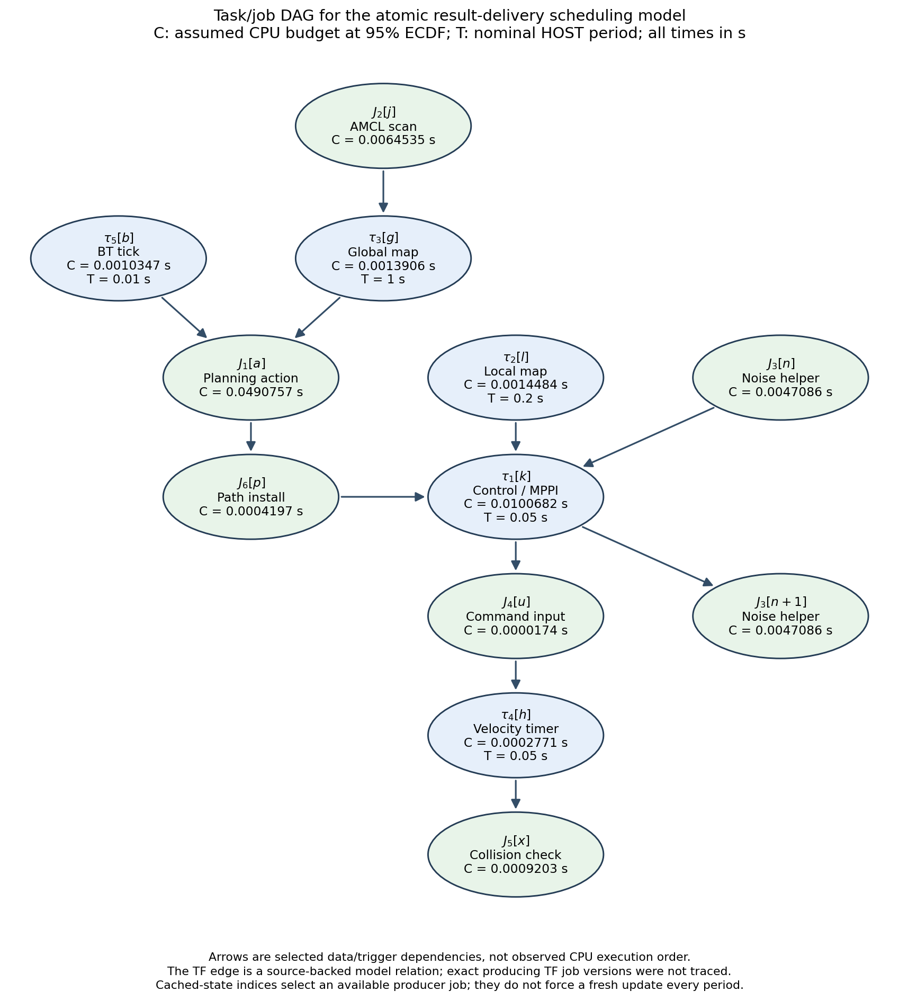
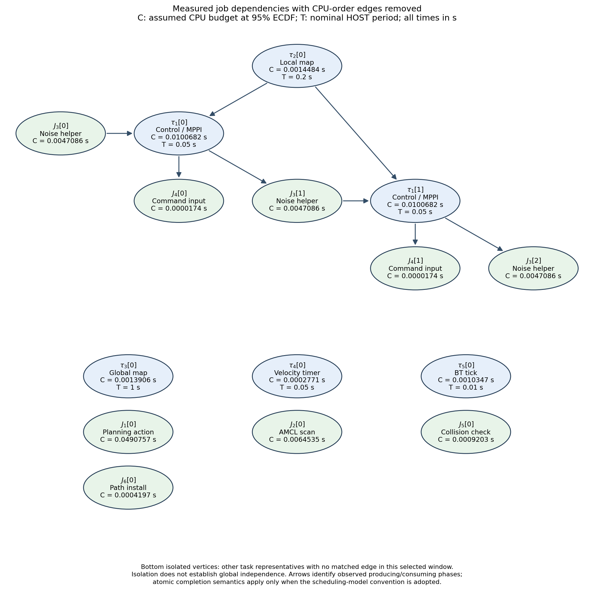
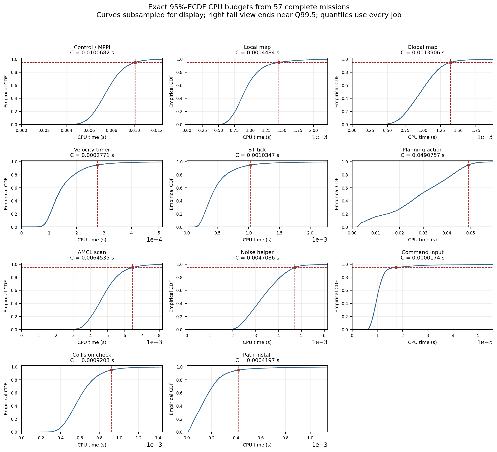

# Extracted parameters — assumed WCET at 95% empirical CDF

Parameters extracted from 57 complete, unchanged full-v2 missions. The source campaign remains sealed; no new simulation was launched. All time values in this report and its new diagrams are seconds.

For task i, let c_(i,k) be each measured inclusive CPU cost in seconds, N_i the pooled job count and F_i the empirical CDF.

$$\widehat F_i(c)=\frac{1}{N_i}\sum_{k=1}^{N_i}\mathbf{1}[c_{i,k}\le c],\qquad C_i^{\mathrm{model}}=\inf\{c:\widehat F_i(c)\ge0.95\}=c_{i,(\lceil0.95N_i\rceil)}.$$

This is the selected assumed WCET for the model. The definition guarantees F_i(C_i^-) < 0.95 <= F_i(C_i), including ties. D_i remains unassigned.

## Primary task parameters

| ID | Primary work unit | Type | C / assumed WCET (s) | Nominal T (s) | Mean interval (s) | Jobs |
| --- | --- | --- | --- | --- | --- | --- |
| tau1 | Control / MPPI | P | 0.0100682 | 0.05 | 0.05000275 | 366220 |
| tau2 | Local map | P | 0.0014484 | 0.2 | 0.20000543 | 91710 |
| tau3 | Global map | P | 0.0013906 | 1 | 1.00000121 | 18345 |
| tau4 | Velocity timer | P | 0.0002771 | 0.05 | 0.05000166 | 366870 |
| tau5 | BT tick | P | 0.0010347 | 0.01 | 0.01001787 | 1828599 |
| J1 | Planning action | A | 0.0490757 | — | 1.05355955 | 17418 |
| J2 | AMCL scan | A | 0.0064535 | — | 0.23708611 | 77369 |
| J3 | Noise helper | A | 0.0047086 | — | 0.05000273 | 366278 |
| J4 | Command input | A | 0.0000174 | — | 0.05000205 | 366272 |
| J5 | Collision check | A | 0.0009203 | — | 0.05000949 | 366193 |
| J6 | Path install | A | 0.0004197 | — | 1.05342221 | 17418 |

For the five periodic named work units, sum(C_i/T_i) = 0.319008600. This accounts only for their selected CPU budgets; it excludes aperiodic work and other ROS/Gazebo/background demand and is not a schedulability result. The nominal hyperperiod is 1 s.

## Book-style scheduling DAG

Chosen scheduling abstraction: atomic output delivery at modeled job completion. Current ROS can publish/trigger before function return. This is not an extracted claim of whole-function completion precedence. Repeated helper jobs are indexed to unroll feedback.

| Producer job | Consumer job | Dependency |
| --- | --- | --- |
| amcl | global | selected map-to-odom TF state |
| bt | plan | action request |
| global | plan | selected committed global grid |
| plan | path | action path result |
| path | control | selected installed path |
| local | control | selected committed local grid |
| noise_old | control | selected committed noise |
| control | noise_next | noise generation trigger |
| control | command | command message |
| command | smooth | selected held command |
| smooth | collision | smoothed command message |

## Verified job dependencies

The clean finite graph has 15 vertices and 8 dependency edges. It removes 28 same-thread order edges. Its isolated representatives are not asserted to be globally independent.

## Empirical CDFs

## Modeling decisions and scheduler readiness

C is the inclusive thread-CPU budget of the named primary work unit. T and observed inter-entry use HOST wall time. Both are expressed in seconds; identical units do not make their clocks interchangeable.

The user selects the 95%-ECDF point as the model WCET. It is an assumed simulation budget, not a certified bound on all executions. The CSV explicitly retains the fraction and count of jobs exceeding it.

For periodic implementations, use the configured nominal T. For aperiodic streams, T stays unassigned: their measured average inter-entry interval is descriptive and is not a guaranteed period or sporadic minimum. Trace arrivals can drive the initial scheduler.

The earlier report used NumPy linear-interpolation percentiles. This extraction instead computes the exact generalized inverse of the empirical CDF (nearest-rank order statistic). Both values are retained in the CSV to explain small numerical differences.

Whole-loop CPU budgets, when measured, are exported separately. Inclusive parent and nested-child costs must not both be charged. A parent/child call relation is containment; it is not an edge saying that the parent must finish before its child starts.

The book-style scheduling DAG adopts atomic output delivery at modeled completion. This matches a job-result delivery abstraction; current upstream ROS can publish/trigger before the enclosing function returns. The measured phase DAG remains the reference for those exact boundaries.

Cached-state edges select the already available producer version; they do not force each control job to wait for a fresh map, path or command update. Noise feedback is unrolled as old noise -> current control -> next noise.

The measured-job diagram removes all same-thread resource-order edges. An isolated representative means no exact dependency matched in this chosen trace window. It does not imply that its task family never interacts with other ROS components. No per-job TF version or exact global-grid producer is invented.

Task-family relations for planning, installed path and command smoothing follow the installed-version source/configuration. Their precise producer/consumer job selectors are model inputs, not new trace facts. The AMCL-to-global-map TF relation is source-backed at task-family level; exact TF job-version mapping and other live TF reads remain in the pass-through framework.

Scheduler development can start with these budgets, configured periodic releases and recorded aperiodic arrivals. Unlisted or unresolved infrastructure callbacks continue as pass-through background work in ROS. No invented C, T, deadline or priority is assigned to them, and they do not block the prototype.

Deadlines remain unassigned. No priority is inferred from historical execution order. Processor/core choices and dispatch policy belong to the next scheduling stage. Simulation was not rerun for this extraction.

## Artifacts and source

Primary parameters: docs/evidence/extracted-parameters.csv and extracted-parameters.json. All measured work-unit budgets, including nested work: extracted-subjob-parameters.csv. Source: sealed full-v2 per-run analysis-cache.npz and final task-characterization-summary.json. Graph evidence: extracted-task-dag.json and extracted-observed-job-dag.json. Figures are editable SVG and DOT as well as PNG. The prior measurement report remains docs/task-model.en.pdf.

Notation: Buttazzo (2011), Section 2.2.2, printed pp. 28–29 (PDF pp. 45–46). In the textbook a predecessor completes before its successor starts; atomic result delivery is the explicit convention needed to use that interpretation for the coarser job graph here. Source/configuration mappings are described in docs/task-model.en.md and docs/task-abstraction-study.fa.md.
