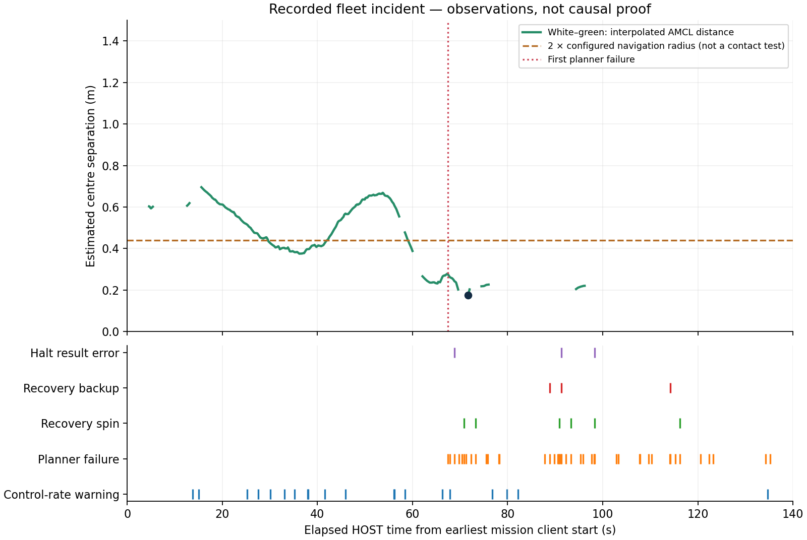
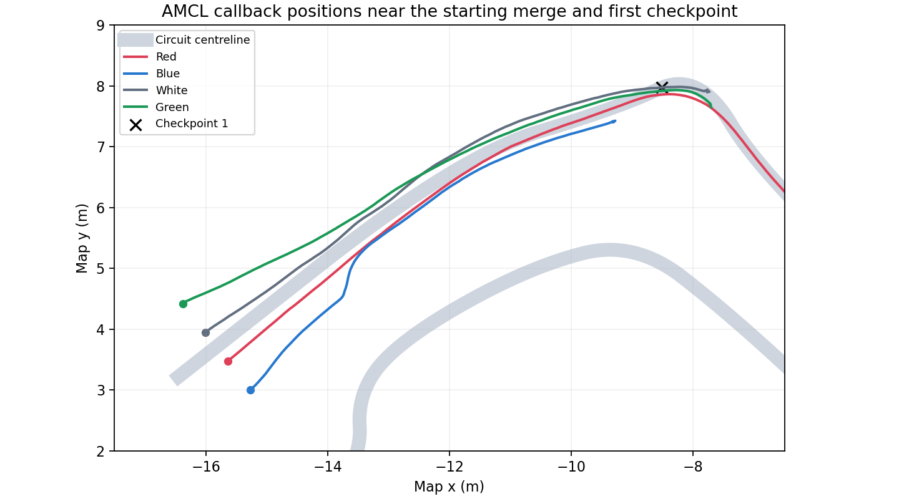

# Four-vehicle incident investigation

The recorded attempt shows four independent Nav2 vehicles converging from a transverse starting row into the original narrow circuit. White and green develop a severe proximity conflict; three missions subsequently abort with planning/recovery failures. The strongest current explanation is an uncoordinated merge and traffic conflict, potentially compounded by perception and host timing effects. The available evidence does not identify a unique physical collision time or prove an OS scheduling cause.

This investigation uses existing files only. No additional simulation, navigation correction, map adjustment or competitive behavior was applied during the investigation. The proposed change to global dynamic-obstacle handling was not executed. The active scene configuration still has the global obstacle layer enabled.

## Evidence and outcome

Input files are the four per-vehicle mission JSON files, launch log, capture metadata and original 120-second GIF originally under `artifacts/fleet`, now retained in ignored local archives. SHA-256 fingerprints are recorded in [the machine-readable analysis](evidence/fleet-incident.json). The analyzer verifies that all seven inputs remain byte-identical after processing. The GIF is actual Gazebo screen capture. A compact 4× version, 30 seconds long, is retained with the other historical previews in the ignored local archive; the original recording is preserved in the verified local media archive. The selected current movie is the separate single-vehicle live-bridge recording.

| Vehicle | Recorded odometry travel (m) | Verified ordered targets | Reported recoveries | Outcome |
| --- | ---: | ---: | ---: | --- |
| Red | 25.754 | 2 / 20 | 0 | Intentionally interrupted when capture ended |
| Blue | 7.829 | 0 / 20 | 17 | Nav2 action aborted |
| White | 9.260 | 1 / 20 | 16 | Nav2 action aborted |
| Green | 9.471 | 1 / 20 | 17 | Nav2 action aborted |

These distances cover the mission-client recording interval, approximately 108–144 HOST seconds depending on the vehicle, including GIF processing after capture. They are not distances measured exclusively within the 120-second clip. A mission field named `full_course` indicates that all 20 targets were requested; it does not mean the mission completed. None of the four missions completed in this attempt.

## Spatial and temporal reconstruction

Let \(\hat p_i(t)\) denote the AMCL position delivered to mission client \(i\) at HOST callback receipt time \(t\). Define the estimated pair separation

\[
\hat d_{ij}(t)=\|\hat p_i(t)-\hat p_j(t)\|_2.
\]

The analyzer interpolates on a 0.1-second HOST grid, restricted to overlapping observation intervals. It excludes a time point whenever either vehicle's interpolation bracket exceeds 1.0 second. This restriction reduces interpolation artifacts; it does not establish a bound on localization error or message age. Receipt time is not the physical measurement time.

The configured circular navigation radius is 0.22 m. Therefore \(\hat d_{ij}<0.44\) m indicates overlap of the estimated navigation footprints. This is a proximity diagnostic, not a physical contact test: the actual collision shapes differ, orientations were not recorded, and AMCL is not ground truth.

| Observation | Elapsed HOST time (s) |
| --- | ---: |
| White–green estimated separation first falls below 0.44 m | 29.695 |
| White–green estimated separation first falls below 0.30 m | 62.095 |
| First logged NavFn planning failure | 67.414 |
| First recovery spin begins | 70.829 |
| Minimum white–green separation with short interpolation brackets: 0.177 m | 71.695 |
| White mission aborts | Approximately 107.85 |
| Green mission aborts | Approximately 110.31 |
| Blue mission aborts | Approximately 135.29 |

All times above use the earliest mission-client start as zero. Individual vehicle elapsed times in the outcome files use their own starts. The exact capture-start timestamp was not recorded, so these event times must not be treated as exact GIF offsets.

An unrestricted interpolation gives a smaller minimum of approximately 0.098 m, but that value spans an observation gap exceeding the selected one-second limit. The retained analysis uses 0.177 m. Sparse AMCL publications can reflect motion thresholds as well as delivery timing; a long AMCL gap alone is not evidence of CPU starvation.



The launch log contains 44 planning failures, six recovery-spin starts, three backup starts and three errors obtaining the FollowPath result during halt. The halt-result errors occur after the first planning failure. Thus the record does not support treating an initial goal-acknowledgement timeout as the initiating failure in this attempt. Heartbeat/shutdown errors appearing during the final controlled teardown are not evidence that a node died before the incident.



The plot connects delivered localization samples and does not reconstruct exact physical trajectories through observation gaps.

## Contributors: evidence and limits

| Contributor | Evidence | Current assessment |
| --- | --- | --- |
| Uncoordinated merge | Four independent stacks target the same checkpoint sequence. The 2.60 m apron narrows to 1.30 m. No merge reservation, yield protocol or overtaking policy exists. | Strong structural explanation for convergence and conflict. Four navigation diameters total 1.76 m, exceeding the downstream road width even without clearance gaps. |
| Global planning blockage | Global obstacle marking is enabled; the first failure is NavFn reporting no plan for a segment toward the next target. White and green are already close before that failure. | Traffic-induced blockage is plausible. No costmap history exists to identify the exact blocking cells or whether another vehicle, wall observations or localization error supplied them. A logged planner start may be an intermediate waypoint in a multi-goal plan. |
| Recovery interactions | The behavior tree clears maps, spins, waits and backs up after failures. Severe estimated proximity persists while recoveries start. | Recovery movements can aggravate an existing close interaction. Temporal overlap alone does not establish which movement made physical contact. |
| Perception and geometry | Planar GPU LiDAR is configured at 5 Hz. In local SDF coordinates its sensor height is 0.150 m, whereas the small lidar visual reaches 0.148 m and the race body is lower. Decorative nose/wings differ from the retained TurtleBot collision body. | Another vehicle's visibility and visual-versus-physical overlap need a resolved-pose/scan audit. The static geometry raises a credible visibility question; no raw scan history proves that a vehicle was missed. Appearance alone cannot certify contact. |
| Collision Monitor | It is loaded and activated, with approach mode, 1.2 s time-to-collision setting and six-point threshold. | It depends on incoming obstacle observations. Its presence does not prove that the other vehicle was detected or that a stop was commanded. The state topic and command chain were not recorded. |
| Shared host timing | Four Nav2 stacks, Gazebo physics/sensors, two GUIs and FFmpeg share one WSL host. Short validation commands also ran during the preview. Twenty controller-rate warning lines are present; GUI logs show software-rendering fallback messages. | Host contention is a credible confound. Its contribution to the incident is not quantified or established causally. This was a visual preview, not an isolated timing experiment. |
| Unequal departure | Goal acceptance differs by 3.593 HOST seconds, or 1.587 SIM seconds between the earliest and latest acceptance. | The current dispatch is not a fair synchronized race start. This is an observable initial-condition difference, not evidence of an assigned task priority. |

The configured sensor period is 0.2 SIM seconds; local/global map update rates are 5/1 Hz and the controller's configured rate is 20 Hz. These nominal settings are not measured end-to-end response times. For illustration, a relative closing speed of 1 m/s and 0.2 seconds of observation age correspond to 0.2 m of closing distance. Actual relative speed and observation age at contact were not measured.

Nav2's official [Collision Monitor documentation](https://docs.nav2.org/jazzy/configuration_and_development/configuration_guide/core_servers/collision_monitor/configuring_collision_monitor_node/) describes sensor-dependent approach behavior and point thresholds. Its [MPPI documentation](https://docs.nav2.org/jazzy/configuration_and_development/configuration_guide/controller_plugins/mppi_controller/configuring_mppic/) describes local obstacle/path critics; independent obstacle avoidance is not a coordinated racing policy.

## What can be said about the laptop and scheduler?

A post-run WSL inventory reports an Intel Core i7-13620H and 16 logical CPUs visible to WSL. This is not a measurement of CPU availability during the incident, and the virtual topology must not be interpreted as an inventory of physical cores.

The abstract A7/A15 execution model and its scheduling policy are not coupled to ROS completion delivery. Consequently, this incident cannot be attributed to that modeled scheduler. Linux/WSL scheduling, ROS executors, DDS delivery, sensor rendering and physics all can influence the live run. No dedicated A7/A15 hardware was executing these Nav2 jobs.

A useful future decomposition is

\[
R_j^{\mathrm{HOST}} = W_j^{\mathrm{executor/OS}} + E_j^{\mathrm{CPU}} + B_j^{\mathrm{locks/I/O}},
\qquad
A_{\mathrm{observation}}=t_{\mathrm{use}}-t_{\mathrm{measurement}}.
\]

The current files do not separately measure these terms. Nor do the 20 warning lines yield a deadline-miss ratio: the full job population and defined deadlines are absent, and the printed instantaneous rate can exceed 20 Hz despite the warning. A warning is not a measured OS run-queue delay. HOST time, CPU service time and SIM time must remain distinct.

A later diagnostic experiment could record physical contacts, ground-truth position/orientation, scans, costmaps, collision-monitor state, command publish/take timestamps, callback execution and per-thread CPU/run-queue traces with aligned clocks. Repeated controlled comparisons with and without GUI/recording load could test the host-contention hypothesis. These are proposals; no new experiment or instrumentation was started here.

## Making the demonstration more competitive — proposals only

- **Common start and scoring:** release motion only after all stacks are ready; show ordered-checkpoint progress, elapsed time, position, contacts and recovery penalties. Equal dispatch conditions remove the measured head start. Agree on whether a contact is allowed, penalized or ends a run before calling it a race.
- **Scheduler competition:** after result-delivery coupling is implemented, assign different scheduling policies while holding vehicle dynamics, controller tuning, route and modeled hardware budgets equal. Report navigation outcome and deadline/response statistics separately. Simultaneous racing supplies a visual comparison; repeated isolated missions help separate scheduling effects from traffic interference and host load.
- **Passing strategy:** investigate lane choice, yielding or passing opportunities as a distinct navigation feature. The existing narrow road may produce following and congestion rather than reliable overtaking. A multiplayer racing policy would be an additional design decision; MPPI tuning alone does not supply race rules.

No competitive feature, speed change, sensor correction or traffic repair has been implemented as part of this investigation. The map and camera settings are preserved. The current four-car setup remains experimental and should not yet be presented as a validated full-lap race.

## Reproduce the analysis

```bash
python3 scripts/analyze_fleet_incident.py
```

This command reads existing evidence only. It writes derived pairwise-distance CSV, event list and summary under ignored `artifacts/fleet/analysis`, plus the report figures and compact evidence JSON. The source logs and mission files remain in place. The original GIF is read directly from the verified local archive when necessary.
