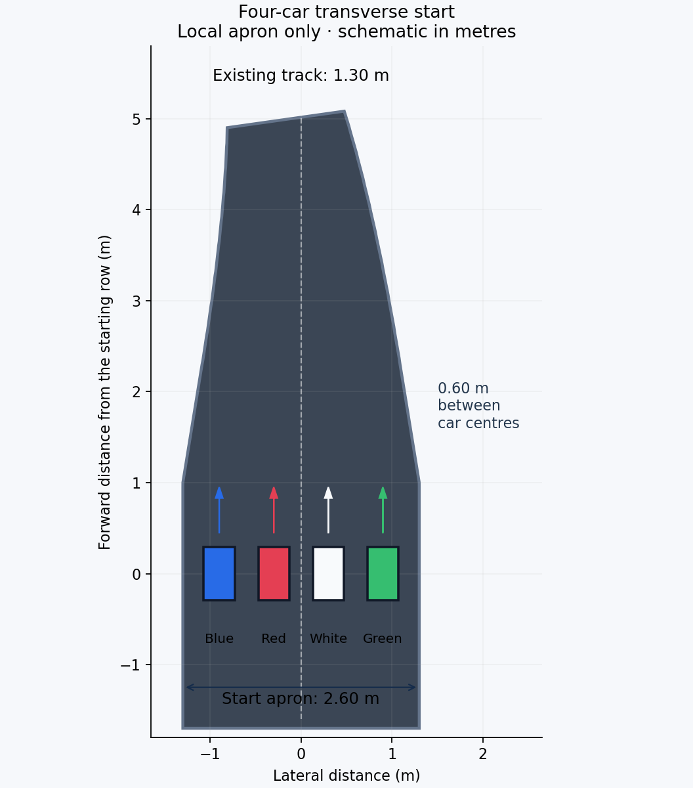

# Four-vehicle preview

An optional scene adds blue, white and green moving vehicles alongside the red vehicle. Each vehicle runs an independent namespaced Nav2 stack with the same navigation tuning, sensors, differential-drive dynamics and original 19 checkpoints plus finish.

Only the starting apron is widened. Four vehicle centres share one transverse row with 0.60 m spacing. The apron is 2.60 m wide and tapers back to the original 1.30 m road by centreline distance 5.80 m. Checkpoints, server cabinets and the remainder of the circuit retain their original geometry. The derived world and occupancy map are generated under `artifacts/fleet/assets`; the frozen single-vehicle assets remain available.



The accepted cameras are retained: a rigid chase camera follows the red vehicle approximately 0.75 m behind, with height offset 0.25 m and look offset 0.10 m, alongside the original fixed overview. A narrow chase view may crop the outer vehicles at the starting row.

## Run

```bash
bash scripts/launch_monaco.sh fleet:=true
# Second terminal:
source scripts/environment.sh
python3 scripts/run_monaco_fleet.py
```

The original single-car launch remains the default. Fleet mode increases the Nav2 behavior-tree action acknowledgement timeout from 20 ms to 1000 ms for all four stacks to accommodate concurrent startup and goal dispatch. Controller, planner, speed and scheduling-policy settings are otherwise preserved. This is a protocol timeout, not an execution deadline or modeled compute budget.

For an isolated short recording, close previous simulation windows first:

```bash
source scripts/environment.sh
python3 scripts/record_dual_view.py --fleet --seconds 120
python3 scripts/compress_publication_gif.py artifacts/fleet/capture/dual-view.gif --output artifacts/videos/four-cars-4x.gif
python3 scripts/validate_monaco_fleet.py
python3 scripts/verify_frozen_scene.py
```

Historical four-vehicle previews and their raw logs are retained in ignored local archives. The selected current local movie is `artifacts/videos/live-fifo-single-4x.gif`, with one vehicle and the live scheduler. The published complete single-car GIF remains the README demonstration. A 120-second preview demonstrates concurrent movement and departure from the apron; it does not certify completion of a four-car race. Short recording termination intentionally cancels ongoing missions. Full-lap finish-area coordination has not been validated. A repeated preview exposed a traffic/proximity incident and three aborted missions; see the [incident investigation](fleet-incident-analysis.en.md). This fleet mode is experimental.

## Possible competition modes — proposals only

1. **Race presentation:** a common start signal, ordered-checkpoint progress, elapsed time and a live position table. Keep the vehicles and navigation tuning equal. A shared start barrier and leaderboard would be added separately; current independent action dispatch is not a synchronized race start.
2. **Scheduling comparison:** couple modeled completion times to actual ROS results, then compare FIFO, deadline-based policies once deadlines are supplied, and a proposed policy. Hold hardware budgets, navigation parameters and scenarios constant. Use repeated isolated runs for the primary policy statistics, because simultaneous robots introduce traffic interactions and host contention.
3. **Overtaking:** the original 1.30 m road limits available clearance. Reliable racing behavior would require a separate study of passing space and explicit passing/yield rules. Nav2 MPPI supports obstacle avoidance and tunable path alignment, but this alone does not implement competitive multi-robot racing. Any future map change or controller retuning needs a separate decision.

The [official Jazzy MPPI documentation](https://docs.nav2.org/jazzy/configuration_and_development/configuration_guide/controller_plugins/mppi_controller/configuring_mppic/) describes obstacle and path critics. None of these competition proposals is implemented in this preview. The original preview and abstract FIFO replay remain separate evidence. A later [live local FIFO bridge](live-bridge.en.md) couples actual Nav2 jobs to modeled hardware; it has not implemented these competition proposals. Original single-car timing measurements supply assumed execution budgets, not measured four-car WCET guarantees.
