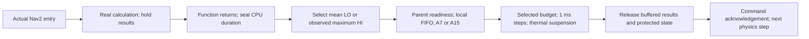

# Live Nav2 / local FIFO bridge

One real Nav2 stack is coupled to one modeled vehicle with one A7 and one A15. The accepted circuit, navigation algorithms, thermal parameters and 0.001 s common physics/hardware lattice remain unchanged. Actual callbacks create jobs. No periodic or aperiodic arrivals are invented by the live scheduler.

## Current budget contract

All eleven existing primary task families have **HI task criticality**. Each has two empirical execution budgets extracted from the same 57 successful characterization missions:

$$C_i^{LO}=\frac{1}{N_i}\sum_{n=1}^{N_i}c_{i,n},\qquad C_i^{HI}=\max_{1\le n\le N_i}c_{i,n}.$$

Here c is inclusive HOST thread-CPU time, expressed in seconds. The [CSV](evidence/dual-budget-parameters.csv) and [JSON](evidence/dual-budget-parameters.json) retain sample counts, source provenance, nominal periods and the historical Q95 for comparison. Q95 is not an active live execution budget.

Let a_j be the measured host algorithm CPU duration of a newly computed job, before releasing its buffered results. Its selected reference budget is

$$B_j=\begin{cases}C_i^{LO},&a_j\le C_i^{LO},\\C_i^{HI},&a_j>C_i^{LO}.\end{cases}$$

Equality selects LO. The comparison occurs before rounding, using seconds converted from CLOCK_THREAD_CPUTIME_ID nanoseconds. Wall time, blocked waiting, cooling and renderer time are not comparison inputs. Adapter RPC and output-copy CPU are excluded. Deferred transmission and adapter cleanup happen after the algorithm measurement and are not included in a_j. The original reference samples include the original named-work body; this harness moves output delivery out of that body, which is a measurement-boundary difference rather than a new hardware calibration.

LO/HI here labels the **selected job budget**, not a change to the task's HI criticality. Selection is per job; a subsequent job can select LO again. There are no synthetic LO tasks, global criticality-mode switching, task dropping or recovery policies yet.

A new actual sample can exceed the recorded maximum. In that case the requested HI maximum is still selected and `observed_max_exceeded` is recorded explicitly. No maximum is silently increased or presented as a certified bound.

| Task | Criticality | C_LO reference (s) | C_HI reference (s) |
| --- | --- | ---: | ---: |
| `control_iteration` | HI | 0.007633349401 | 0.0306778 |
| `local_costmap_update` | HI | 0.0009595755719 | 0.0076756 |
| `global_costmap_update` | HI | 0.0009884044263 | 0.0099746 |
| `velocity_smoothing_tick` | HI | 0.0001533304849 | 0.0162255 |
| `bt_tick` | HI | 0.000492935622 | 0.0194456 |
| `planning_request` | HI | 0.02835470188 | 0.0818079 |
| `amcl_scan_callback` | HI | 0.004807714569 | 0.019939 |
| `mppi_noise_generation` | HI | 0.003392521343 | 0.015244 |
| `velocity_command_callback` | HI | 1.118834282e-05 | 0.0038324 |
| `collision_check` | HI | 0.0006137018624 | 0.0135562 |
| `controller_path_install` | HI | 0.00017698385 | 0.0023685 |

## Equivalent work and target timing

The existing virtual reference is f_ref = 1000 MHz and eta_ref = 1. For the selected budget:

$$W_j=B_j f_{ref}\eta_{ref},\qquad C_{j,k}=\frac{W_j}{f_k\eta_k},\qquad n_{j,k}=\left\lceil\frac{C_{j,k}}{0.001}\right\rceil.$$

W is in million equivalent cycles when frequency is in MHz. Both the actual sample and the LO threshold scale by the same positive factor, so comparing them before target conversion preserves the LO/HI decision. At the current operating points, A7 uses 1600 MHz / eta 1, and A15 uses 2000 MHz / eta 1.8. These are model conversion inputs, not measured laptop clock counters. Nominal T remains timing metadata and does not scale with target frequency.

The selected HI budget is the **total** budget, not C_LO + C_HI. Every job starts with exactly its selected demand. The 1 ms lattice rounds duration upward; cooling adds elapsed suspension without consuming remaining work.

## Compute, seal, schedule, release

1. An actual instrumented Nav2 work unit enters and creates a job.
2. The installed Nav2 function computes on the host. Its outgoing topic messages are copied into owned serialized buffers; service responses are deep-copied. The original function returns before budget selection.
3. The adapter seals the actual CPU measurement. The broker rejects a stage request without this seal, selects LO or HI, and records both the sample and selected equivalent work.
4. A staged job becomes eligible only after every selected parent has modeled completion. Ready FIFO selects the oldest-idle local core. Ordinary arrivals do not preempt a running job.
5. The selected budget executes on the common lattice. Whole-device cooling suspends both cores and blocks result release.
6. At the modeled finish, all eligible gates are released before the next physics step. The adapter flushes the buffered topic/service results and commits the protected shared state. Transport reception of the final command is acknowledged before physics advances.



For job j, with actual entry r_j, sealed-computation time b_j and selected parents pred(j):

$$A_j=\max\left(r_j,b_j,\max_{p\in pred(j)}F_p\right),\qquad S_j\ge A_j.$$

FIFO orders eligible jobs by (A_j, r_j, job ID). Blocked children occupy no core. The available core with the earliest last-idle timestamp is selected; a tie uses A7 before A15.

Local-map writes retain their actual map mutex until modeled release. Noise-buffer commits retain their protected ownership through the gate; inline reset regeneration remains deferred. The global planner map lock covers its read-modify-write request. Same-thread path installation and mutually exclusive component callbacks complete their gates before the next work unit can consume their state. Nested same-thread work remains charged within the primary body rather than as an additional independent job.

Action requests are control triggers, not delivered computational results. Their exact goal UUID records the producing BT job; planning children still cannot dispatch before that parent completes. An action server can send a cached planning result from a different ROS executor thread. The adapter binds that response to its exact result-request UUID and producing planning job, then withholds it until the producer has finished its selected budget and committed its buffered outputs. This prevents a cached result from bypassing the computation gate.

A publication interval is opened in the broker before DDS sends the message and sealed immediately afterward. A racing subscription take waits for that interval to close, then binds its exact source timestamp; transport reception cannot outrun producer registration.

DDS/input fingerprints, selected map/noise state and installed path IDs establish the implemented job dependencies. Exact TF versions and every framework callback are not modeled. Unresolved/external inputs remain counted rather than assigned invented parents. The broker does not claim deterministic native-thread replay or an instruction-level RTOS emulator.

## Thermal and motion semantics

Ambient and initial core temperatures are 45 degrees C. Any core reaching Tmax = 46.2 degrees C suspends the whole vehicle device; both cores resume only after all are at or below Tbalance = 45.8 degrees C. Ordinary idle powers are A7 0.05 W / A15 0.15 W; cooling powers are A7 0.005 W / A15 0.015 W. The coupled RC model is advanced each 1 ms step. Thermal guards precede output delivery at coincident ticks.

Cooling withholds new computation results and commands. Gazebo's actuator retains its last applied command and physics continues. A moving vehicle during cooling is therefore possible. The low-level motor actuator is not one of the eleven modeled CPU task families.

The live Gantt uses 2 s windows and displays per-core modeled temperatures. The approximately 0.75 m following camera, overview and existing GIF assets are retained. The published 6x movie is the [historical Q95 preview](live-bridge-q95.en.md), not a recording of this revised budget contract.

## Verification and reproduction

The final development verification is `artifacts/live-bridge/dual-budget-smoke-04`. Four bounded development trials were run while correcting output release and producer registration; this is functional verification, not a statistical comparison of policies. The final vehicle traveled 3.406654 m during 8 s of active simulation, with no navigation abort. Two newly staged jobs remain uncompleted at the deliberate cutoff; all completed jobs finished their output commits before shutdown.

| Check | Result |
| --- | ---: |
| Active simulation interval (s) | 8.0 |
| Initialization + active clock pairs | 14000 |
| Actual-entry / sealed jobs | 1033 |
| Completed / committed jobs | 1031 |
| LO / HI budget selections | 952 / 81 |
| Verified selected dependency edges | 811 |
| Output-release events at exact selected finish | 666 |
| Unresolved selected input bindings | 0 |
| Cooling entries / exits | 13 / 13 |
| Validation errors | 0 |
| Unit tests passed | 56 |

The current short-trial [validation](figures/dual-budget-bridge/validation.json), [per-task results](figures/dual-budget-bridge/task-summary.csv) and [applied Gantt](figures/dual-budget-bridge/applied-gantt.png) report the measured LO/HI selections and output timings. A finite smoke trial demonstrates the local bridge contract, not full-course success or a formal hard-deadline guarantee.

```bash
source scripts/environment.sh
python3 scripts/extract_dual_budgets.py
python3 scripts/build_live_bridge.py
python3 scripts/run_live_bridge.py --seconds 8 --output artifacts/live-bridge/<new-trial>
python3 scripts/analyze_live_bridge.py artifacts/live-bridge/<new-trial> --output docs/figures/dual-budget-bridge
python3 -m unittest discover -s tests
python3 scripts/verify_frozen_scene.py
```

Each new trial snapshots the launch configuration, hardware configuration and task budget table. Raw protocol, live events, jobs, CPU measurements and clock pairs stay together under ignored `artifacts/live-bridge`. Socket/shared-clock files live under /tmp. Historical raw characterization CSVs are preserved. Scene geometry is unchanged. Commit and push remain manual.
