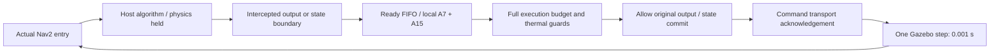
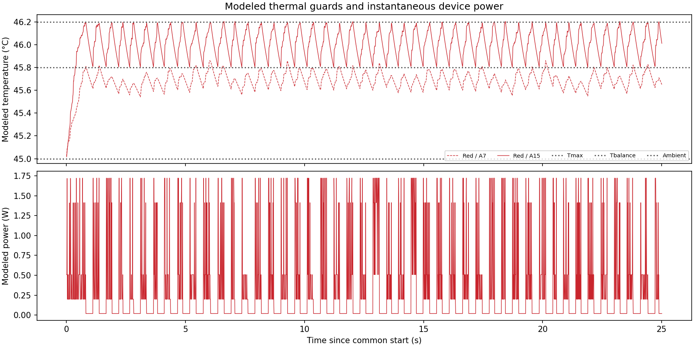
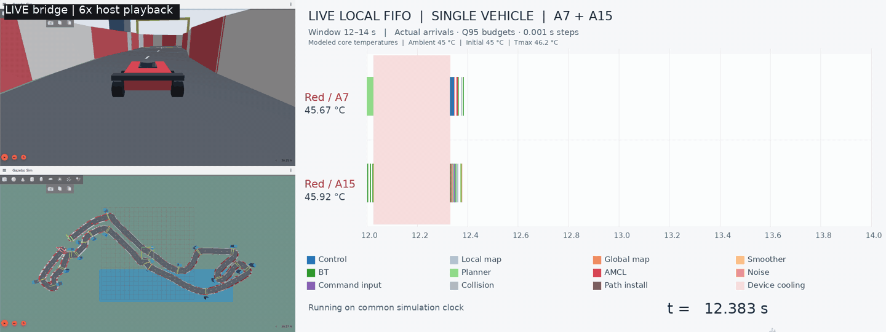
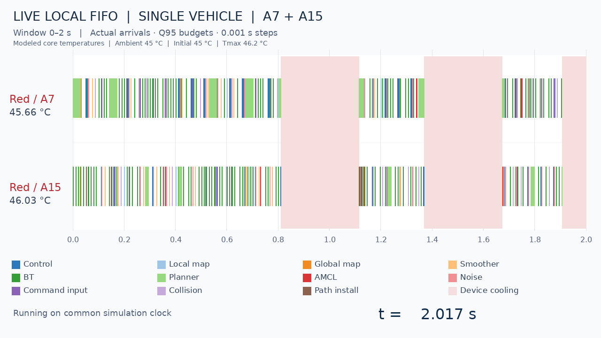
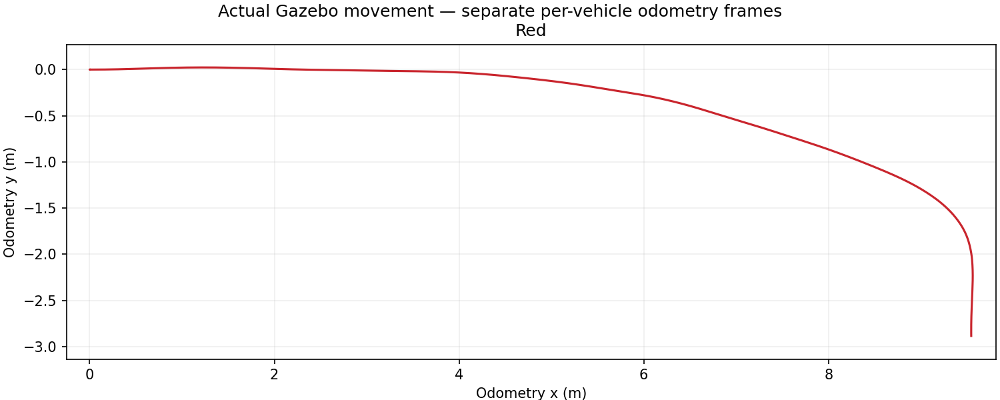

# Live Nav2 / local FIFO bridge

One real Nav2 stack is coupled to one abstract vehicle processor, with one Cortex-A7 and one Cortex-A15. A single red vehicle follows the original accepted route. The host executes the original installed navigation algorithms, while a broker advances modeled computation, thermal state and Gazebo physics on one **0.001 s** lattice. Edge placement and communication are inactive in this local baseline.

The [validation](figures/live-bridge/validation.json), [task table](figures/live-bridge/task-summary.csv) and figures below describe one bounded single-vehicle trial. The earlier full-course GIF and standalone FIFO replay remain separate demonstrations.

## Arrival and result semantics

A job is created only when an instrumented primary Nav2 work unit actually enters. The bridge never calls the offline `periodic_jobs` generator, replays recorded releases, or creates an aperiodic period. The extracted task table supplies the Q95 execution budget and timing metadata. Native timer/rate objects retain their configured cadence, expressed in simulation time for the application loops handled by the adapter.

The host first runs the real algorithm with physics held. At its first intercepted output or state-commit boundary, the adapter stages the job and waits for its modeled execution budget. At modeled completion the boundary can proceed. Further intercepted outputs from that job remain subject to device cooling. The tail executes on the host and its actual return and thread-CPU duration are recorded separately.

This is a **full-budget-before-first-visible-phase abstraction**. Modeled completion is the logical availability of a result, rather than the native whole-function return. This matters for BT/action waits and Nav2 functions that publish before returning: charging an atomic callback and simultaneously waiting for its descendant would introduce false cycles. A nested same-thread work unit is charged within its inclusive primary budget, not again as a separate job.

The broker tracks running host work and native waits cooperatively. A busy tracked calculation holds simulation time; an intercepted mutex/condition/action wait can allow other jobs and physics to advance. All eligible result gates at a tick are released before the next physics step. The stepper also waits for the last expected final command on Gazebo Transport before requesting that step. Transport receipt is acknowledged; this does not claim an instruction-level barrier inside every Gazebo plugin.



## Execution demand, readiness and core choice

For task i, the assumed WCET is the measured thread-CPU empirical Q95 from the characterization campaign:

$$C_i^{ref}=\inf\{x:\widehat F_i(x)\geq 0.95\}.$$

It is a user-selected budget, not a certified upper bound. The existing virtual reference normalization is f_ref = 1000 MHz and eta_ref = 1. Equivalent work and active duration on core k are

$$W_i=C_i^{ref}\eta_{ref}f_{ref},\qquad C_{i,k}=\frac{W_i}{\eta_k f_k}.$$

W is in million equivalent cycles when frequency is in MHz. The active budget is rounded upward to the common lattice:

$$n_{i,k}=\left\lceil\frac{C_{i,k}}{\Delta}\right\rceil,\qquad \Delta=0.001\;\mathrm{s}.$$

Cooling adds suspended elapsed time without consuming work. Reference normalization, target frequency and performance multiplier are model inputs; this conversion is not a measurement of actual A7/A15 instructions or clock counters. T_i remains time metadata and does not scale with core frequency.

For job j, let r_j be actual entry time, b_j the time its real computation reaches a staged boundary, and pred(j) its selected job parents. It becomes eligible at

$$a_j=\max\left(r_j,b_j,\max_{p\in pred(j)}F_p\right),\qquad S_j\geq a_j.$$

FIFO orders ready jobs by (a_j, r_j, job ID), separately for each vehicle. Blocked children occupy no core. The available core with the earliest last-idle timestamp is selected; a tie uses core ID, A7 before A15. This is **oldest idle**, not the core with the shortest predicted execution time. Running jobs retain their core through thermal suspension. Ordinary arrivals do not preempt them.

The tested operating points are:

| Core per vehicle | Frequency (MHz) | Voltage (V) | Performance eta | Cooling power (W) |
| --- | ---: | ---: | ---: | ---: |
| A7 | 1600 | 1.1 | 1.0 | 0.005 |
| A15 | 2000 | 1.3 | 1.8 | 0.015 |

No DVFS policy changes levels during this trial. Existing server templates retain two cores of each type for later offloading work.

## Selected dependencies

A child can start only after every recorded parent has modeled completion F_p <= S_j. The adapter rejects unknown/cross-vehicle parents, cycles and a newly discovered unfinished predecessor after child dispatch. It binds actual selected inputs, not every possible family-to-family connection:

| Relation | Binding used by the live bridge |
| --- | --- |
| BT goal -> planning request | Actual action goal UUID |
| Planning request -> path installation | Computed Path geometry/frame fingerprint, including when visualization has no subscriber |
| Path installation -> control | Last installed path in that vehicle's controller |
| Local map -> control | Writer observed under the actual map mutex |
| Global map / planner read-modify-write | Writer under the global map mutex; the adapter extends the lock across the request to include NavFn's start-cell modification |
| Control -> command input -> smoothing -> collision check | Selected Twist payload with DDS source timestamp matched to the intercepted publish interval |
| Control -> next MPPI noise -> subsequent control | Actual deferred noise trigger and noise-buffer writer/read under its mutex |
| Successive map writes | Selected previous writer of the read-modify-write state |

Equivalent Path geometry intentionally treats repeated identical paths as equivalent data. Noise triggers are deferred until the producing Control job's modeled completion; an inline reset clears the writer and delays its asynchronous regeneration signal. These synchronization changes belong to the bridge harness; planner, localization, MPPI and collision-check calculations still execute in their installed Nav2 libraries. Their floating-point results and random sequences need not match an unconstrained host run.

Bootstrap/external data can have no modeled parent. Unresolved lookups are counted explicitly in the retained validation JSON. Exact TF version provenance and every framework callback are not modeled. The native algorithms still perform their ordinary transform and sensor-availability checks. Aperiodic work is not isolated merely because it is event driven: an actual selected data dependency still creates an edge. Feedback is unrolled into distinct jobs, so the selected job graph remains acyclic.

## Thermal suspension and physical motion

Each vehicle uses its existing coupled RC network. With thermal capacitance matrix A, conductance matrix B, ambient temperature T_a and constant power vector p over one step,

$$A\dot{\boldsymbol\theta}=-B(\boldsymbol\theta-T_a\mathbf 1)+\mathbf p,$$

$$\boldsymbol\theta_{n+1}=\boldsymbol\theta_\infty+
 e^{-A^{-1}B\Delta}(\boldsymbol\theta_n-\boldsymbol\theta_\infty),\qquad
 \boldsymbol\theta_\infty=T_a\mathbf 1+B^{-1}\mathbf p.$$

At any core temperature >= 46.2 degrees C, the **entire vehicle device** suspends both modeled cores. It resumes when every core is <= 45.8 degrees C. Ambient is 45 degrees C; both cores start at 45 degrees C. These are independent parameters. Cooling power is 0.005 W for A7 and 0.015 W for A15; total device cooling power is 0.020 W. Normal idle powers are 0.05 W and 0.15 W. Thermal guards precede output delivery at coincident ticks, with at most one step of threshold-crossing quantization.

Suspended jobs retain their remaining work. Their outputs, including final actuation from unbudgeted framework paths, are held while the device cools. The bridge issues no forced stop, zero command or vehicle shutdown for thermal reasons. Gazebo keeps evolving with its previously applied command. Ordinary Nav2 safety behavior remains active.


The colored segments show modeled active computation for actual arrivals; pink bands cover both cores during whole-device cooling. The chart covers the first 2 s after the common start, on the vehicle's two cores.



These are modeled temperatures and instantaneous powers, not laptop sensor measurements. The hardware model starts at its configured initial temperatures when the start barrier opens; initialization does not preheat the model.

## Live presentation

Three windows display the unchanged rear-following camera (approximately 0.75 m behind the vehicle), the fixed circuit overview, and the applied live Gantt. The scheduler window has two lanes, A7 and A15, and **2 s** windows: 0–2, 2–4, and so on. Bars grow from actual `start`, `budget_complete` and cooling events, rather than a prerecorded schedule. The current common simulation time is shown below the chart, and each core's current modeled temperature is displayed beside its lane. Temperatures come directly from the applied RC model through live thermal samples. A sample for both cores is emitted every 10 model steps (0.010 s); the guards and thermal integration still run every 0.001 s. Rendering polls at 100 ms host intervals; it does not change the 1 ms scheduling/physics step.

The local recording combines the two camera views on the left and the live Gantt on the right. It is labeled **6× host-recording playback**. The visible simulation clock is the experiment time; sixfold host playback does not imply sixfold simulation time when real computation pauses physics.



The launcher reads `vehicle_color` in `config/live_bridge.json`; red, blue, white and green change the one vehicle's appearance for later algorithm comparisons. The current scheduling policy remains local FIFO. The original four-vehicle preview remains an optional separate experiment.

## Retained verification trial

The retained trial is `artifacts/live-bridge/single-45c-max46p2-balance45p8-11m-01`. It advances **25.011 s after the common start**, plus 6.074 s of initialization: 31.085 s total simulation time in 282.493 host seconds. All six checked Nav2 lifecycle nodes were active. Action acceptance and initial hardware dispatch share tick 6074. The run stops intentionally when active-interval planar odometry reaches 11 m. The mission shutdown report contains `Interrupted.` because this is a distance-bounded preview, rather than a full-lap test.

| Check | Result |
| --- | ---: |
| Matching physics/hardware tick pairs | 31,085 |
| Actual-entry jobs | 3,117 |
| Modeled completions | 3,111 |
| FIFO / oldest-idle assignments checked | 3,113 |
| Actual staging/readiness times checked | 3,113 |
| Quantized completed compute budgets checked | 3,113 |
| Selected precedence edges checked | 2,372 |
| Path installation jobs with planner parent | 99 |
| Planning jobs with BT goal parent | 99 |
| DDS source-interval bindings | 483 |
| Equivalent payload / goal UUID bindings | 198 |
| Unresolved or external input lookups | 92 |
| Live per-core thermal samples matched to model | 2,501 |
| Whole-device cooling entries / exits | 46 / 45 |
| Validation errors | 0 |

The vehicle traveled **11.005907 m**, passed 1 ordered checkpoint, and reported 0 recoveries. No navigation-abort or transform error was observed during this interval. All 47 unit tests pass; the frozen scene check verifies 12 unchanged files.

Whole-device cooling occupied **13.620 s (54.46%)** of the active interval. The trial ends during its last cooling interval, explaining the one unmatched cooling entry. The sampled temperature peaks were **45.8598 °C / 46.2043 °C** for A7/A15; the final samples were 45.6501 °C / 46.0109 °C. Tmax is checked every 1 ms, so a small threshold overshoot can occur before cooling starts. The hardware snapshot's standalone `control_epoch_s` is overridden by the live step; `thermal_guard_period_s` in the validation report records the effective value.

The bridge recorded **357 moving odometry intervals entirely within cooling**. This is actual Gazebo movement under the previously applied command. The bridge gates Nav2 results and final `/cmd_vel` publication; it does not replace the Gazebo DiffDrive actuator or wheel/contact dynamics with virtual CPU jobs. The actuator retains its last target when a new command is withheld. Counts at the finite cutoff differ because some jobs remain staged, queued or unfinished; they are retained in the trace.

An earlier 55 °C ambient / 55.6 °C Tmax trial spent 87.94% of its active interval cooling. Under those settings, the ordinary-idle A15 equilibrium was approximately 55.709 °C, already above Tmax. Ambient, initial temperature and thresholds are independent configuration fields in the current model. Ordinary idle and cooling retain their distinct powers.

The unresolved/external lookups have no asserted predecessor. The verified edges therefore cover the selected bindings implemented by this adapter, not a claim of complete causal provenance for every ROS/TF/framework input. All 11 primary task families appear in the completed-job table.






The [task CSV](figures/live-bridge/task-summary.csv) contains all 11 primary task families, counts, C_ref, nominal T where defined, observed mean release-to-modeled-finish time and mean actual thread CPU for returned callbacks. Host thread CPU includes adapter overhead; it is audit evidence, not a replacement budget or a target-CPU calibration. The [validation JSON](figures/live-bridge/validation.json) records dependency-family counts, mission outcomes and the raw trace SHA256. Bridge invariants and successful navigation are reported separately.

A preliminary 10 ms experiment had valid bridge invariants but Nav2 aborted with error 102 after delayed map-to-odom transforms. Its two retained runs moved 0.110 m and 0.290 m. Rounding every short work unit up to 10 ms changes demand and thermal suspension substantially; asynchronous ROS input delivery also remains part of the harness. This is an observed failure, not proof that quantization alone caused it. Those diagnostic runs are retained in ignored local archives. The selected configuration is 1 ms.

## Reproduce

Close an existing simulation first. From the repository in WSL:

```bash
source scripts/environment.sh
python3 scripts/build_live_bridge.py
python3 scripts/run_live_bridge.py --seconds 90 --distance 11 --views --record
# Use the output directory printed by the runner:
python3 scripts/analyze_live_bridge.py artifacts/live-bridge/<trial-directory>
python3 -m unittest discover -s tests
python3 scripts/verify_frozen_scene.py
```

`--seconds` bounds the active interval after initialization and the common start. `--distance 11` requests a clean stop after the observer records at least 11 m of active-interval planar odometry; polling can cause a small distance overshoot. Bootstrap lasts at least 6 s of simulation and continues until the six checked Nav2 lifecycle nodes, the mission client and any requested views are ready. The barrier then holds physics until the real action is accepted and its first BT job is staged. The hardware begins from its configured initial state at that origin. `--gui` opens one camera; `--views` opens all three without recording; omit both for a headless run. Finite runs intentionally end ongoing missions and close their owned windows.

Runtime libraries are preloaded only into the Nav2 container, not into Gazebo or the physical ROS/Gazebo bridge. Baseline scene hashes remain unchanged. A derived copy of the original single-car world changes only its physics step to 0.001 s. Native application rate/smoother timing uses simulation time; DDS and OS clocks remain host clocks. The shared broker/Gazebo clock is acknowledged each step; ordinary ROS clock and sensor subscriptions are asynchronous. Lifecycle bond timeouts are disabled and BT action-acknowledgement timeout is 1000 ms in this launch so host-time infrastructure watchdogs tolerate deliberately paused simulation. Navigation/controller and geometric settings retain their baseline values.

Build outputs remain under ignored `build/live-bridge`. Per-trial traces, logs, mission outcomes, observations, live events and clock pairs stay together under ignored `artifacts/live-bridge/<trial-directory>`. Separate launch and hardware configuration snapshots accompany each trial, including the initial temperature, ambient, thresholds and inactive powers. Analysis uses that recorded hardware snapshot. Socket and shared-clock files use a unique identifier under `/tmp`, because the Windows-mounted filesystem does not support these Unix sockets. The selected local movie is `artifacts/videos/live-fifo-single-6x.gif`; older captures and diagnostic trials are in ignored `.private` archives. Original task-characterization evidence remains under `artifacts/task-profiling`.

The local FIFO bridge is implemented for the measured task families. The next experiment compares baseline scheduling policies with the same route and hardware model. The bridge implements the local scheduling experiment. It does not establish deterministic replay of every native thread: unbudgeted infrastructure, host wait completion, the 0.002 s host quiet window and transport service order can still affect actual arrivals. It is not an instruction-level CPU/RTOS emulator. Deadline assignment, new policies and edge offloading remain separate work. A short trial validates bridge invariants and observed movement; it does not establish full-lap success under every workload.
