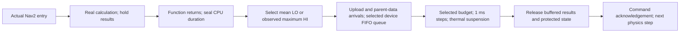

# Live Nav2 heterogeneous scheduling bridge

One real Nav2 stack is coupled to a modeled vehicle (one A7) and 25 independent RSUs (one A15 each). Placement is selectable as `local`, `offload`, `random` or minimum-temperature `greedy`, while every device uses FIFO / shortest predicted finish queues. The original ROS namespace is preserved when a job executes remotely. The accepted circuit, navigation algorithms and 0.001 s common physics/hardware lattice remain unchanged. Current thermal and DVFS settings are specified below. Actual callbacks create jobs. No periodic or aperiodic arrivals are invented by the live scheduler.

## Current budget contract

All eleven existing primary task families have **HI task criticality**. The full-course protocol first runs three local calibration laps using sealed measured CPU demand directly at the middle operating point. It pools their samples once to obtain the two fixed comparison budgets:

$$C_i^{LO}=\frac{1}{N_i}\sum_{n=1}^{N_i}c_{i,n},\qquad C_i^{HI}=\max_{1\le n\le N_i}c_{i,n}.$$

Here c is inclusive HOST thread-CPU time, expressed in seconds. The [CSV](evidence/dual-budget-parameters.csv) and [JSON](evidence/dual-budget-parameters.json) retain sample counts, nominal periods, observed intervals and descriptive CPU quantiles. The earlier 57-mission characterization remains historical evidence; its budgets are replaced only after the three new calibration laps finish. Q95 is not an active live execution budget.

Let a_j be the measured host algorithm CPU duration of a newly computed job, before releasing its buffered results. Its selected reference budget is

$$B_j=\begin{cases}C_i^{LO},&a_j\le C_i^{LO},\\C_i^{HI},&a_j>C_i^{LO}.\end{cases}$$

Equality selects LO. The comparison occurs before rounding, using seconds converted from CLOCK_THREAD_CPUTIME_ID nanoseconds. Wall time, blocked waiting, cooling and renderer time are not comparison inputs. Adapter RPC and output-copy CPU are excluded. Deferred transmission and adapter cleanup happen after the algorithm measurement and are not included in a_j. Calibration and comparison use the same sealed algorithm boundary. Host CPU samples remain empirical observations under the recorded workload and instrumentation.

LO/HI here labels the **selected job budget**, not a change to the task's HI criticality. Selection is per job; a subsequent job can select LO again. There are no synthetic LO tasks, global criticality-mode switching, task dropping or recovery policies yet.

A new actual sample can exceed the recorded maximum. In that case the requested HI maximum is still selected and `observed_max_exceeded` is recorded explicitly. No maximum is silently increased or presented as a certified bound.

The active per-family numerical table is the linked CSV/JSON. The full-course report records its frozen values and hashes alongside the per-run results.

## Equivalent work and target timing

The existing virtual reference is f_ref = 1000 MHz and eta_ref = 1. For the selected budget:

$$W_j=B_j f_{ref}\eta_{ref},\qquad C_{j,k}=\frac{W_j}{f_k\eta_k},\qquad n_{j,k}=\left\lceil\frac{C_{j,k}}{0.001}\right\rceil.$$

W is in million equivalent cycles when frequency is in MHz. Both the actual sample and the LO threshold scale by the same positive factor, so comparing them before target conversion preserves the LO/HI decision. In the current placement comparison A7 uses 1200 MHz / eta 1, and A15 uses 1500 MHz / eta 1.8. The deadline reference uses the maximum A15 point, 2000 MHz / eta 1.8. These are model conversion inputs, not measured laptop clock counters. Nominal T remains timing metadata and does not scale with target frequency.

The selected HI budget is the **total** budget, not C_LO + C_HI. Every job starts with exactly its selected demand. The duration formula above applies at a fixed operating point. With variable DVFS, completion uses the work integral described in [DVFS semantics](live-dvfs.en.md); cooling adds elapsed suspension without consuming remaining work.

A scheduler can select one of five paired frequency/voltage levels separately for each active 1 ms interval of the same job. An omitted selection uses maximum frequency and voltage. The current system reaction boosts every core of the device to its own maximum paired point when any HI-budget job consumes its LO work. It persists until the last active overrun job finishes, including through cooling pauses. Other devices continue their normal policy. This reaction is independent of placement and per-device queue assignment. There is no global mode or task-dropping policy. Power and temperature use the chosen operating point.

## Current deadline contract

$T_i$ is the native activation period, in seconds, and remains unchanged across processor types. A release rate in Hz gives $T_i=1/h_i$. CPU clock frequency converts normalized work to service time; it does not rescale the native release period.

For a task family, $W_i^{HI}=C_{i,ref}^{HI}(1000\,\mathrm{MHz})(1)$ and $D_i=U_iW_i^{HI}/[(2000\,\mathrm{MHz})(1.8)]$, where $U_i\sim\mathcal U(1.1,1.3)$. A job's absolute deadline is its actual entry time plus this relative deadline. Queueing, communication, dependencies, temperature and cooling are excluded from deadline construction. Sampled values are saved once and reused for all four policies; there is no period-based deadline adjustment.

## Compute, seal, schedule, release

1. An actual instrumented Nav2 work unit enters and creates a job.
2. The installed Nav2 function computes on the host. Its outgoing topic messages are copied into owned serialized buffers; service responses are deep-copied. The original function returns before budget selection.
3. The adapter seals the actual CPU measurement. The broker rejects a stage request without this seal, selects LO or HI, and records both the sample and selected equivalent work.
4. A staged job becomes eligible after its task upload and every selected parent-data transfer arrive. Parent data cannot be sent before modeled parent completion. The selected device maps eligible jobs in FIFO order to the core queue with the smallest predicted finish time. Only the eligible head of a free core queue starts; arrivals do not preempt running work.
5. The selected budget executes on the common lattice. Whole-device cooling suspends all cores of the selected device and blocks its result release.
6. At the modeled finish, all eligible gates are released before the next physics step. At a full-course finish or requested cutoff, physics stays frozen until released outputs commit and active host computations quiesce; incomplete modeled jobs remain censored. The adapter flushes the buffered topic/service results and commits the protected shared state. Full-course completion requires a successful native action, all 20 ordered targets, checkpoint proximity and final-goal proximity; a distance threshold alone cannot certify a full lap. The action-completion timestamp and the final drained observation timestamp are retained separately. Transport reception of the final command is acknowledged before physics advances.



For job j, with actual entry r_j, sealed-computation time b_j, task-upload arrival u_j and parent-data arrivals a_pj:

$$A_j=\max\left(r_j,b_j,u_j,\max_{p\in pred(j)}a_{pj}\right),\qquad S_j\ge A_j.$$

The FIFO queue policy orders newly eligible jobs by (A_j, r_j, job ID). Blocked children occupy no core. A predicted queue finish includes running remaining work, previous reservations and the new job's service at the selected point. Equal predictions use core ID. Future thermal pauses are not predicted, but all actual thermal guards are enforced.

Local-map writes retain their actual map mutex until modeled release. Noise-buffer commits retain their protected ownership through the gate; inline reset regeneration remains deferred. The planner map-copy section uses the native costmap lock, but NavFn clears the start cell before acquiring that copy lock. Exact provenance for the complete global grid is therefore not established; the graph does not invent a whole-grid version from callback order. Same-thread path installation and mutually exclusive component callbacks complete their gates before the next work unit can consume their state. Nested same-thread work remains charged within the primary body rather than as an additional independent job.

Action requests are control triggers, not delivered computational results. Their exact goal UUID records the producing BT job; planning children still cannot dispatch before that parent completes. An action server can send a cached planning result from a different ROS executor thread. The adapter binds that response to its exact result-request UUID and producing planning job, then withholds it until the producer has finished its selected budget and committed its buffered outputs. This prevents a cached result from bypassing the computation gate.

A publication interval is opened in the broker before DDS sends the message and sealed immediately afterward. A racing subscription take waits for that interval to close, then binds its exact source timestamp; transport reception cannot outrun producer registration.

DDS/input fingerprints, selected map/noise state and installed path IDs establish the implemented job dependencies. Exact TF versions and every framework callback are not modeled. Unresolved/external inputs remain counted rather than assigned invented parents. The broker does not claim deterministic native-thread replay or an instruction-level RTOS emulator.

Policy and communication hooks, RSU placement and device-specific thresholds are documented in [extension interfaces](scheduling-interfaces.en.md). The local policy does not offload; the other placement policies use the same execution engine and a separately replaceable task-upload / parent-edge cost pair.

## Native algorithm clocks

Physics and modeled hardware advance on the same acknowledged 1 ms clock. Instrumented `rclcpp::Rate` waits and selected native timers use that clock. The installed behavior-tree `RateController` also requires explicit treatment: its high-resolution clock resolves to the host system clock on this installation. A scoped interposer supplies simulation time only to calls made directly by the original rate-controller plugin during its `tick`; middleware timestamps, ordinary host clocks and thread-CPU measurements keep their native domains.

The installed-plugin regression fixture verifies that 1.15 host seconds with physics frozen do not trigger a second child tick, 0.999 simulation seconds do not trigger it, and 1.000 simulation seconds do. This corrects the internal 1 Hz replanning gate identified in the historical pilot. The optional TF timing audit remains a native pass-through observer and is disabled during the campaign. It does not assign invented TF producer versions to the task graph.

Each physics step waits for host calculations to quiesce, released results to commit, the actuator command to be acknowledged, and the new ground-truth pose to arrive. Native middleware and OS activity are not an instruction-level deterministic replay; observed callback arrivals, clock pairs and source timestamps are retained for audit.

## Thermal and motion semantics

Ambient and initial core temperatures are 45 degrees C. Any core reaching Tmax = 46.2 degrees C suspends the whole vehicle device; the core resumes only after all are at or below Tbalance = 45.6 degrees C. Ordinary idle powers are A7 0.05 W / A15 0.15 W; cooling powers are A7 0.005 W / A15 0.015 W. The coupled RC model is advanced each 1 ms step. Thermal guards precede output delivery at coincident ticks.

Cooling withholds new computation results and commands. Gazebo's actuator retains its last applied command and physics continues. A moving vehicle during cooling is therefore possible. The low-level motor actuator is not one of the eleven modeled CPU task families.

The live Gantt uses 2 s windows and displays per-core modeled temperatures. For edge-enabled trials it also displays the latest executing RSU, labelled with its actual endpoint ID; this view is separate from the four-nearest-RSU recordings, which select their panels by geometric proximity and show each actual endpoint ID. The following camera remains approximately 0.75 m behind the vehicle. Full-course publication maps native camera frames through recorded monotonic/physics clock pairs to 8x simulation-time playback; historical previews retain their original host-playback labels. Earlier Q95 preview evidence is retained in the [historical report](live-bridge-q95.en.md).

## Retained smoke verification and reproduction

The sealed-budget verification preceding the DVFS update is `artifacts/live-bridge/dual-budget-smoke-04`, recorded with Tmax = 46.2 degrees C. Four bounded development trials were run while correcting output release and producer registration; this is functional verification, not a statistical comparison of policies. The final vehicle traveled 3.406654 m during 8 s of active simulation, with no navigation abort. Two newly staged jobs remain uncompleted at the deliberate cutoff; all completed jobs finished their output commits before shutdown.

| Check | Result |
| --- | ---: |
| Active simulation interval (s) | 8.0 |
| Initialization + active clock pairs | 14000 |
| Actual-entry / sealed jobs | 1033 |
| Completed / committed jobs | 1031 |
| LO / HI budget selections | 952 / 81 |
| Verified selected dependency edges | 811 |
| Output-release events at exact selected finish | 666 |
| Unresolved selected input bindings | 0 |
| Cooling entries / exits | 13 / 13 |
| Validation errors | 0 |
| Unit tests passed | 56 |

The retained sealed-budget short-trial [validation](figures/dual-budget-bridge/validation.json), [per-task results](figures/dual-budget-bridge/task-summary.csv) and [applied Gantt](figures/dual-budget-bridge/applied-gantt.png) report the measured LO/HI selections and output timings. A finite smoke trial demonstrates the local bridge contract, not full-course success or a formal hard-deadline guarantee.

```bash
source scripts/environment.sh
python3 scripts/build_live_bridge.py
python3 scripts/run_live_bridge.py --seconds 8 --output artifacts/live-bridge/<new-trial>
python3 scripts/analyze_placement_trial.py artifacts/live-bridge/<new-trial>
python3 -m unittest discover -s tests
python3 scripts/verify_frozen_scene.py
```

Each new trial snapshots the launch configuration, hardware configuration and task budget table. Raw protocol, live events, jobs, CPU measurements, transmission rows and clock pairs stay together under ignored `artifacts/live-bridge` or `artifacts/placement-comparison`. Use `analyze_placement_trial.py` for schema 4 edge-enabled traces; the earlier analyzer remains available for historical schemas. Socket/shared-clock files live under /tmp. Historical raw characterization CSVs are preserved. Scene geometry is unchanged. Commit and push remain manual.


## Retained local policy/RSU preview

The retained bounded preview is `artifacts/live-bridge/rsu-policy-8x-01`, using the current vehicle thresholds (46.2 / 45.6 °C), the replaceable FIFO policy at maximum DVFS and 25 RSUs. It travels 11.010419 m in 26.580 s of active simulation and passes one checkpoint, with no navigation abort. The historical GIF uses 8x host-playback timing. [Current validation](figures/current-bridge/validation.json) checks 32,658 common clock pairs, 1,627 sealed jobs, 1,366 selected dependency edges, 1,355 exact output-release events and zero unresolved selected inputs or validation errors. There are 1,621 modeled completed jobs; the remaining newly queued/running jobs are retained as incomplete at the requested distance cutoff.

Cooling occupied 21.092 s (79.353%) of this active interval, with 41 entries and 40 exits; the final cooling interval is truncated by shutdown. Actual host rendering load changes the measured per-job CPU samples used for budget selection, so this presentation run is not a controlled performance comparison against the preceding headless trials. Maximum frequency remains the baseline; no thermal optimization was enabled. All 71 unit tests pass.
