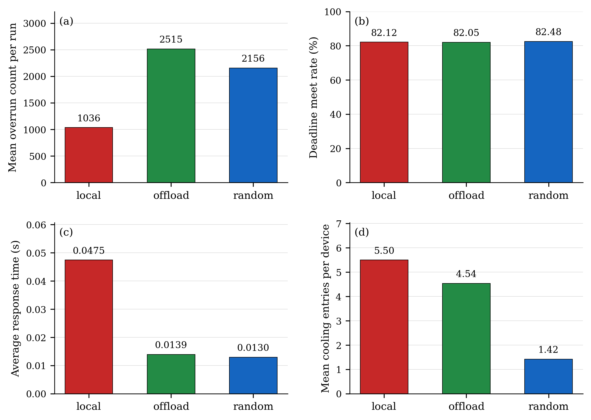
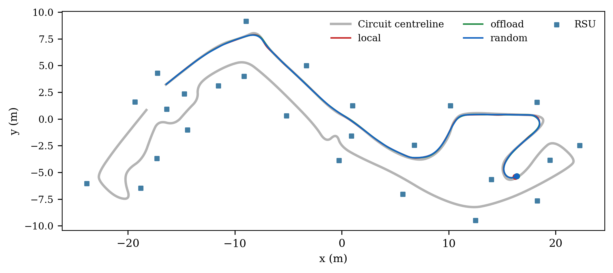

# Earlier maximum-frequency placement comparison

The three actual Nav2 runs each stop after at least 50 m of active-interval odometry travel. All runs use one vehicle and the same 25 RSUs, realized hardware parameters, relative deadline table, native navigation configuration and 1 ms physics/hardware lattice. The vehicle colour is red for `local`, green for `offload`, and blue for `random`.

## Observed results

| Policy | Distance (m) | Active time (s) | Jobs | Overruns | Deadline meet (%) | Mean response (s) | Cooling entries/device |
| --- | ---: | ---: | ---: | ---: | ---: | ---: | ---: |
| local | 50.014 | 113.446 | 10345 | 1036 | 82.117 | 0.047451 | 5.5000 |
| offload | 50.017 | 111.858 | 20513 | 2515 | 82.053 | 0.013905 | 4.5385 |
| random | 50.018 | 112.031 | 21159 | 2156 | 82.485 | 0.012982 | 1.4231 |



The stopping distance is cumulative odometry travel, not a promise of identical trajectories; completed checkpoint counts are retained in the per-run CSV. There is **one run per policy**. All three traces pass the independent work, clock, placement, dependency-transfer, core-queue and exact output-gate checks. The current unit suite passes 83 tests. Mean overrun count per run is therefore the observed run count; run-to-run variance and confidence intervals cannot be estimated. The average response is the arithmetic mean over completed jobs. [Per-run CSV](figures/placement-comparison-max-reference/per-run.csv), [policy means](figures/placement-comparison-max-reference/policy-means.csv), [vector PDF packet](figures/placement-comparison-max-reference/placement-comparison.pdf) and [inputs/hashes](figures/placement-comparison-max-reference/results.json) retain the denominators and evidence. Unfinished jobs remain in the raw CSV and are excluded from mean response, not replaced by zero.

Deadline meet rate includes completed jobs and unfinished jobs already past their absolute deadlines. Unfinished jobs not yet due are reported separately. The thermal metric is the number of **whole-device cooling entries**, divided by the fixed population of 26 devices. A sustained cooling interval counts once. This is the requested event-count metric, not a count of over-threshold temperature samples.



Recorded scheduling windows: [local](figures/placement-comparison-max-reference/local-first-window.png), [offload](figures/placement-comparison-max-reference/offload-first-window.png), [random](figures/placement-comparison-max-reference/random-first-window.png). Each window shows the vehicle and the latest executing RSU, labelled with its endpoint ID. The four nearest-RSU GIF slots in the README remain separate reserved presentation space.

## Placement and service

`local` always selects the vehicle. `offload` selects the minimum-distance RSU among those within 5 m when the job enters; it falls back to the vehicle if that set is empty. `random` chooses uniformly from the vehicle and RSUs within that same send-time range. Placement uses Gazebo ground-truth XY at the acknowledged physics tick, and remains fixed for the lifetime of the job. Coverage is not checked again on reception.

Every device maps newly eligible jobs in FIFO order to the core queue with the smallest predicted finish tick, including the new job's service on that core. The prediction uses maximum-frequency remaining service plus FIFO reservations; actual execution still obeys device-wide cooling. The prediction does not anticipate future thermal suspensions. Each core serves its reserved jobs in FIFO order without preemption or migration. Running work and every frequency/voltage pair are recorded.

For job $j$ on selected device $m_j$, actual entry $r_j$, staged computation $b_j$, task-upload arrival $u_j$, and parent-edge arrivals $a_{pj}$:

$$A_j=\max\left(r_j,b_j,u_j,\max_{p\in pred(j)}a_{pj}\right),\qquad S_j\ge A_j.$$

The data transfer $p\to j$ can be sent only after parent completion and after the child's destination is known. If the child becomes known after the parent finishes, the transmission is sent then; it is never backdated. Each selected parent must have a recorded transfer, including zero-duration same-device transfers. The existing output gate releases the buffered host result at the selected device's modeled finish. This experiment charges the **two requested transfer types** (task upload and parent-edge data); it does not add an implicit third result-return delay.

## Communication delays

Both `task_upload_cost_s(*, distance_m, task_size_bytes=None, **kwargs)` and `edge_data_cost_s(*, distance_m, edge_size_bytes=None, **kwargs)` return finite nonnegative durations in seconds and can be replaced independently through `LiveEngine(upload_cost=..., data_cost=...)`. Size values are reserved extension inputs; the present model uses distance only. There is no modeled link contention, serialization or packet loss.

| Distance $d$ (m) | Delay (s) |
| --- | ---: |
| $0\le d<1$ | 0 |
| $1\le d<2$ | 0.003 |
| $2\le d<3$ | 0.004 |
| $3\le d\le5$ | 0.005 |
| $d>5$ | 0.010 |

Same-device communication is zero. RSU-to-RSU parent data may travel farther than 5 m; the 5 m admission condition applies to the vehicle's initial task upload. Every transmission records its send-time endpoints, distance, delay and arrival tick.

## Deadlines and measurements

Each task-family vertex receives one independently sampled $U_i\sim\mathcal{U}(0.8,1.2)$. The sampled values themselves are saved and shared across the three policies. Random device choices use fresh system randomness. All clocks below use seconds.

$$D_i^*=C_i^{HI}U_i,\qquad D_i=\begin{cases}(C_i^{HI}+T_i)/2,&T_i\text{ exists and }D_i^*>T_i,\\D_i^*,&\text{otherwise.}\end{cases}$$

$C_i^{HI}$ is the extracted observed-maximum CPU budget at the declared virtual reference normalization. A job's absolute deadline is $r_j+D_i$, independent of whether it selects the LO or HI execution budget. For event-driven vertices no period adjustment is applied. The user's arithmetic rule is applied literally; if $C_i^{HI}>T_i$, the adjusted deadline can still exceed $T_i$.

| Task | $C_i^{HI}$ (s) | $T_i$ (s) | $U_i$ | $D_i$ (s) |
| --- | ---: | ---: | ---: | ---: |
| amcl_scan_callback | 0.0199390 | — | 0.8068330 | 0.0160874 |
| bt_tick | 0.0194456 | 0.0100000 | 1.1425269 | 0.0147228 |
| collision_check | 0.0135562 | — | 1.1549523 | 0.0156568 |
| control_iteration | 0.0306778 | 0.0500000 | 0.8546781 | 0.0262196 |
| controller_path_install | 0.0023685 | — | 0.8217257 | 0.0019463 |
| global_costmap_update | 0.0099746 | 1.0000000 | 1.0061503 | 0.0100359 |
| local_costmap_update | 0.0076756 | 0.2000000 | 1.0821644 | 0.0083063 |
| mppi_noise_generation | 0.0152440 | — | 1.0316927 | 0.0157271 |
| planning_request | 0.0818079 | — | 1.1808510 | 0.0966029 |
| velocity_command_callback | 0.0038324 | — | 1.0854853 | 0.0041600 |
| velocity_smoothing_tick | 0.0162255 | 0.0500000 | 0.9761868 | 0.0158391 |

A job selects the measured-mean LO work if its sealed actual CPU time is at or below that mean, otherwise the observed-maximum HI work. An overrun is counted once when an HI-selected job consumes its LO-equivalent work; the remaining work uses maximum DVFS. All task families retain HI criticality. Task arrivals remain actual callback entries, not a synthetic periodic generator. Measured host CPU samples and navigation-triggered arrivals can differ between the three runs, so this experiment describes the closed-loop policies rather than a replay of an identical job stream.

## Reproduction and retained evidence

```bash
source scripts/environment.sh
python3 scripts/build_live_bridge.py
python3 scripts/run_live_bridge.py --placement offload --distance 50 --seconds 600 --deadline-file config/task_deadlines.json --output artifacts/placement-comparison/<new-trial>
python3 scripts/analyze_placement_trial.py artifacts/placement-comparison/<new-trial>
# Run all three policies with shared saved hardware and deadlines:
python3 scripts/run_placement_comparison.py artifacts/placement-comparison/<new-campaign>
python3 scripts/report_placement_comparison.py artifacts/placement-comparison/<new-campaign>
```

The campaign uses a single explicit hardware realization in its saved `hardware.json`; supply `--hardware-config` with that file to reuse exactly those physical values. Each trial retains immutable inputs, original protocol/clock logs, all jobs, all transfers, per-device cooling counts and validation JSON under ignored `artifacts/placement-comparison/50m-01`. Original characterization CSVs remain intact. The route and navigation map are unchanged.
