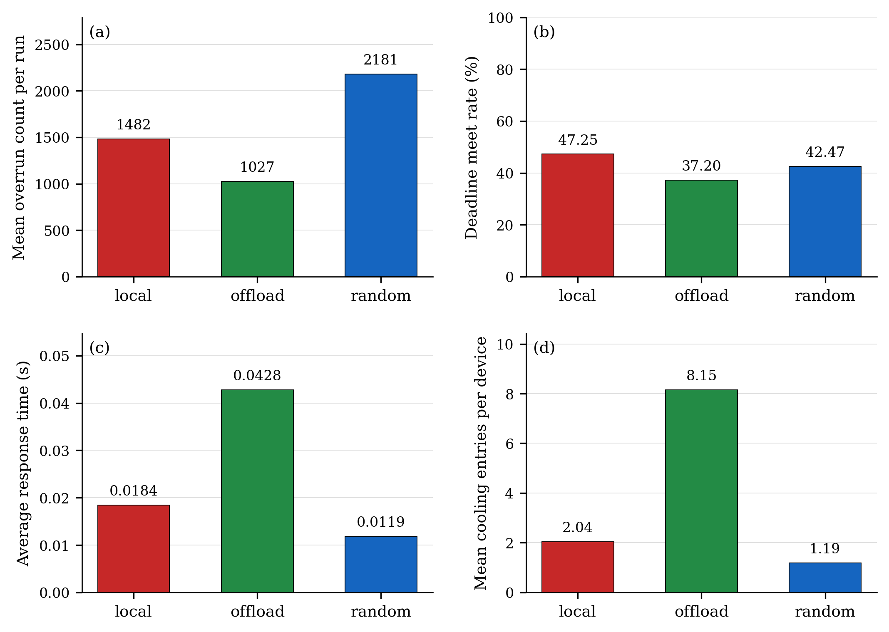
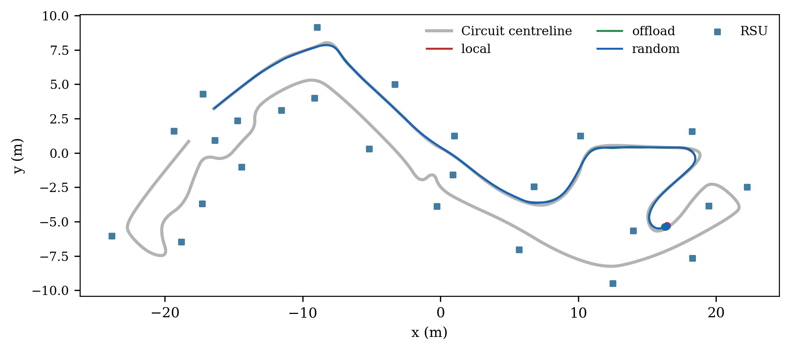
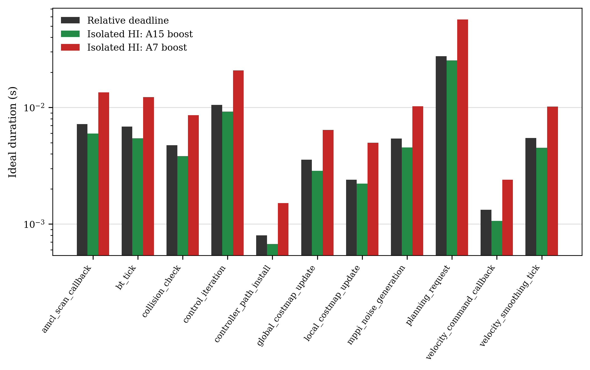

# Placement comparison on the fixed Monaco circuit

The three actual Nav2 runs each stop after at least 50 m of active-interval odometry travel. All runs use one vehicle and the same 25 RSUs, realized hardware parameters, relative deadline table, native navigation configuration and 1 ms physics/hardware lattice. The vehicle colour is red for `local`, green for `offload`, and blue for `random`.

## Observed results

| Policy | Distance (m) | Active time (s) | Jobs | Overruns | Deadline meet (%) | Mean response (s) | Cooling entries/device |
| --- | ---: | ---: | ---: | ---: | ---: | ---: | ---: |
| local | 50.024 | 111.908 | 18318 | 1482 | 47.248 | 0.018428 | 2.0385 |
| offload | 50.014 | 112.675 | 11963 | 1027 | 37.198 | 0.042780 | 8.1538 |
| random | 50.006 | 111.797 | 22350 | 2181 | 42.467 | 0.011879 | 1.1923 |



The stopping distance is cumulative odometry travel, not a promise of identical trajectories; completed checkpoint counts are retained in the per-run CSV. These are **pilot runs**: a confirmed internal HOST-clock path in the replanning decorator affects workload timing. See the [diagnostic analysis](placement-diagnosis.en.md) before interpreting an algorithm ranking. There is **one run per policy**. All three traces pass the independent work, clock, placement, dependency-transfer, core-queue and exact output-gate checks. The current unit suite passes 89 tests. Mean overrun count per run is therefore the observed run count; run-to-run variance and confidence intervals cannot be estimated. The average response is the arithmetic mean over completed jobs. [Per-task metrics](figures/placement-comparison/task-family-metrics.csv), [per-run CSV](figures/placement-comparison/per-run.csv), [policy means](figures/placement-comparison/policy-means.csv), [vector PDF packet](figures/placement-comparison/placement-comparison.pdf) and [inputs/hashes](figures/placement-comparison/results.json) retain the denominators and evidence. Unfinished jobs remain in the raw CSV and are excluded from mean response, not replaced by zero.

Deadline meet rate includes completed jobs and unfinished jobs already past their absolute deadlines. Unfinished jobs not yet due are reported separately. The thermal metric is the number of **whole-device cooling entries**, divided by the fixed population of 26 devices. A sustained cooling interval counts once. This is the requested event-count metric, not a count of over-threshold temperature samples.



Recorded scheduling windows: [local](figures/placement-comparison/local-first-window.png), [offload](figures/placement-comparison/offload-first-window.png), [random](figures/placement-comparison/random-first-window.png). Each window shows the vehicle and the latest executing RSU, labelled with its endpoint ID. The four nearest-RSU GIF slots in the README remain separate reserved presentation space.

## Placement and service

`local` always selects the vehicle. `offload` selects the minimum-distance RSU among those within 5 m when the job enters; it falls back to the vehicle if that set is empty. `random` chooses uniformly from the vehicle and RSUs within that same send-time range. Placement uses Gazebo ground-truth XY at the acknowledged physics tick, and remains fixed for the lifetime of the job. Random placement has no affinity to parent devices: a child may independently select a different covered RSU. Coverage is not checked again on reception.

Every device maps newly eligible jobs in FIFO order to the core queue with the smallest predicted finish tick, including the new job's service on that core. The prediction uses remaining service at the configured operating point plus FIFO reservations; actual execution still obeys device-wide cooling. The prediction holds the currently selected rate and does not anticipate future thermal suspensions or boost transitions. Each core serves its reserved jobs in FIFO order without preemption or migration. Running work and every frequency/voltage pair are recorded.

For job $j$ on selected device $m_j$, actual entry $r_j$, staged computation $b_j$, task-upload arrival $u_j$, and parent-edge arrivals $a_{pj}$:

$$A_j=\max\left(r_j,b_j,u_j,\max_{p\in pred(j)}a_{pj}\right),\qquad S_j\ge A_j.$$

The data transfer $p\to j$ can be sent only after parent completion and after the child's destination is known. If the child becomes known after the parent finishes, the transmission is sent then; it is never backdated. Each selected parent must have a recorded transfer, including zero-duration same-device transfers. The existing output gate releases the buffered host result at the selected device's modeled finish. This experiment charges the **two requested transfer types** (task upload and parent-edge data); it does not add an implicit third result-return delay.

## Communication delays

Both `task_upload_cost_s(*, distance_m, task_size_bytes=None, **kwargs)` and `edge_data_cost_s(*, distance_m, edge_size_bytes=None, **kwargs)` return finite nonnegative durations in seconds and can be replaced independently through `LiveEngine(upload_cost=..., data_cost=...)`. Size values are reserved extension inputs; the present model uses distance only. There is no modeled link contention, serialization or packet loss.

| Distance $d$ (m) | Delay (s) |
| --- | ---: |
| $0\le d<1$ | 0 |
| $1\le d<2$ | 0.003 |
| $2\le d<3$ | 0.004 |
| $3\le d\le5$ | 0.005 |
| $d>5$ | 0.010 |

Same-device communication is zero. RSU-to-RSU parent data may travel farther than 5 m; the 5 m admission condition applies to the vehicle's initial task upload. Every transmission records its send-time endpoints, distance, delay and arrival tick.

## Deadlines and measurements

The vehicle has **one A7** and every RSU has **one A15**. Normal execution uses the middle paired point: A7 **1200 MHz / 1.0 V**, A15 **1500 MHz / 1.2 V**. At an HI-selected job's first LO-work crossing, a **system reaction** boosts every core of its device to its own maximum paired point. The device returns to normal selection after its last active overrun job finishes. This active set survives cooling pauses, and other devices are unaffected. This reaction is identical for all three algorithms; it does not alter placement or FIFO order. With one core per device, the shared FIFO/shortest-finish policy reduces to that device's FIFO queue.

The extracted $C_{i,ref}^{LO}$ and $C_{i,ref}^{HI}$ are reference CPU-time samples in seconds, not A7 execution times. The declared normalization uses $f_{ref}=1000$ MHz and $\eta_{ref}=1$. Thus normalized work and ideal execution time are

$$W_i^{HI}=C_{i,ref}^{HI}f_{ref}\eta_{ref}\quad[\text{Mcycles}],\qquad E_i(m,q)=\frac{W_i}{f_{m,q}\eta_m}\quad[\text{s}].$$

The fastest A15 reference is $f_{A15,max}=2000$ MHz and $\eta_{A15}=1.8$. Each task-family vertex receives one independently drawn $U_i\sim\mathcal{U}(1.1,1.3)$; the actual draws are saved and shared across policies. Random device choices use fresh system randomness. Relative and absolute deadlines are

$$D_i=U_i\frac{W_i^{HI}}{2000\cdot1.8},\qquad d_j=r_j+D_i.$$

For an isolated HI-selected job starting at the normal middle point and triggering its own device boost, ideal continuous service (without waiting, communication, cooling or tick rounding) is

$$E_i^{HI,boost}=\frac{W_i^{LO}}{f_{mid}\eta}+\frac{W_i^{HI}-W_i^{LO}}{f_{max}\eta}.$$

Another active overrun on the same multicore device may boost a job sooner. The current devices each have one core. For A15 HI jobs, meeting the assigned deadline depends on the initial LO phase, transfer and waiting. A7 is slower even at its maximum point than the maximum-A15 deadline reference. The deadline remains independent of the overrun reaction.

This calculation excludes **queueing, dependencies, transfers, temperature and cooling**. It always uses HI work, even when a job selects LO work. It is not rounded to a physics tick and is not capped by $T_i$. Completion is observed on the 0.001 s lattice and compared against the unrounded absolute deadline. In particular, path-install deadlines are below one tick: any positive-work job of that family needs at least one execution tick and therefore cannot meet D, even before transfer or waiting. The experiment keeps these requested values unchanged.

$T_i$ is the fixed activation period in seconds. A configured release rate $h_i$ in Hz gives $T_i=1/h_i$; it is unrelated to the processor's clock frequency. For a target core, $T_i f_{m,q}10^6$ expresses the same interval in cycles; dividing by that same clock recovers $T_i$. Changing CPU frequency changes service time, not the ROS release period. Event-driven tasks retain no assumed period. The declared normalization is an abstract work model, not measured physical ARM instruction cycles.



[Full LO/HI work, per-processor timing and period-cycle conversions](figures/placement-comparison/task-timing-units.csv).

| Task | $C_{i,ref}^{HI}$ (s) | $W_i^{HI}$ (Mcycles) | Ideal max A15 HI (s) | $T_i$ (s) | $U_i$ | $D_i$ (s) |
| --- | ---: | ---: | ---: | ---: | ---: | ---: |
| amcl_scan_callback | 0.0199390 | 19.93900 | 0.0055386 | — | 1.2981957 | 0.0071902 |
| bt_tick | 0.0194456 | 19.44560 | 0.0054016 | 0.0100000 | 1.2683894 | 0.0068513 |
| collision_check | 0.0135562 | 13.55620 | 0.0037656 | — | 1.2594020 | 0.0047424 |
| control_iteration | 0.0306778 | 30.67780 | 0.0085216 | 0.0500000 | 1.2353820 | 0.0105274 |
| controller_path_install | 0.0023685 | 2.36850 | 0.0006579 | — | 1.2154420 | 0.0007997 |
| global_costmap_update | 0.0099746 | 9.97460 | 0.0027707 | 1.0000000 | 1.2883217 | 0.0035696 |
| local_costmap_update | 0.0076756 | 7.67560 | 0.0021321 | 0.2000000 | 1.1258370 | 0.0024004 |
| mppi_noise_generation | 0.0152440 | 15.24400 | 0.0042344 | — | 1.2785814 | 0.0054141 |
| planning_request | 0.0818079 | 81.80790 | 0.0227244 | — | 1.2093935 | 0.0274828 |
| velocity_command_callback | 0.0038324 | 3.83240 | 0.0010646 | — | 1.2495472 | 0.0013302 |
| velocity_smoothing_tick | 0.0162255 | 16.22550 | 0.0045071 | 0.0500000 | 1.2159897 | 0.0054806 |

A job selects the measured-mean LO work if its sealed actual CPU time is at or below that mean, otherwise the observed-maximum HI work. All task families retain HI criticality. Task arrivals remain actual callback entries. Measured host CPU samples and navigation-triggered arrivals can differ between the three runs, so this experiment describes the closed-loop policies rather than a replay of an identical job stream. Counts, completed-job response and deadline denominators are all retained per task family. [LO/HI deadline metrics](figures/placement-comparison/budget-mode-metrics.csv) retain the selected-budget split.

### Why the earlier aggregate rates were similar

The [earlier experiment](placement-comparison-max-reference.en.md) used different hardware, maximum DVFS and reference-time deadlines. Its aggregate rates (82.117%, 82.053%, 82.485%) hid large per-task differences. Path-install deadline meet rates were 89.964% / 0% / 5.944% for local / offload / random, while control rates were 87.147% / 95.093% / 98.273%. BT job counts were 3,834 / 8,635 / 9,182. Therefore similar weighted aggregate rates did not imply similar per-family timing. The new experiment supersedes those settings, and the earlier evidence remains separately retained.

## Reproduction and retained evidence

```bash
source scripts/environment.sh
python3 scripts/build_live_bridge.py
python3 scripts/run_live_bridge.py --placement offload --distance 50 --seconds 600 --deadline-file config/task_deadlines.json --output artifacts/placement-comparison/<new-trial>
python3 scripts/analyze_placement_trial.py artifacts/placement-comparison/<new-trial>
# Run all three policies with shared saved hardware and deadlines:
python3 scripts/run_placement_comparison.py artifacts/placement-comparison/<new-campaign>
python3 scripts/report_placement_comparison.py artifacts/placement-comparison/<new-campaign>
```

The campaign uses a single explicit hardware realization in its saved `hardware.json`; supply `--hardware-config` with that file to reuse exactly those physical values. Each trial retains immutable inputs, original protocol/clock logs, all jobs, all transfers, per-device cooling counts and validation JSON under ignored `artifacts/placement-comparison/50m-mid-device-boost-01`. Original characterization CSVs remain intact. The route and navigation map are unchanged. Mission progress files retain historical hard-coded scheduler/communication labels; the immutable `trial-config.json`, executed jobs and transfer records establish the actual settings. Future mission summaries read those labels from the trial configuration. The 50 m observation bound intentionally interrupts the full-course action; its `Interrupted` marker is not a navigation failure. The earlier constant-middle cohort is superseded and excluded from these statistics; its original raw traces remain in a separate campaign directory. The cutoff freezes physics while already released outputs finish committing; incomplete modeled jobs are never forced to finish.
