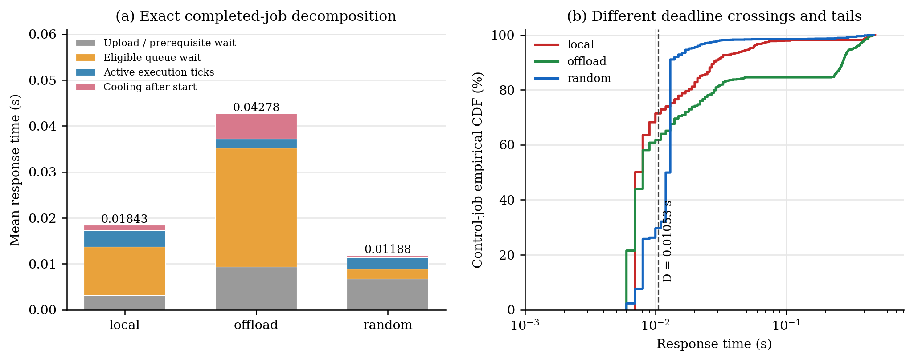

# Diagnosis of the three 50 m placement trials

These are **pilot observations, not a validated final ranking of placement algorithms**. The recorded arithmetic is reproducible, but a confirmed internal HOST-clock leak affects workload generation. The previous audit verifies physics/hardware clock equality, FIFO execution, selected dependencies, communication and output gates; it does not establish that every native Nav2 clock follows simulation time.

This diagnosis uses the existing `50m-mid-device-boost-01` traces only. No new simulation or policy change was made. [Summary CSV](figures/placement-diagnosis/summary.csv), [task breakdown](figures/placement-diagnosis/task-breakdown.csv), [device breakdown](figures/placement-diagnosis/device-breakdown.csv) and [clock evidence with input hashes](figures/placement-diagnosis/clock-audit.json) retain the calculations. Each policy has one run, so no causal ranking or run-to-run uncertainty estimate is available.

## 1. Confirmed defect: the replanning decorator retains HOST time

The unchanged behavior tree contains `RateController hz="1.0"`. The installed `rate_controller.hpp` stores a `std::chrono::high_resolution_clock` time point. Disassembly of the installed `libnav2_rate_controller_bt_node.so` shows `RateController::tick()` calling `std::chrono::_V2::system_clock::now()` at instruction address `0x10500`. The bridge does not override that function or define `clock_gettime`; its built shared library imports the host `clock_gettime`.

The bridge translates the native `rclcpp::Rate::sleep()` cadence and the velocity smoother's steady timer, but that does not translate the decorator's separate chrono clock. Consequently, freezing physics during real computations does not freeze this decorator's elapsed time. This is a clock-domain defect for an experiment that intends a common simulation-time rate, even though recorded Gazebo and hardware clocks remain equal.

| Policy | Planner requests | Mean observed planner interarrival in SIM seconds |
| --- | ---: | ---: |
| local | 481 | 0.233142 |
| offload | 326 | 0.346258 |
| random | 585 | 0.191223 |

Planner requests are action/event jobs, not a proven strictly periodic task. Their intervals also depend on feedback, completion and BT state; the table does not identify the precise contribution of the clock leak. The confirmed HOST-clock path means that host runtime can influence the workload and that common-rate semantics have not been fully established. A corrected comparison requires auditing such internal timeouts/rate gates, then new runs. Reusing current results cannot establish what the corrected ranking would be.

## 2. The response-time arithmetic is internally consistent

For each completed job, let $r$ be actual entry, $A$ eligibility after staging/upload/parents, $S$ execution start, and $F$ result release. The exact accounting is

$$R=F-r=(A-r)+(S-A)+E_{ticks}+H_{exec}.$$

Here $E_{ticks}$ sums recorded active execution intervals, and $H_{exec}$ is execution-device cooling between $S$ and $F$. In these traces, there is no residual post-computation delay beyond this decomposition. The queue term includes cooling while the job waits; prerequisite waiting can also inherit a parent's cooling. Upload and parent waiting overlap, so individual transmission durations must not simply be added again to the prerequisite term.

| Mean component, seconds | local | offload | random |
| --- | ---: | ---: | ---: |
| Upload / prerequisites, $A-r$ | 0.003144 | 0.009309 | 0.006718 |
| Eligible queue, $S-A$ | 0.010582 | 0.025841 | 0.002137 |
| Active execution ticks | 0.003530 | 0.002073 | 0.002527 |
| Cooling after execution starts | 0.001172 | 0.005557 | 0.000497 |
| **Total response** | **0.018428** | **0.042780** | **0.011879** |

Offload actually spends the least mean time in active execution. It loses that advantage in waiting. Direct cooling exposure, including queue time while the selected device is cooling, accounts for **0.028742 s / 67.19%** of its mean response. The corresponding shares are **33.83%** for local and **16.85%** for random. These percentages exclude indirect thermal delay through parents.

The mean includes completed jobs only. The full-run deadline metric also counts due unfinished jobs as misses, so the completed-job DMR column in the diagnostic task CSV is not an alternative definition of the published full-run aggregate.

## 3. Nearest placement concentrates a stream on one hot A15

At a fixed vehicle position, `offload` sends every entering family to the same nearest covered RSU, irrespective of its queue or temperature. `random` independently samples the vehicle and covered RSUs. The latter is the requested uniform policy; no queue/thermal preference was added.

| Quantity | local | offload | random |
| --- | ---: | ---: | ---: |
| Devices receiving jobs during the run | 1 | 13 | 22 |
| Sum of active core time, seconds | 64.639 | 24.791 | 56.475 |
| Sum of device cooling time, seconds | 21.465 | 66.558 | 11.103 |
| Cooling-entry events | 53 | 212 | 31 |

Device-time sums can overlap and must not be interpreted as wall duration. The random vehicle performs 22.624 active seconds with zero cooling entries, whereas the local vehicle performs 64.639 active seconds and enters cooling 53 times. These observations are consistent with distributing the load. They do not isolate a causal effect because job streams and CPU samples differ.

The configured A15 power and temperature limits also make frequent cooling unsurprising. At 45°C, modeled active A15 power is approximately **0.9341 W** at the middle point and **1.3582 W** at maximum, versus **0.15 W** ordinary idle. With the retained resistance values, idle equilibrium is approximately 45.6–45.9°C, already close to the 46.5°C threshold. For a representative $R\simeq5$ K/W, holding middle-point leakage fixed at 45°C gives $T_\infty\simeq45+5(0.9341)=49.67$°C, well above that threshold. This is an explanatory constant-power estimate; runtime leakage varies with temperature. The current realized RC time constants are fractions of a second. A15 compute speed therefore does not imply immunity to thermal pauses in this particular model.

The published thermal metric divides events by all 26 devices, including unused ones. It measures mean entries per modeled device; it is not cooling duration or the probability that an active server cools.

## 4. Some deadlines are infeasible before queueing or cooling

The requested deadline construction deliberately excludes transfers and thermal effects:

$$D_i=U_i W_i^{HI}/(2000\cdot1.8),\qquad U_i\in[1.1,1.3].$$

That choice can be used as a stress setting, but a miss need not imply poor scheduling.

* Path-install has $D=0.000799660$ s, below the 0.001 s execution lattice. Every positive-work path-install job necessarily misses.
* Velocity-command input has $D=0.001330212$ s. A 0.003 s upload already exceeds it, even before execution.
* Local-map update has $D=0.002400410$ s, also below any nonzero upload in the current observations (at least 0.003 s).

For each completed job, a conservative optimistic bound is

$$R_{min}=L_{upload}+0.001\left\lceil\frac{W_{selected}}{0.001f_{max}\eta}\right\rceil.$$

This bound gives each job maximum frequency immediately and removes every parent, queue and cooling delay. Even under that more favorable assumption, **10.57% / 34.53% / 34.88%** of completed local/offload/random jobs still cannot meet their assigned deadlines.

Under the actual single-core middle-then-maximum reaction, all **1,482 / 1,026 / 2,181 completed HI-budget jobs** also fail the isolated service-plus-upload bound. For example, HI BT on A15 requires one middle-point tick followed by five maximum-point ticks: 0.006 s active service. Its deadline is 0.006851276 s. With even a 0.003 s upload, response is at least 0.009 s. Thus the zero HI-budget DMR in all three runs has an explicit timing explanation. One additional unfinished offload job accounts for the 1,027th overrun in the full-run count.

The model still distinguishes HI **criticality** (all families) from an individual job selecting LO or HI **work**. These are not low-criticality tasks.

## 5. Raw overrun counts compare different workloads

| Quantity | local | offload | random |
| --- | ---: | ---: | ---: |
| Entered jobs | 18,318 | 11,963 | 22,350 |
| Overruns per 1,000 entered jobs | 80.90 | 85.85 | 97.58 |
| BT overruns | 1,375 | 941 | 1,987 |
| BT share of overruns | 92.78% | 91.63% | 91.11% |

Random's larger count is partly a larger workload, rather than evidence that its placement itself causes twice as many overruns. Closed-loop arrival differences are expected, but the identified HOST-clock leak is an additional confounder. Each trial also measures fresh laptop CPU demand, which controls LO/HI selection; hardware/deadline inputs alone do not make the work streams identical.

The requested two-point budget rule is strongly discontinuous. BT has $C^{LO}=0.000492936$ reference seconds and $C^{HI}=0.019445600$ reference seconds, a factor of **39.45**. A measured CPU sample only slightly above the mean selects that entire maximum work budget. About **20–21% of BT HI selections** exceed the mean by no more than 10%. This behavior follows the requested rule, but makes the experiment sensitive to laptop CPU noise around the mean. It must be acknowledged when interpreting overrun counts and thermal load.

## 6. Smaller mean response does not imply better deadline meet rate

For the same control family, $D=0.010527445$ s:

| Control-job statistic | local | offload | random |
| --- | ---: | ---: | ---: |
| Median response, seconds | 0.007 | 0.008 | 0.013 |
| Mean response, seconds | 0.020557 | 0.056786 | 0.016329 |
| P95 response, seconds | 0.053 | 0.324 | 0.018 |
| Deadline meet rate | 71.43% | 61.81% | 29.65% |

Offload often completes quickly, but a minority of very long thermal waits raises its mean. Random has a smaller tail and smaller mean, while many control jobs cluster just beyond the deadline because their upload/dependency paths cross devices. The plotted ECDF shows the actual deadline crossings, so this apparent contradiction is mathematically consistent.

Overall DMR also weights families by their actual counts. BT is numerous and relatively easy to meet in LO mode; path-install and several communication-sensitive families are systematically late. Per-family results are necessary to interpret the aggregate.

## What the current evidence supports

The executions follow their recorded model constraints, and the response/DMR/cooling arithmetic is reproducible. Offload's thermal and queue delays, random's parallel load distribution, stringent communication-blind deadlines, and the discontinuous work-selection rule explain much of the numerical pattern. **The experiment is nevertheless not ready for a final algorithm ranking while the internal clock-domain defect remains.**

The next implementation step is to audit and correct internal scheduling-relevant clocks, without silently changing the three placement algorithms, route, requested budgets or deadline formula. Subsequent comparisons should retain per-family metrics, overrun rates, cooling durations and repeated runs. A shared-input replay can separately isolate scheduler effects; actual-arrival closed-loop experiments remain useful for navigation behavior. No corrected outcome is predicted from these pilot traces.
