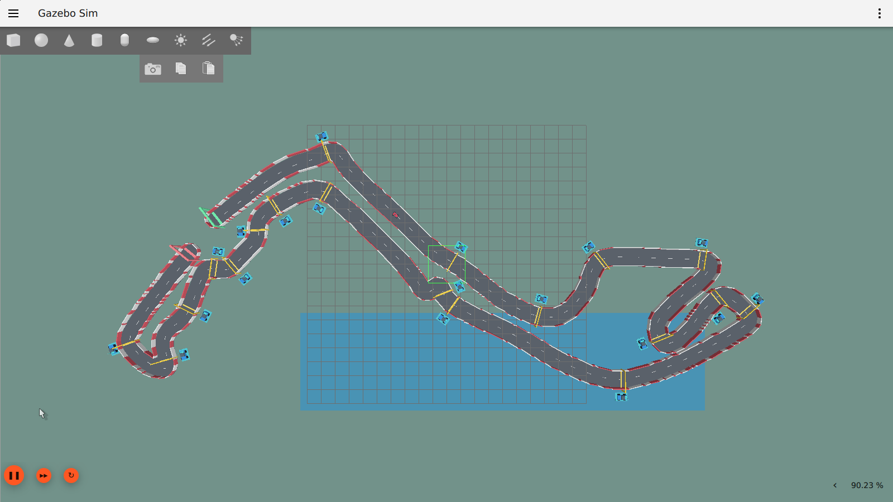
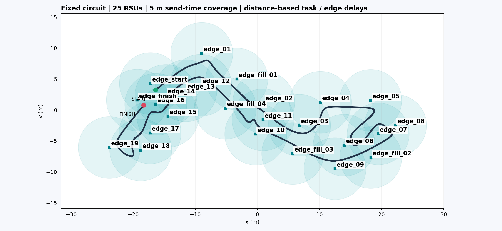

# Nav2 Monaco — Real-Time Scheduling and Modeling

Local repository: `nav2-monaco-scheduling-modeling`

A ROS 2 / Nav2 simulation foundation for scheduling experiments. The current scene is an open circuit inspired by Monaco: one moving car visits 19 turn-entry checkpoints, then a finish gate. Twenty-five static blue cabinets with antennas mark edge-server locations. The simulator runs on Ubuntu 24.04 / WSL2 with ROS 2 Jazzy, Gazebo Harmonic and RViz.

## Current implementation

The track is designed in this repository from a rough Monaco outline. The car uses the ready-made TurtleBot3 differential-drive dynamics, sensors and upstream Nav2 algorithms, with a racecar appearance. It is not an Ackermann racing-vehicle physics model. The ordered checkpoint mission uses Nav2's existing `NavigateThroughPoses` action. All checkpoints and the finish are sent as one continuous mission; intermediate gates are pass-through targets. The track uses four iterations of Chaikin corner rounding, preserving straight stretches while smoothing turns.

The [live bridge](live-bridge.en.md) connects actual Nav2 callback jobs to virtual A7/A15 scheduling and gates their outputs at modeled completion. Physics and modeled hardware share a 1 ms clock. The vehicle has one A7 and each RSU has one A15. Four placement baselines share FIFO / shortest predicted finish-time queues: local, random, nearest-covered-RSU offload and minimum-temperature greedy. Parameters are calibrated once and frozen for comparison. All current task families have HI criticality; synthetic LO tasks and a complete mixed-criticality policy remain future work. RSUs are modeled execution resources; native callback computation still runs on the host laptop.

The [current full-course comparison](full-course-comparison.en.md) completed three calibration laps and one balanced comparison block before the fixed cutoff. Each accepted policy run reached all 20 targets and passed its scheduling audit. See the repository README for current recordings and results.

## Install

On Ubuntu 24.04:

```bash
sudo bash scripts/install_wsl.sh
```

WSLg is required for graphical windows. The installer uses official ROS repositories and adds the Python packages used by the scene generator.

## Run the circuit

In a WSL terminal at the repository root:

```bash
bash scripts/launch_monaco.sh
```

This verifies the frozen world and map, launches Gazebo and RViz, spawns one moving car and loads upstream Nav2. The accepted scene is pinned by a hash manifest; the normal launcher does not regenerate it. The car initially waits at the start gate.

In a second WSL terminal:

```bash
bash scripts/run_monaco.sh
```

The mission initializes AMCL at the actual starting pose, requests all checkpoints in order and verifies the action result, zero Nav2 error code and estimated proximity to every target in order. Results are written to `artifacts/monaco-run.json`. Restart the simulation before requesting another mission: this script initializes the car at the starting pose.

To record the entire real Gazebo run instead of using the preceding mission command:

```bash
source scripts/environment.sh
python3 scripts/record_monaco.py
```

After a successful recorded mission, produce the video with a labeled map of the recorded position:

```bash
python3 scripts/render_monaco_video.py
```

This writes `artifacts/monaco-smooth-start-to-finish.gif`. The main view is the actual Gazebo recording. The inset is explicitly labeled as the AMCL estimated trajectory; target labels use recorded Nav2 feedback.

The recording wrapper requests the mission and stops capture after its result. It writes `artifacts/monaco-smooth-race-raw.gif`, recording metadata, a frozen copy of the recorded scene and the mission report. Legacy recordings have been converted to GIF; their original MP4s were removed after validation. See the publication-ready media below. Gazebo's window must retain its configured 1600 by 900 size during capture. A failed mission is reported as failed; a recording alone does not prove course completion.

Stop the simulation with Ctrl+C or:

```bash
bash scripts/stop_demo.sh
```

The graphical camera shows the entire track; yellow gates are checkpoints, green is start, red is finish, and blue cabinets are static edge locations. RViz displays the map, planning and checkpoint labels.

The simulation-only focused test `bash scripts/run_monaco.sh --from-checkpoint 9 --limit 3` repositions the car at checkpoint 9 and checks targets 10–12; it writes a separate report and is not a full race.

## Configuration and evidence

See `docs/resources-and-timing.md` for actual CPU, memory, scheduling and speed settings. See `docs/monaco-scenario.md` for geometry, changes to scenario parameters, communication options and validation. `scenarios/monaco/layout.png` is a design overview; actual screenshots and recordings are stored separately under ignored `artifacts/`.

The original official TurtleBot sandbox remains available through `scripts/launch_demo.sh` and `scripts/verify_demo.sh`. Its installation and successful navigation were recorded in `docs/setup-report.md`.

The generated racecar description, baseline Nav2 parameter file, pass-through behavior tree and Gazebo GUI template retain their upstream Apache-2.0 attribution in `scenarios/monaco/NOTICE.md` and `LICENSE.upstream`. Original project scripts and track design use the root MIT license.

## Publish later

Everything is local Git; no GitHub login is required. Create an empty public repository named `nav2-monaco-scheduling-modeling`, then use your account:

```bash
git remote add origin https://github.com/YOUR_USERNAME/nav2-monaco-scheduling-modeling.git
git push -u origin main
```

## Upstream projects

- [Navigation2](https://github.com/ros-navigation/navigation2)
- [Minimal TurtleBot simulation](https://github.com/ros-navigation/nav2_minimal_turtlebot_simulation)
- [Gazebo Sim](https://github.com/gazebosim/gz-sim)
- [ROS apt source configuration](https://github.com/ros-infrastructure/ros-apt-source)

## Task abstraction investigation

The [Persian technical study](task-abstraction-study.fa.md) separates existing frequencies, triggers and timing fields from unmeasured CPU demand and proposes a causal job DAG and controlled virtual-time result delivery for modeled CPUs. [The inspection inventory](evidence/task-abstraction-inventory.json) preserves configuration hashes and a read-only runtime graph snapshot. The original inventory is a pre-measurement snapshot. Instrumented task profiling and a standalone dependency-safe FIFO scheduler are implemented; The original profiling campaign predates the live bridge; current CPU-demand calibration and ROS result gating are documented in the full-course comparison. The [English real-time report](task-model.en.md), [PDF](task-model.en.pdf), [task statistics](evidence/task-characterization-table.csv), [per-run statistics](evidence/task-characterization-per-run.csv), and [profiling protocol](task-profiling.en.md) separate configured activation contracts from measured CPU demand and empirical intervals. The final campaign stopped before the authorized 09:00 Tehran cutoff on 2026-10-09: 59 main-cohort attempts produced 57 successful full laps, one navigation abort and one intentional cutoff truncation. The [cutoff audit](evidence/task-campaign-finalization.json) verifies shutdown and unchanged scenario hashes; the [incident record](evidence/task-campaign-incidents.json) separates navigation failure from administrative truncation.

The scheduling inputs are now [extracted parameters](extracted-parameters.en.md) ([PDF](extracted-parameters.en.pdf), [CSV](evidence/extracted-parameters.csv), [JSON](evidence/extracted-parameters.json)). The user-selected model WCET is the exact inverse empirical CDF at 95%, computed from all jobs of 57 complete missions; it is an assumed budget, not a certified bound. New diagrams use seconds and show C for every primary task and nominal T for periodic tasks. The [book-style model DAG](figures/extracted-parameters/book-style-task-dag.svg) declares atomic result delivery; the [measured dependency graph](figures/extracted-parameters/verified-job-dependencies.svg) removes CPU-order edges. Unlisted infrastructure remains pass-through background work for the initial scheduler. Reproduce without simulation: `python3 scripts/extract_task_parameters.py`.

## Independent virtual compute validation

The [standalone heterogeneous compute model](abstract-compute.en.md) supports configurable Cortex-A7/A15 operating points. The current live experiment uses one A7 per vehicle and one A15 per RSU. Its independent scheduler supports readiness, per-core serial execution and device-wide thermal cooling with retained work. Power and temperature are modeled without energy reporting or aging. The extracted task budgets and selected job graph now feed a standalone local FIFO replay. The [live bridge](live-bridge.en.md) applies the frozen dual budgets, dependency-safe scheduling, task placement, communication and thermal gating to actual Nav2 arrivals.

Run `python3 scripts/validate_abstract_compute.py` for tests and `python3 scripts/demo_abstract_compute.py` for the synthetic power/cooling demonstration. The [metric circuit map](figures/metric-map/circuit-dimensions.png) and [endpoint coordinates](evidence/metric-map-locations.csv) support subsequent coverage design.

## Frozen circuit and actual simulation

The accepted circuit has a **50.45 × 22.30 m map**, **1.30 m road width** and approximately **125.96 m centreline**. One vehicle visits nineteen checkpoints and the finish. Twenty-five blue cabinets mark edge locations, including start/finish and infill endpoints. The map, world, checkpoints and Nav2 settings are pinned and checked before launch. RSU visuals and additional endpoints are recorded separately; the circuit map, route and navigation settings are shared across comparison runs.


Earlier actual Gazebo scene, before the server cabinet visual update:



The current full-course recording combines an approximately 0.75 m chase camera, the original overview and the connected live Gantt. Temperature and actual modeled execution bars are updated from scheduling events.

**8× simulation-time playback — displayed eight times faster than simulation time.**


To run a new coupled full-course experiment, with no other Gazebo run active:

```bash
source scripts/environment.sh
python3 scripts/build_live_bridge.py
python3 scripts/run_live_bridge.py --placement local --full-course --seconds 1200 --views --output artifacts/live-bridge/new-local-full-course
```

Choose a new output directory for every trial. The [full-course report](full-course-comparison.en.md) explains the frozen calibration, comparison protocol, actual achieved repetition count and retained failure evidence. The README contains all four vehicle recordings followed by four recordings of their currently nearest RSUs. Original recordings and runtime logs stay in ignored local archives.

## Historical standalone task replay

This independent historical replay uses eleven task families and the earlier **95%-ECDF assumed WCET**; it does not describe the current live calibration. Periodic releases preserve their nominal time periods; aperiodic arrivals are explicit. The vehicle has one A7 and one A15. A job enters ready FIFO only after its release and completion of all selected parent jobs; dispatch selects the available core that became idle earliest. Power, temperature and whole-device cooling are enabled.


The [execution model and equations](task-execution.en.md), [full Gantt](figures/task-fifo/local-fifo-gantt.png), [selected job DAG](figures/task-fifo/selected-job-dag.svg), [task/clock table](evidence/modeled-task-parameters.csv), and [per-job results](evidence/task-fifo-jobs.csv) are retained. The demo uses measured callback-entry offsets and selected dependencies; it runs independently of Gazebo.

Equivalent work is normalized at an explicitly assumed 1000 MHz reference with performance factor 1. This is not a measured laptop cycle count. A task's activation Hz is distinct from the core clock; moving tasks changes modeled compute time, while their time-based release periods remain unchanged.

```bash
python3 scripts/demo_task_fifo.py
python3 -m unittest discover -s tests -v
```

The historical replay used a zero-cost communication hook. Current placement uses a **5 m task-upload radius** and separate distance-based upload and parent-data delays; see [extension interfaces](scheduling-interfaces.en.md).



Publication media and scientific figures live in `docs/` and are eligible for Git. Full local GIF archives, raw traces and runtime logs stay under ignored `artifacts/`.
