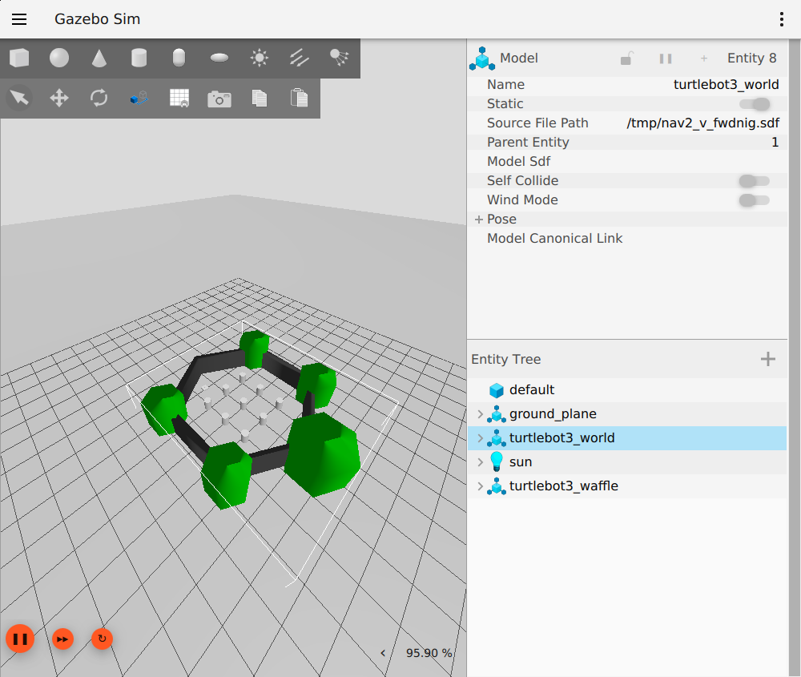
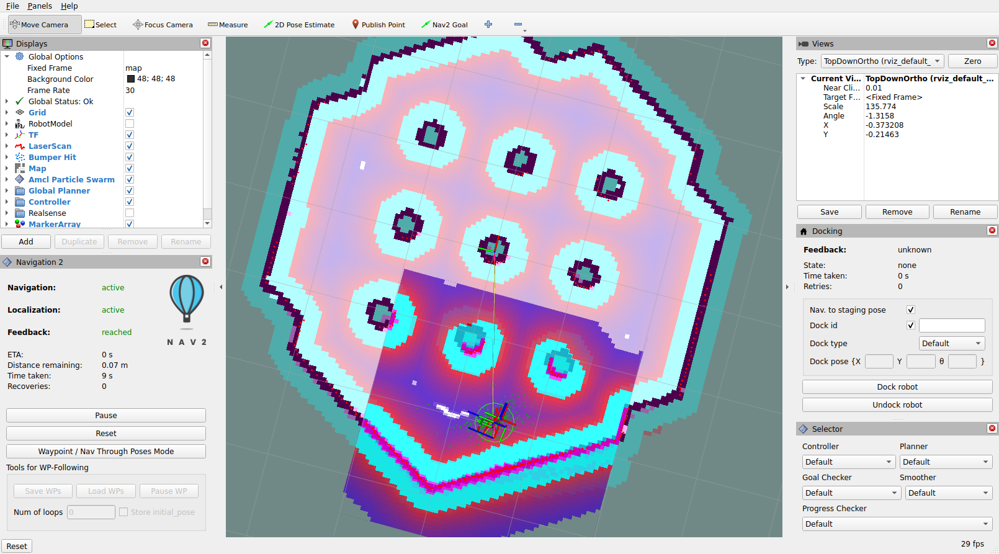

# Initial setup verification

Verified on 2026-10-09 (Asia/Tehran).

## Result

**PASS:** the official single-TurtleBot3 Nav2 sandbox ran in WSL2, both Gazebo and RViz opened through WSLg, and the robot completed a navigation goal.

This is an installation and application integration check. It is not a scheduler baseline, mixed-criticality implementation, edge-server experiment or multi-robot scenario. No performance advantage is claimed.

## What was tested

- WSL2, Ubuntu 24.04.3 LTS, ROS 2 Jazzy and Gazebo Harmonic 8.15.0.
- Gazebo physics, sensor bridge and advancing ROS simulation time.
- 68 valid laser scans and 375 odometry samples during verification.
- Active `amcl`, `map_server`, `planner_server`, `controller_server` and `bt_navigator` lifecycle nodes.
- A `NavigateToPose` action from `(-2.0, -0.5)` to `(-2.0, 0.5)` with successful status 4.
- Goal execution: 8.603 seconds of wall time.
- Odometry path length: 1.181 metres.
- Final **AMCL-estimated** position error: 0.11 metres. This is not a simulator-ground-truth accuracy measurement.

The requested goal is one metre from the start. The travelled path can be longer because the navigation controller turns and follows a feasible trajectory.

## Visual evidence

These are actual screenshots of the WSLg application windows, not designed mockups.





The simulator remains open after setup so the user can inspect it. Current screen views and robot position can differ from the first measured run.

## Reproducibility and limits

The wrapper explicitly configures existing WSLg sockets because this tool terminal did not inherit `DISPLAY` and `WAYLAND_DISPLAY`. The experiment uses ROS domain 42. The OpenGL renderer detected in this session was Mesa llvmpipe (software rendering), not GPU acceleration; rendering load must be separated from worker resources before scheduling benchmarks.

Some initial TF warnings occurred before the initial localization pose was published. The acceptance check required active lifecycle nodes, sensor data, physical odometry movement and a successful navigation action, rather than merely checking that the launch process was alive.

Nav2's upstream algorithms and default execution are used. The only display customization generated by the wrapper centers the RViz view and enables the existing robot model. A new warehouse and any game scenario have not been designed.

The user will publish the local Git repository later. No GitHub repository was created and no remote push was performed.

## Pending scenario decision

The user's intended demonstration is multiple robots visiting marked waypoint cells and reaching a final destination, using the same ready-made navigation algorithms and different scheduling policies. The environment layout, robot count, resource placement, criticality model and policies must be discussed before implementation. New artificial application tasks are not part of the agreed scope.

For actual mixed-criticality scheduling, execution budgets, deadlines and criticality labels will still need to be attached to selected existing processing chains; that does not require inventing new robot behaviours. ROS node connectivity alone is not automatically a finite job-level DAG.

## Installed package versions

```text
ros-jazzy-desktop	0.11.0-1noble.20261006.040109
ros-jazzy-gz-sim-vendor	0.0.13-1noble.20260905.073557
ros-jazzy-nav2-bringup	1.3.13-1noble.20261006.042503
ros-jazzy-nav2-minimal-tb3-sim	1.0.1-1noble.20261006.041307
ros-jazzy-navigation2	1.3.13-1noble.20260921.033624
ros-jazzy-ros-gz	1.0.24-1noble.20261006.041805
ros-jazzy-rviz2	14.1.24-1noble.20260915.204213
```

Measured summary: [navigation-verification.json](evidence/navigation-verification.json).

Commands: see the repository [README](../README.md).
