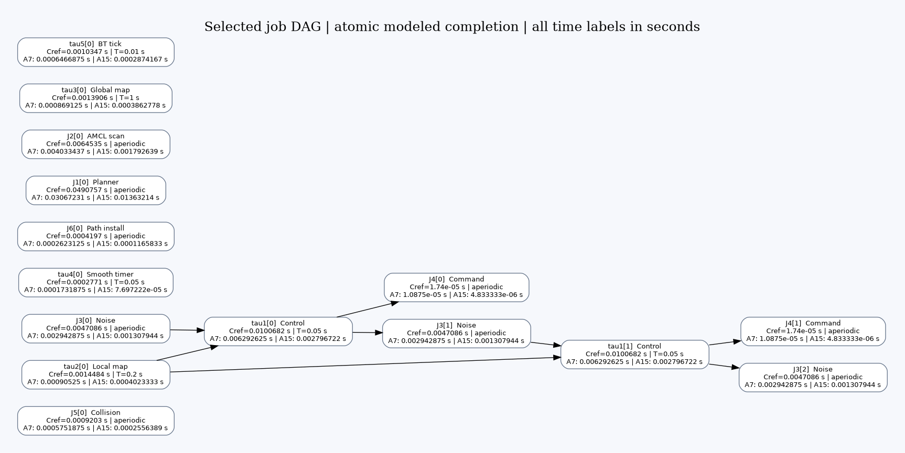

# Local heterogeneous task execution

The accepted scene is frozen. Eleven primary Nav2 work units use their exact 95%-ECDF assumed WCET from 57 complete missions. The executable model schedules concrete job dependencies on the vehicle's one A7 and one A15; server templates retain two A7 and two A15. The first baseline is local, nonpreemptive ready FIFO. The replay in this document is independent of ROS. The separate [live bridge](live-bridge.en.md) now applies these budgets to actual Nav2 outputs and advances Gazebo on the same 0.001 s clock. The current bridge uses one red vehicle and a 2 s live Gantt window.

## Timing and equivalent work

Let C_i^ref be the measured thread-CPU Q95 budget, T_i the configured periodic HOST-wall interval, f_ref a virtual reference clock, and eta_ref its performance multiplier. The default f_ref=1000 MHz and eta_ref=1 are an explicit normalization, not a measurement of laptop clock cycles or target CPU calibration.

$$W_i=C_i^{ref}\eta_{ref}f_{ref}\quad\text{(million equivalent cycles, when }f_{ref}\text{ is MHz)}.$$

At operating point ell on core k:

$$C_{i,k,\ell}=\frac{W_i}{\eta_k f_{k,\ell}},\qquad N^{exec}_{i,k}=\frac{10^6W_i}{\eta_k},\qquad N^{period}_{i,k,\ell}=10^6T_i f_{k,\ell}.$$

N denotes a continuous equivalent cycle count in this abstraction. It is not a hardware counter observation or an instruction count. Changing reference frequency scales modeled CPU demand; changing target DVFS scales duration. Frequency and voltage are resolved independently for the selected core when dispatch occurs.

$$f_i^{activation}=1/T_i,\quad T_i^{ms}=1000T_i,\quad C_i^{ms}=1000C_i^{ref}.$$

Activation Hz and processor MHz are different quantities. Periodic releases retain their time interval when a task moves between cores. Their cycle representation changes with the target clock. Aperiodic tasks have no invented T; measured mean inter-entry is exported separately, alongside explicit arrivals. All time axes and graph timing labels use seconds.

For Control, Cref=0.0100682 s, T=0.05 s, activation rate=20 Hz, W=10.0682 Mcycles. At maximum DVFS, its A7 compute budget is 0.006292625 s and its A15 compute budget is 0.002796722222 s. One period is 80,000,000 A7 clock cycles or 100,000,000 A15 clock cycles. These target durations depend on the stated reference normalization.

The complete [CSV](evidence/modeled-task-parameters.csv) and [JSON](evidence/modeled-task-parameters.json) include all eleven tasks, milliseconds, seconds, nominal activation Hz, observed mean intervals, equivalent demand, target execution budgets and target period cycles. Inclusive child scopes are not additionally charged on top of an inclusive primary budget.

## Readiness, precedence and FIFO

For job j with explicit selected parents pred(j), release r_j and actual modeled finish F_p:

$$a_j=\max\left(r_j,\max_{p\in pred(j)}F_p\right),\qquad S_j\ge a_j.$$

Only completed parents satisfy a dependency; a parent's estimated compute-only finish cannot release its child during thermal cooling. A blocked child occupies no core and reserves no future slot. Ready FIFO orders by (a_j,r_j,input order). An incoming job does not preempt a running one. Available cores are ordered by the time they most recently became idle, then core ID. This implements oldest-idle selection, rather than choosing the core with the shortest predicted finish.

Selected cached versions are explicit job IDs. A control iteration can reuse an earlier completed map; it does not wait for every new map update. Repeated noise/control feedback is unrolled into distinct jobs. Graph validation rejects unknown parents, duplicate IDs and cycles before execution.

The coarse scheduling abstraction delivers results atomically at modeled completion. Original ROS can publish or commit shared state before callback return. This is a stated abstraction, not evidence that whole-function finish-to-start ordering already holds in upstream ROS.

## Replay and figures

The example replays 15 selected measured jobs and eight matched dependencies from one trace window. Recorded callback-entry offsets are release inputs here, not exact OS-ready instants. Seven isolated representatives remain without edges; their isolation applies to this measured window. The replay spans 0.5864912185 s. It uses Q95 budgets for every job, with power and thermal behavior enabled. No cooling occurs in this short example. Thermal-precedence tests also exercise longer workloads that do enter cooling.




The [full Gantt](figures/task-fifo/local-fifo-gantt.png), [job-level CSV](evidence/task-fifo-jobs.csv), [machine-readable events/results](evidence/task-fifo-demo.json), and [release inputs](../config/task_fifo_window.json) are retained. Unmodeled infrastructure remains ordinary background work. Deadlines and criticality classes remain unassigned.

Reproduce without launching ROS or accessing raw logs:

```bash
python3 scripts/demo_task_fifo.py
python3 -m unittest discover -s tests -v
python3 scripts/verify_frozen_scene.py
```

`periodic_jobs` generates nominal periodic releases over a finite horizon. `GraphJob` accepts explicit aperiodic releases and selected parent IDs; `instantiate_graph` accepts both exported graph representations. `DependencyFIFOScheduler.run_graph` dynamically maps ready jobs locally and returns per-job timing and event evidence.

## Communication and scene preservation

Coverage is a 5 m Euclidean radius around each parked edge location. Within coverage, modeled communication cost is 0 s, a user-selected idealization independent of physical propagation, DDS or radio delays. `reachable_endpoints` evaluates geometric eligibility; transport and offloading remain inactive for the local baseline. There is no modeled bandwidth, congestion, packet loss or obstacle attenuation yet.


The scene manifest pins the accepted map, geometry, checkpoints, robot description, navigation parameters and scenario configuration. The normal launcher verifies their hashes and no longer regenerates them. New coverage plots and camera configurations are separate rendering artifacts.

The published [4× full-course two-camera GIF](media/dual-view-4x.gif) contains actual Gazebo pixels, with an approximately 0.75 m rear camera on the left and the original overview on the right. The current two-camera run completed all 20 ordered targets in 353.887 s of mission wall time, with zero recoveries and Nav2 error code 0. It demonstrates the camera and vehicle motion; the separate offline scheduler plot is not claimed to have controlled that motion. Camera following uses [Gazebo GUI's tracking interfaces](https://github.com/gazebosim/gz-gui/blob/gz-gui8/src/plugins/camera_tracking/CameraTracking.cc).

All nine existing MP4s were converted at 5 frames/s, preserving the full time interval, validated frame by frame, then removed as requested. Redundant GIFs and conversion metadata are retained in ignored local archives; the selected compact 4× GIF and real screenshots are retained in `docs/media/` for publication. Future recording conversion is `python3 scripts/convert_recordings_to_gif.py --remove-mp4`. Rendering from older recording metadata can use its sibling GIF when the MP4 was removed.

The 1461 sampled centreline vertices include 23 outside every 5 m coverage disk; observed geometric coverage ranges from zero to five servers. This sample count is not a distance-weighted coverage percentage. The map is preserved; uncovered locations simply have no eligible remote endpoint.

## Visual-only server update

Nineteen edge locations are now drawn as minimal blue cabinets (0.66 × 0.44 × 1.25 m) with antennas. Their poses, original collision geometry and every other non-visual world element remain unchanged. The frozen-world hash was refreshed for this explicitly authorized visual update; map, route, checkpoints and navigation settings retain their previous hashes. Earlier full-course evidence records the previous server appearance. Original recordings and optional playback variants remain in ignored local archives. The published 4× GIF is compressed with FFmpeg by reducing resolution, sampling rate and palette size while retaining the full start-to-finish interval: 359.0 s of recorded footage displayed in 89.75 s, at 896 × 252 pixels with 10 sampled frames/s and an 80-color palette. The README uses the selected 4× playback, explicitly labeled as four times faster than the recorded run. The full-course dual-camera recording shows the current cabinet appearance.
