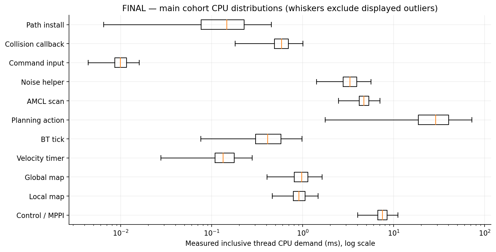
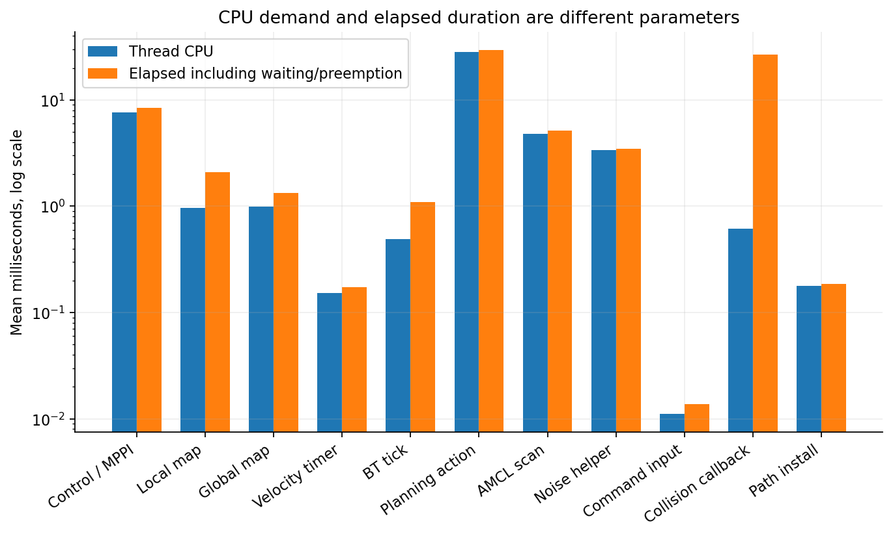
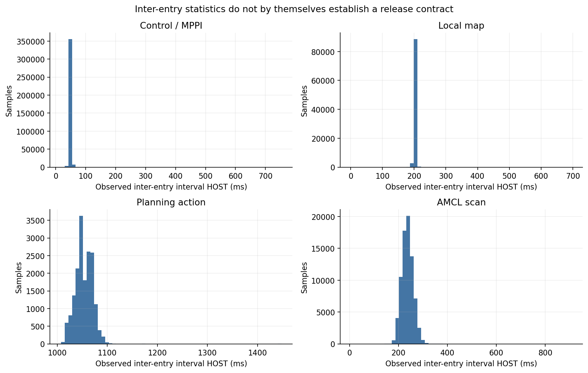
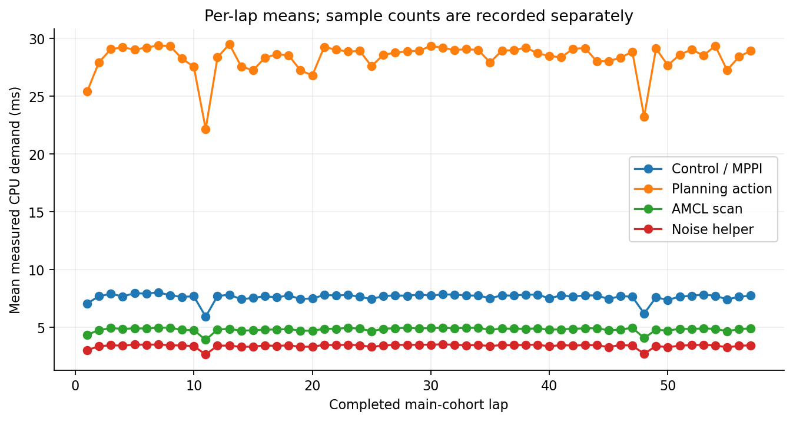
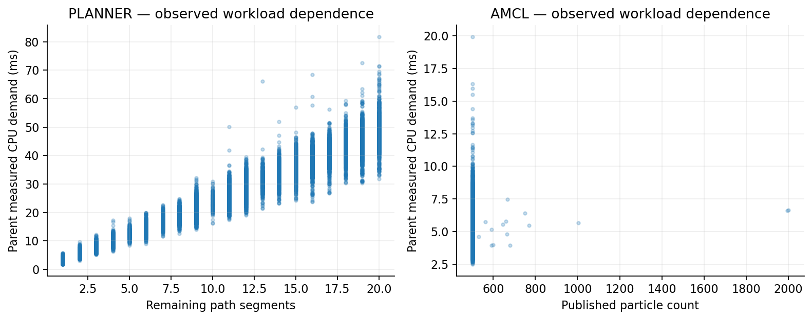
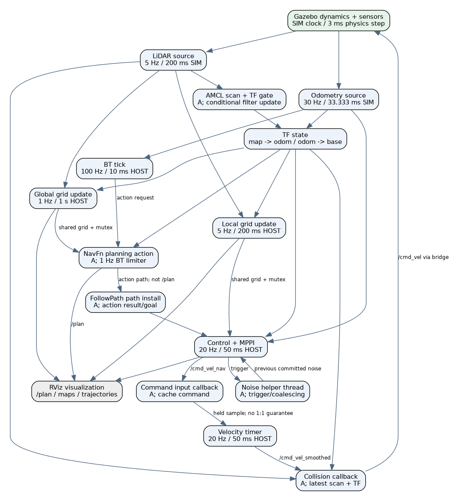
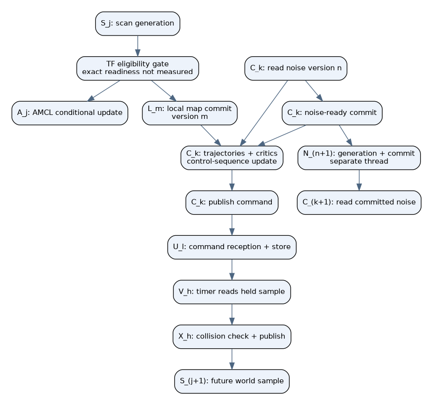
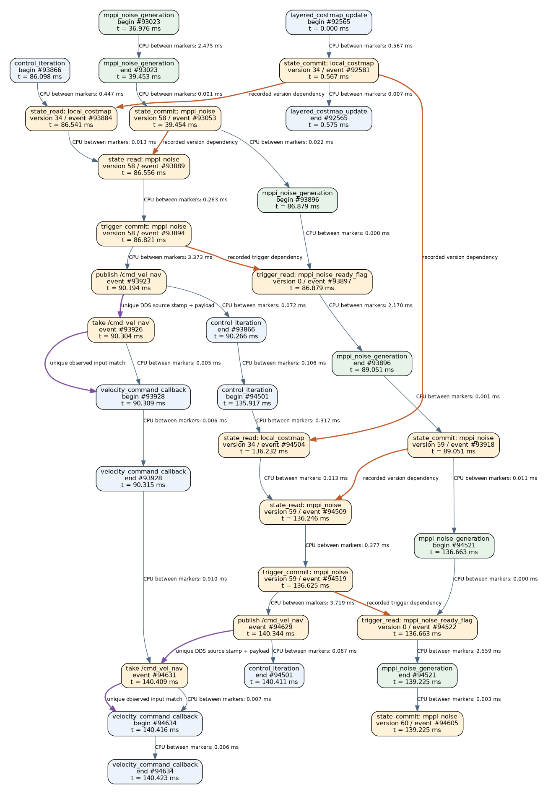
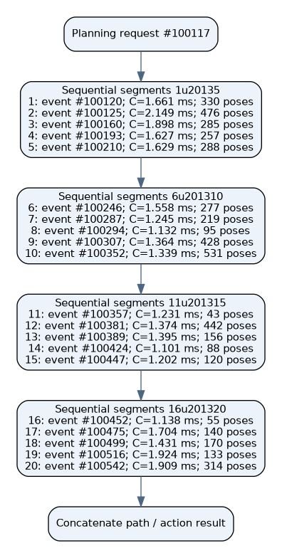

# FINAL — Empirical Real-Time Task Characterization

## Scope and evidence

This is the **FINAL** characterization generated at 2026-10-09T09:08:01.679614+03:30. Authorized simulation cutoff: 2026-10-09T09:00:00+03:30. Counts include only sealed attempts at generation time; an active unfinished run is not treated as a completed lap.

The unchanged Monaco-style scenario has one moving vehicle, 19 parked visual edge vehicles, and 20 ordered navigation targets. The parked vehicles currently execute no offloaded tasks. Nav2 performs real perception, planning, control, smoothing and collision checks. No custom scheduling algorithm, mixed-criticality mode or processor emulation is active. The experiment measures the current task set before deciding an abstraction.

There are 67 recorded attempts, 64 successful laps across all instrumentation cohorts, and 3 failed/truncated attempts. The main comparable measurement cohort is **full-v2-20261009**, with 57 successful analyzed laps. Supporting cohorts are reported separately because their probes differ. Each attempt retains its configuration hashes, frozen probe source/binary, outcome, raw spans, message events and host samples.

Notation follows the supplied Buttazzo (2011), Section 2.2 (printed pp. 26–29; PDF pp. 43–46) and Section 4.1 (printed pp. 79–82; PDF pp. 96–99). Local trace measurements, installed-version source and scenario configuration determine this system's facts. The book supplies definitions, not execution-cost values.

## Cutoff verification and outcome separation

The main campaign sealed its final manifest at 2026-10-09T08:59:54.391575+03:30, before the authorized cutoff. A process-group audit at 2026-10-09T05:31:25.179488+00:00 found no remaining owned simulation processes. All four scenario configuration hashes match their start-of-campaign values. The main cohort has 59 attempts: 57 successful full laps, 1 spontaneously aborted mission and 1 intentionally cutoff-truncated mission. The latter is an administrative truncation, not a spontaneous navigation failure. Supporting instrumentation cohorts remain separate. Audit details and the sealed manifest hash are in docs/evidence/task-campaign-finalization.json.

## Classical task and job notation

A task is a stream of jobs. Let $J_{i,k}$ denote the k-th job of task $\tau_i$. Its logical release, execution start and finish are $r_{i,k}$, $s_{i,k}$ and $f_{i,k}$. The relative deadline is $D_i=d_{i,k}-r_{i,k}$ and response time is $R_{i,k}=f_{i,k}-r_{i,k}$. All deadlines remain unassigned here.

For a strictly periodic stream, $r_{i,k}=\phi_i+(k-1)T_i$. Buttazzo denotes its k-th job by $\tau_{i,k}$, and an aperiodic job by $J_i$; this report uses $J_{i,k}$ as a generic indexed job when discussing all streams together. A sporadic stream requires the guaranteed constraint $r_{i,k+1}-r_{i,k}\geq T_i^{\min}$. An aperiodic stream has no such established deterministic arrival constraint. A measured average or observed minimum inter-entry interval does not establish a sporadic guarantee. A subscription can consume data from a periodic sensor and still have variable, delayed or bursty callback activations.

P* below means an intended periodic implementation whose actual release/continuation can experience jitter, overruns, skips, deactivation and state-dependent work. P* is a report annotation, not a new classical task category. A means aperiodic under the currently established contract. No listed message/action stream is promoted to sporadic without a separately verified lower-bound contract.

For empirical abstraction use $\widehat{\tau}_i=(\mathrm{type}_i,\theta_i,\overline{C}_i,T_i^0\ \mathrm{or}\ \overline{I}_i,D_i=\bot,\mathrm{resources}_i,\mathrm{dependencies}_i)$. Here $\theta_i$ is the workload feature vector. The measured mean $\overline{C}_i$ is a descriptive processor-demand parameter; it is not a certified worst-case execution time. $\bot$ denotes a quantity that is not assigned or established. Hard, firm and soft describe consequences of missing a deadline; neither those classes nor mixed-criticality levels are inferred from a task's name or a successful lap.

## Task classification and mean parameters

| Measured work unit | Class | Native activation setting | Clock / trigger | Jobs | Mean CPU C (ms) | Mean inter-entry HOST (ms) |
| --- | --- | --- | --- | --- | --- | --- |
| control_iteration | P* | 20 Hz / 50 ms | host WallRate | 366220 | 7.633 | 50.003 |
| local_costmap_update | P* | 5 Hz / 200 ms | host WallRate | 91710 | 0.960 | 200.005 |
| global_costmap_update | P* | 1 Hz / 1000 ms | host WallRate | 18345 | 0.988 | 1000.001 |
| velocity_smoothing_tick | P* | 20 Hz / 50 ms | host wall timer | 366870 | 0.153 | 50.002 |
| bt_tick | P* | 100 Hz / 10 ms | host WallRate | 1828599 | 0.493 | 10.018 |
| planning_request | A | 1 Hz rate limiter; not T=1 s | host rate limiter + action | 17418 | 28.355 | 1053.560 |
| amcl_scan_callback | A | LiDAR source 5 Hz; no callback T guarantee | scan + TF filter | 77369 | 4.808 | 237.086 |
| mppi_noise_generation | A | Triggered; no configured T | condition-variable wakeup | 366278 | 3.393 | 50.003 |
| velocity_command_callback | A | Message-triggered; no configured T | command arrival | 366272 | 0.011 | 50.002 |
| collision_check | A | Message-triggered; no configured T | smoothed command arrival | 366193 | 0.614 | 50.009 |
| controller_path_install | A | Action/state update; no configured T | FollowPath goal/preemption | 17418 | 0.177 | 1053.422 |

The empirical inter-entry column is a start-to-start statistic. For P* it describes the observed implementation; the configured period remains available separately. For A it describes arrivals/executions and is not a declared period. The exported CSV also contains CPU standard deviation, min, median, p95, p99, observed max, elapsed duration, observed minimum interval, run counts, and the mean/std of run means. Each run has its own sample counts and distributions.

Classification details: the planning action is issued by the BT; the 1 Hz RateController limits successful replanning behavior but can tick a RUNNING child and can be reset/preempted. It is not a strict independent 1-second periodic task. AMCL's scan callback is gated by TF; heavy particle-filter work is conditional on motion/initialization. The noise helper waits on a condition variable with a boolean readiness flag, so triggers may coalesce. Command callbacks store a held sample for the smoother's timer. Collision checks are activated by smoothed commands and consume cached scan/TF data. Path installation follows action state changes, rather than subscribing to /plan.

## Native parameters, units and clocks

| Parameter / source | Native value | Meaning / measured counterpart |
| --- | --- | --- |
| Controller | 20 Hz = 0.050 s HOST | Control iteration; full-loop work is also measured |
| Local map | 5 Hz = 0.200 s HOST; publish 2 Hz | Compute updates and map publication are separate |
| Global map | 1 Hz = 1.000 s HOST | Map update loop |
| Velocity smoothing | 20 Hz = 0.050 s HOST | Wall timer; exact expected-call stamps observed |
| BT loop | 10 ms = 0.010 s HOST | Tree tick while a navigation mission is active |
| Planning limiter | 1 Hz nominal limiter | Not a certified sporadic minimum or strict T |
| expected_planner_frequency | 20 Hz | 50 ms elapsed warning threshold; not planner release rate |
| LiDAR generation | 5 Hz = 0.200 s SIM | Header stamp differences and HOST receipt intervals measured |
| Odometry generation | 30 Hz = 1/30 s SIM | Header stamp differences and HOST receipt intervals measured |
| IMU / depth sensors | 200 Hz / 5 Hz SIM | IMU bridged but unused by this Nav2 path; depth unbridged here |
| Physics step | 0.003 s SIM | Simulation integration quantization, not CPU task period |
| MPPI | 2000 samples × 56 steps × 1 iteration | model_dt = 0.050 s is a prediction grid, not measured C or task T |
| AMCL | 500–2000 particles; max_beams 120 | Actual published particle counts and conditional filter jobs measured |
| Map sizes | Local 60 × 60; global 1009 × 446 cells | 0.05 m resolution; scene data, not processor-time units |
| Timeouts | 0.3 s controller map wait; 1 s planner map wait | Runtime guards; not assigned task deadlines |
| Velocity / collision staleness | 1 s / 1 s; progress allowance 10 s | Runtime checks; not D_i |

Converting frequency to seconds is valid: $T^0=1/f^0$. It does not change the clock domain. HOST denotes monotonic host wall time, CPU denotes accumulated running time on one host thread, SIM denotes Gazebo /clock or a simulation-stamped sensor header. Nav2's scheduling loops here use host time even though use_sim_time is enabled for other operations. A simulator-time interval does not equal the same host-time interval when the real-time factor varies.

The process-level cached /clock values in span rows are the latest delivered clock, not the exact simulator time sampled by that function. Concurrent delivery can yield cache regressions. Original cached values are retained; source header stamps and the independent /clock observer are used for actual source interval analysis. CPU/elapsed values in the report use HOST/CPU clocks and are not silently divided by a single real-time factor.

## Source generation and observed message intervals

| Topic | Header interval samples | Mean SIM interval (ms) | SIM interval std (ms) | Mean observer HOST receipt interval (ms) |
| --- | --- | --- | --- | --- |
| /clock | 4840653 | 3.197 | 3.892 | 3.790 |
| /odom | 429780 | 36.000 | 0.095 | 42.676 |
| /scan | 77311 | 200.000 | 1.414 | 237.086 |
| /cmd_vel_nav | 0 | unknown | unknown | 49.984 |
| /cmd_vel_smoothed | 0 | unknown | unknown | 49.988 |
| /cmd_vel | 0 | unknown | unknown | 50.000 |
| /amcl_pose | 76971 | 200.224 | 6.817 | 237.363 |
| /plan | 17361 | 888.697 | 45.073 | 1052.898 |

Only messages with an actual source header or /clock value contribute to the SIM interval statistic. Unstamped Twist commands have no invented header time. Observer receipt is the observer's delivery time and is not the application's release time. Scan scan_time and time_increment are zero in the original simulator messages; those zero metadata fields do not mean the sensor period is zero.

In the initial retained runs, odometry header intervals were 36 ms SIM, despite a native 30 Hz / 33.333 ms setting. This is consistent with a source that rounds its publish opportunity upward to the 3 ms physics grid: ceil(33.333/3) × 3 = 36 ms. That causal explanation is an inference from the setting and measured grid, not a substitute for the original configuration. The exported statistics retain the actual source interval for every run, so the final model can use the measured mean without hiding this discrepancy.

## Execution-cost boundaries and measurement equations

For a measured span on thread $\ell$, let $u_\ell(w)$ be CLOCK_THREAD_CPUTIME_ID at host monotonic time w. The measurements are $\widehat{c}_{i,k}=u_\ell(w_f)-u_\ell(w_s)$ and $\widehat{\Delta w}_{i,k}=w_f-w_s$. Their residual $\widehat{Q}_{i,k}=\widehat{\Delta w}_{i,k}-\widehat{c}_{i,k}$ combines blocking, preemption and other non-running intervals; it is not a pure blocking bound. E remains reserved for Buttazzo's tardiness, and H for hyperperiod.

Inclusive parent cost contains its synchronous children. Exclusive cost subtracts directly nested child CPU intervals: $\widehat{c}^{\mathrm{excl}}_v=\widehat{c}^{\mathrm{incl}}_v-\sum_{h\in\mathrm{children}(v)}\widehat{c}^{\mathrm{incl}}_h$. Do not add both a parent and its children to a workload total. The noise producer runs on a separate thread; its CPU demand is measured separately, while overlap means its elapsed duration must not simply be added to the control response time.

Two granularities are provided. Kernel/function spans measure the named work units. Whole-loop CPU is measured between the return of Rate::sleep for the previous iteration and the next call to Rate::sleep. It includes iteration work outside the named kernel. The first body without a preceding sleep anchor is omitted from this derived measurement, while its raw span remains. Sleep return is an observed software continuation, not exact OS readiness or an ideal release timestamp.

The exported control/MPPI subtasks include velocity-command computation, noise copying/trigger/reset, noised-trajectory generation, critic scoring and control-sequence update. Planning segments are sequential subjobs within one action. AMCL filter and particle-publication spans are nested conditional subjobs. Stamped command forwarding is a nested call in this configuration, not an additional independent job stream.

## CPU, elapsed and whole-loop statistics

| Work unit | Mean C (ms) | C std | C p95 | Observed C max | Mean elapsed (ms) | Mean full-loop C (ms) |
| --- | --- | --- | --- | --- | --- | --- |
| control_iteration | 7.633 | 1.378 | 10.068 | 30.678 | 8.440 | 7.754 |
| local_costmap_update | 0.960 | 0.278 | 1.448 | 7.676 | 2.093 | 1.037 |
| global_costmap_update | 0.988 | 0.274 | 1.391 | 9.975 | 1.335 | 1.661 |
| velocity_smoothing_tick | 0.153 | 0.087 | 0.277 | 16.226 | 0.173 | unknown |
| bt_tick | 0.493 | 0.320 | 1.035 | 19.446 | 1.101 | 0.917 |
| planning_request | 28.355 | 14.268 | 49.075 | 81.808 | 29.702 | unknown |
| amcl_scan_callback | 4.808 | 0.948 | 6.453 | 19.939 | 5.126 | unknown |
| mppi_noise_generation | 3.393 | 0.799 | 4.709 | 15.244 | 3.459 | unknown |
| velocity_command_callback | 0.011 | 0.015 | 0.017 | 3.832 | 0.014 | unknown |
| collision_check | 0.614 | 0.207 | 0.920 | 13.556 | 26.849 | unknown |
| controller_path_install | 0.177 | 0.160 | 0.420 | 2.369 | 0.185 | unknown |

## Subjob classification and measured costs

| Measured subjob | Parent / activation context | Samples | Mean inclusive CPU ms | CPU std ms |
| --- | --- | --- | --- | --- |
| amcl_filter_update | amcl_scan_callback (conditional branch) | 77028 | 3.615 | 0.741 |
| amcl_particle_publication | amcl_scan_callback | 77028 | 0.160 | 0.068 |
| collision_check_stamped | collision_check | 366193 | 0.607 | 0.206 |
| layered_costmap_update | local_costmap_update or global_costmap_update (keep actors distinct) | 110055 | 0.733 | 0.231 |
| mppi_control_sequence_update | mppi_optimize | 366220 | 0.995 | 0.219 |
| mppi_critic_scoring | mppi_optimize | 366220 | 1.618 | 0.367 |
| mppi_noise_copy | mppi_noised_trajectories | 366220 | 0.360 | 0.206 |
| mppi_noise_reset | initialization / reset context; see recorded parent | 58 | 0.239 | 0.079 |
| mppi_noise_trigger | mppi_noised_trajectories | 366220 | 0.037 | 0.028 |
| mppi_noised_trajectories | mppi_optimize | 366220 | 3.995 | 0.905 |
| mppi_optimize | mppi_velocity_commands | 366220 | 6.636 | 1.227 |
| mppi_velocity_commands | control_iteration | 366220 | 7.336 | 1.353 |
| planning_segment | planning_request | 205342 | 2.277 | 0.543 |
| rate_sleep | cyclic loop wait; not an independent computational task | 2306348 | 0.032 | 0.053 |
| velocity_command_stamped_callback | velocity_command_callback | 366272 | 0.005 | 0.010 |

These synchronous subjobs inherit their parent's activation model; they are not additional independent periodic or sporadic task streams. Layered-map costs are pooled here only as a scope inventory; use the distinct local/global parent streams for modeling different grid sizes. Rate::sleep is a waiting interval whose small CPU overhead is measured, not an independent computational job. Exact parent IDs remain in the original trace and derived job-samples.csv. The control/noise branch is asynchronous only for the separately listed producer thread.

## Release, jitter, communication and locking

The velocity smoother's wall timer exposes expected_call_time and actual_call_time. For an identified steady-clock timer callback, expected_call_time provides an observed timer due point $\rho_k$. Therefore $\widehat W^{\mathrm{due}}_k=s_k-\rho_k$ and $\widehat R^{\mathrm{due}}_k=f_k-\rho_k$ are reported. This due point is not a kernel scheduler-ready event. W denotes due-to-start delay, not Buttazzo's deadline lateness L. The same interpretation is not applied to ROS-clock timers or loop jobs without an exact due stamp.

Fast DDS source_timestamp and received_timestamp expose middleware source-to-receipt delay $\widehat\delta^{\mathrm{DDS}}=t_{\mathrm{received}}-t_{\mathrm{source}}$ on this single host. RMW publish events and take events retain source timestamps and payload signatures; unique matching keys can substantiate selected message dependencies. Duplicate matches remain ambiguous. Middleware receipt, rcl_take, callback start and TF eligibility are different stages. A received scan can wait for transforms before the heavy AMCL callback.

Selected map and MPPI mutex acquisitions record call duration. This acquisition elapsed time includes synchronization and host preemption. It does not isolate a deterministic blocking term B_i or certify a priority-inheritance protocol. Map/noise versions are recorded while the associated mutex is held. The complete raw event stream retains version commits/reads and thread CPU/wall stamps.

## Measured middleware delay

| Topic | Takes with valid DDS stamps | Mean ms | Std ms | Observed min ms | Observed max ms |
| --- | --- | --- | --- | --- | --- |
| /cmd_vel | 366162 | 0.342 | 0.826 | 0.040 | 75.944 |
| /cmd_vel_nav | 366272 | 0.022 | 0.167 | 0.006 | 21.085 |
| /cmd_vel_smoothed | 366193 | 0.038 | 0.083 | 0.006 | 13.700 |
| /compute_path_through_poses/_action/status | 33347 | 0.354 | 1.968 | 0.009 | 316.709 |
| /follow_path/_action/feedback | 366220 | 0.061 | 0.184 | 0.017 | 36.292 |
| /follow_path/_action/status | 34497 | 0.382 | 0.979 | 0.011 | 38.551 |
| /navigate_through_poses/_action/feedback | 145172 | 0.315 | 0.477 | 0.056 | 18.210 |
| /navigate_through_poses/_action/status | 62 | 0.452 | 0.774 | 0.089 | 5.746 |
| /odom | 859650 | 1.160 | 2.445 | 0.055 | 112.505 |
| /plan | 17418 | 1.147 | 1.906 | 0.126 | 28.949 |
| /scan | 383771 | 0.980 | 1.802 | 0.038 | 46.063 |
| /tf | 7942945 | 1.405 | 2.798 | 0.013 | 2149.133 |

Negative intervals, if present, remain visible and require clock/timestamp diagnosis; they are not clipped into a fabricated physical delay.

## Identified steady-timer timing

| Callback role | Samples | Mean due-to-start ms | Observed max due-to-start ms | Mean due-to-finish ms |
| --- | --- | --- | --- | --- |
| velocity_smoothing_tick  /  period_ms=50.0 | 366870 | 0.420 | 463.848 | 0.600 |

Other timer roles remain in the JSON evidence. Ephemeral TF-wait polling timers are classified as periodic while armed inside an event-driven transaction, rather than a permanent independent periodic task. Bond heartbeat timers are distinct from the smoother's 50 ms work; the identified work-unit series uses its actual enclosing callback.

Using $W_k=s_k-\rho_k$ and $F_k=f_k-\rho_k$, the measured timer equivalents of Buttazzo's jitter definitions are $\widehat{RRJ}=\max_k|W_k-W_{k-1}|$, $\widehat{ARJ}=\max_k W_k-\min_k W_k$, $\widehat{RFJ}=\max_k|F_k-F_{k-1}|$ and $\widehat{AFJ}=\max_k F_k-\min_k F_k$. They are computed within each binding lifetime/run; the JSON retains difference statistics and per-binding ranges. The maximum observed difference is the empirical relative jitter. These are finite-observation timer-due statistics, not guaranteed OS-release jitter bounds.

## Framework callback inventory

The main cohort contains 453 identified callback role groups. The separate callback-characterization-table.csv contains every observed role, node, trigger/source, configured timer periods, clock types, binding generation count and mean/std/min/max CPU cost. Subscription callbacks are modeled as A under the current reception contract; services are A; persistent timers are P while enabled. Dynamic TF polling belongs to an event-driven transaction. Action worker spans are measured separately from the framework callback that initially accepts the goal.

Callback objects and timer handles can be destroyed and reused. The full-v2 trace records the binding generation at callback start and joins metadata at that lifetime, avoiding last-pointer-wins attribution. Unresolved callbacks remain explicitly unresolved. Middleware /clock, TF, lifecycle, action-support, visualization and bridge callbacks are infrastructure work; treating only the eleven algorithmic units as the complete host workload would omit this demand.

## Architecture, finite DAGs and phase precedence

The static runtime architecture contains physical feedback, asynchronous state and a noise producer/consumer cycle. It is not itself a single finite DAG. Unrolling a finite observation horizon gives $G_H=(V_H,E_{\mathrm{program}}\cup E_{\mathrm{data}}\cup E_{\mathrm{state}})$, with job/phase instances and versioned dependencies.

An important observation is that an output can be committed before its enclosing callback finishes. A map mutex can be released before updateMap's trailing footprint work ends. Control can trigger the helper and then continue its own computation. Publishing a command can make it visible before computeAndPublishVelocity returns. A whole callback modeled as an atomic node can therefore impose false full-completion precedence. Use read/compute/commit phases, or explicitly represent early output availability and parallel helper work.

The indexed graph is an explanatory structural template; its scan/TF edges are not claimed as exact measured version matches. The separately extracted observed graph uses actual selected event IDs, timestamps and recorded local-map/noise versions. The extractor verifies acyclicity. Same-thread order records this run's resource ordering; it is not automatically a policy-independent application dependency.

For a latest-value consumer, a version edge points from the actual recorded commit to the corresponding read. Initial values committed before the horizon act as roots. The MPPI readiness flag may coalesce trigger jobs; a noise generation is not invented for each trigger. /plan is a visualization output; the controller's path dependency uses the planning action result and FollowPath goal/path installation. /amcl_pose is an observation output; navigation obtains localization through TF. Exact TF/cache-read provenance remains unresolved without more instrumentation.

Global-map epochs need an additional qualification. NavFn clears the starting cell before acquiring its map-copy mutex, then copies the grid under that mutex. The probe logs a conservative planning read/write epoch at unlock; this does not observe every byte mutation or prove complete global-grid provenance. Local-map and noise locked versions used in the illustrated control graph have a narrower recorded scope. Source: [NavFn 1.3.13 makePlan and clearRobotCell](https://github.com/ros-navigation/navigation2/blob/1.3.13/nav2_navfn_planner/src/navfn_planner.cpp).

## Observed DAG evidence

The extracted example is full-v2-20261009/run-001: 32 phase/event vertices and 38 edges; acyclicity verified. Full event IDs and raw timestamps are in docs/evidence/observed-phase-dag.json. Its scope and dependency types are recorded alongside the graph.

## Current resources and scheduling

The processor is the user's laptop: Intel Core i7-13620H, 16 WSL-visible logical CPUs, approximately 15 GiB RAM and 4 GiB swap. These are shared host resources, not simulated per-edge CPUs. WSL2, host workload, software rendering, Gazebo, RViz, middleware and instrumentation compete for them. No target A15/A7 costs are assigned in this characterization.

ROS 2 Jazzy uses the installed Nav2 1.3.13 and rclcpp 28.1.22. The components use isolated single-thread callback executors, with separate action workers, costmap update threads and the MPPI noise thread. All observed scheduling policy, nice value and affinity snapshots are exported per measured thread. Normal SCHED_OTHER execution does not implement RMS or EDF job priorities; ROS callback-group/executor order and Linux thread scheduling are separate mechanisms. Configuration numbers called frequency/timeout do not provide fixed job priorities or execution budgets.

The nominal HOST periodic rates have $H^0=\mathrm{lcm}(10,50,200,1000)\ \mathrm{ms}=1000\ \mathrm{ms}$. This is a nominal hyperperiod of selected rates, not repetition of the entire feedback system. The per-run empirical core demand is $\widehat U^{\mathrm{named}}=\sum\widehat{c}^{\mathrm{nonoverlap}}_{i,k}/\Delta w_{\mathrm{mission}}$, summing the named primary work once and the separate noise helper. It excludes omitted infrastructure/Gazebo CPU and is not the classical WCET utilization bound $\sum_i C_i/T_i$ or a schedulability guarantee.

## Observed thread scheduling snapshots

| Linux policy code | Nice | Affinity bitmask | Thread snapshots across runs |
| --- | --- | --- | --- |
| 0 | 0 | 0xffff | 21439 |

Policy code 0 denotes SCHED_OTHER. Repeated snapshots belong to distinct run/thread lifetimes; they are not a count of physical CPU cores.

## Known, measured and still unestablished parameters

| Parameter | Existing fact / measurement | What it can support |
| --- | --- | --- |
| T_i^0 / rate | Known for cyclic loops and source sensors; units/clock explicit | Nominal activation contract; measured intervals retained separately |
| C_i,k / mean C_i | Measured CPU per kernel, subjob and complete loop where anchored | Empirical cost model; workload-feature conditioning |
| Arrival/inter-entry distribution | Measured per task and callback role | Trace replay / descriptive aperiodic arrival model |
| Phase | Observed first entry relative to goal send | Run-specific phase; not exact formal release phase |
| r_i,k | Timer expected-call point available for identified steady timers | Exact observed timer-due analysis only; other readiness remains unknown |
| D_i / d_i,k | Intentionally unassigned | User will choose deadlines later |
| WCET | Observed maximum and quantiles retained; no certified bound | Finite tests cannot prove a worst-case guarantee |
| Sporadic T_min | Observed minimum retained; no general guaranteed bound | Do not substitute average/minimum for a specification |
| Blocking B_i | Mutex acquisition elapsed recorded; no pure/preemption split | Empirical contention description, not schedulability blocking bound |
| J_i / release jitter | Due-to-start for selected steady timers; inter-entry variability elsewhere | Do not label interval variance as guaranteed release jitter |
| Priority | OS policy/nice/affinity and ROS execution structure observed | No per-task fixed-priority assignment active |
| Communication | Actual DDS source/receive delay and message events retained | Current-host transport evidence; no edge network-rate model active |
| State dependencies | Instrumented map/noise version matches plus message event evidence | Finite phase DAG; exact TF/other cache versions not fully covered |
| Hard/firm/soft and mixed criticality | Not specified by this scenario | Requires consequence/assurance requirements, not inferred from runtime |
| CPU cycles | No hardware cycle-counter demand measurement | Use CPU seconds; do not invent cycles from GHz |
| Gazebo plugin/render tasks | Host process/system samples, not all internal per-job spans | Outside the Nav2 work-unit cost inventory |

## Classical schedulability assumptions

| Buttazzo Section 4.1 assumption | Current system |
| --- | --- |
| A1: periodic instances at a constant rate | Nominal loop/timer periods plus event-driven streams; jitter/skip/deactivation matter |
| A2: a common WCET C_i for every instance | Not established; empirical CPU distributions and workload-feature variation are available |
| A3: common relative deadline D_i = T_i | Not adopted; deadlines intentionally deferred |
| A4: independent tasks; no precedence/resource constraints | False: maps, held commands, TF, sequential segments and stateful control |
| A5: no task self-suspension | Not valid generally: mutex, condition-variable, map/TF and action waits |
| A6: release immediately on arrival | Not established: delivery, executor dispatch and TF eligibility are separate stages |
| A7: zero kernel overhead | Not adopted: real OS dispatch, synchronization and probe overhead exist |

These departures explain why a bare independent (C_i,T_i,D_i) table is insufficient. The measured table, activation contracts, phases, resources and data dependencies together describe the current workload. An empirical DAG simulator can be built from them later; this report does not claim an already valid hard schedulability proof.

## Repeated-trial protocol and statistics

Every trial restarts the same world and navigation launch, sends the unchanged full ordered mission, records outcome and raw data, then shuts down its owned process groups. Instrumentation source/binary is frozen per cohort. No overlapping campaign simulators are allowed. A safety margin stops simulation before 09:00; after the cutoff only analysis/reporting is allowed.

For observed CPU values $c_{i,k}$, the pooled mean is $\overline{C}_i=(1/N_i)\sum_k c_{i,k}$. Sample standard deviation uses denominator $N_i-1$. Quantiles in the algorithmic task tables use NumPy's default linear percentile convention. The mean of run means is also reported: $\overline{C}_i^{\mathrm{runs}}=(1/M_i)\sum_m\overline{C}_{i,m}$. It weights laps equally and can differ from the pooled mean when job counts differ. Jobs within a lap are dependent, so no independent-sample confidence claim is made.

All failed/truncated attempts remain in the attempt manifest and raw evidence; their partial statistics remain separate from the completed-lap main means. A forced shutdown can leave an unfinished span or buffered tail unrecorded. Missing samples are not imputed. Framework callback groups use streaming moments (n, mean, sample std, min, max); their quantiles are explicitly not computed, but every original callback span remains available for later exact statistics. Supporting instrumentation cohorts are kept separate.

## Per-attempt ledger

| Cohort | Run | Outcome | Attempt wall seconds | Stop reason |
| --- | --- | --- | --- | --- |
| causal-pilot-20261009 | run-001 | success | 336.29 | mission finished |
| full-20261009 | run-001 | success | 338.76 | mission finished |
| full-20261009 | run-002 | success | 338.54 | external stop |
| full-v2-20261009 | run-001 | success | 334.13 | mission finished |
| full-v2-20261009 | run-002 | success | 339.83 | mission finished |
| full-v2-20261009 | run-003 | success | 354.58 | mission finished |
| full-v2-20261009 | run-004 | success | 353.15 | mission finished |
| full-v2-20261009 | run-005 | success | 358.20 | mission finished |
| full-v2-20261009 | run-006 | success | 358.68 | mission finished |
| full-v2-20261009 | run-007 | success | 355.21 | mission finished |
| full-v2-20261009 | run-008 | success | 353.78 | mission finished |
| full-v2-20261009 | run-009 | success | 340.78 | mission finished |
| full-v2-20261009 | run-010 | success | 343.04 | mission finished |
| full-v2-20261009 | run-011 | success | 302.88 | mission finished |
| full-v2-20261009 | run-012 | success | 348.98 | mission finished |
| full-v2-20261009 | run-013 | success | 349.82 | mission finished |
| full-v2-20261009 | run-014 | success | 335.84 | mission finished |
| full-v2-20261009 | run-015 | success | 341.47 | mission finished |
| full-v2-20261009 | run-016 | success | 349.32 | mission finished |
| full-v2-20261009 | run-017 | success | 352.50 | mission finished |
| full-v2-20261009 | run-018 | success | 351.10 | mission finished |
| full-v2-20261009 | run-019 | success | 335.94 | mission finished |
| full-v2-20261009 | run-020 | success | 337.83 | mission finished |
| full-v2-20261009 | run-021 | success | 350.41 | mission finished |
| full-v2-20261009 | run-022 | success | 349.13 | mission finished |
| full-v2-20261009 | run-023 | success | 350.45 | mission finished |
| full-v2-20261009 | run-024 | success | 346.21 | mission finished |
| full-v2-20261009 | run-025 | success | 336.74 | mission finished |
| full-v2-20261009 | run-026 | success | 350.00 | mission finished |
| full-v2-20261009 | run-027 | success | 352.03 | mission finished |
| full-v2-20261009 | run-028 | success | 350.21 | mission finished |
| full-v2-20261009 | run-029 | success | 352.30 | mission finished |
| full-v2-20261009 | run-030 | success | 350.82 | mission finished |
| full-v2-20261009 | run-031 | success | 353.85 | mission finished |
| full-v2-20261009 | run-032 | success | 350.37 | mission finished |
| full-v2-20261009 | run-033 | success | 351.40 | mission finished |
| full-v2-20261009 | run-034 | success | 349.53 | mission finished |
| full-v2-20261009 | run-035 | success | 338.03 | mission finished |
| full-v2-20261009 | run-036 | success | 349.15 | mission finished |
| full-v2-20261009 | run-037 | success | 349.88 | mission finished |
| full-v2-20261009 | run-038 | success | 350.11 | mission finished |
| full-v2-20261009 | run-039 | success | 349.49 | mission finished |
| full-v2-20261009 | run-040 | success | 339.19 | mission finished |
| full-v2-20261009 | run-041 | success | 347.93 | mission finished |
| full-v2-20261009 | run-042 | success | 350.17 | mission finished |
| full-v2-20261009 | run-043 | success | 350.00 | mission finished |
| full-v2-20261009 | run-044 | success | 353.02 | mission finished |
| full-v2-20261009 | run-045 | success | 337.37 | mission finished |
| full-v2-20261009 | run-046 | success | 345.71 | mission finished |
| full-v2-20261009 | run-047 | failed/truncated | 212.94 | mission finished |
| full-v2-20261009 | run-048 | success | 350.42 | mission finished |
| full-v2-20261009 | run-049 | success | 303.58 | mission finished |
| full-v2-20261009 | run-050 | success | 343.76 | mission finished |
| full-v2-20261009 | run-051 | success | 336.67 | mission finished |
| full-v2-20261009 | run-052 | success | 349.79 | mission finished |
| full-v2-20261009 | run-053 | success | 349.38 | mission finished |
| full-v2-20261009 | run-054 | success | 351.12 | mission finished |
| full-v2-20261009 | run-055 | success | 343.34 | mission finished |
| full-v2-20261009 | run-056 | success | 335.93 | mission finished |
| full-v2-20261009 | run-057 | success | 348.37 | mission finished |
| full-v2-20261009 | run-058 | success | 349.11 | mission finished |
| full-v2-20261009 | run-059 | failed/truncated | 116.75 | cutoff safety margin (stop before 09:00) |
| overnight-20261009 | run-001 | success | 334.50 | mission finished |
| overnight-20261009 | run-002 | success | 337.80 | mission finished |
| overnight-20261009 | run-003 | success | 336.71 | external stop |
| pilot-20261009 | run-001 | failed/truncated | 38.43 | launch exited |
| pilot-fixed-20261009 | run-001 | success | 337.52 | mission finished |

## Investigated mission incidents

| Cohort | Run | Outcome | Observed initiating failure | Causal limit |
| --- | --- | --- | --- | --- |
| full-v2-20261009 | run-047 | mission_aborted | FollowPath goal acknowledgement timeout in the navigation behavior tree; navigate_through_poses then aborted. | Not established; no CPU/DDS/OS cause inferred from the timeout alone. |
| full-v2-20261009 | run-059 | administratively_truncated_at_cutoff | Runner stopped its simulation group at the cutoff safety margin; the active navigation action then aborted during shutdown. | Intentional experiment cutoff, not classified as a spontaneous navigation failure. |

Detailed timestamps, log lines, partial progress and recovery handling are retained in docs/evidence/task-campaign-incidents.json. The main-cohort run-047 aborted after a FollowPath goal acknowledgement timeout; fresh unchanged runs 048 and 049 subsequently succeeded. Later lifecycle/bond errors during shutdown are distinguished from the initiating timeout. Run-059 was intentionally stopped at the cutoff safety margin; its navigation abort is classified as an administrative truncation. Both incomplete missions are excluded from completed-lap pooled means; their original partial evidence remains available.

## Measurement perturbation and completeness

The preload probe adds timestamping, hashing, buffer writes, framework hook work and selective lock instrumentation. A basic-probe no-op harness retained three enabled and three disabled batches of 100,000 calls; roughly 1.9 microseconds CPU per enabled call versus 0.6 microseconds disabled. This is a small-call harness for the earlier basic probe, not a certified full-v2 overhead correction. No fixed value is subtracted from real jobs. Full-v2 also traces many middleware/TF callbacks, and shared host load is preserved in host-samples.jsonl. Main-cohort measurements are therefore explicitly instrumented measurements of this host and configuration.

Version tracing covers the instrumented map update/plan and noise paths. Current successful missions report their recovery count; an external map clear/reset would need a separate version boundary. Mutex ownership epochs handle recursive locking once at the outer unlock. Temporary timer/callback pointer reuse is resolved by binding generations in full-v2. Unbound callbacks, malformed rows and forced-shutdown flags remain in each run summary. Data files retain raw nanoseconds and original payload/header metadata for independent reanalysis.

## Artifact index and reproducibility

The editable mathematical report is docs/task-model.en.md; the portable version is docs/task-model.en.pdf. Scientific figures are available as PNG, SVG and editable Graphviz DOT in docs/figures/task-model/. The primary classification/statistics CSV is docs/evidence/task-characterization-table.csv; per-run statistics are task-characterization-per-run.csv; all framework role groups are callback-characterization-table.csv. The complete machine-readable report is task-characterization-summary.json; observed phase-DAG evidence is observed-phase-dag.json.

Original evidence lives under artifacts/task-profiling/<cohort>/run-NNN/: metadata.json, mission.json, raw/events-PID.csv, observer.jsonl, host-samples.jsonl, process snapshots, logs, job-samples.csv, summary.json, callback-binding-details.json and analysis-cache.npz. The derived job CSV contains algorithm/worker spans; every framework callback is preserved in the original raw CSV. Original CSVs were retained; replacement/deletion for compression was not executed.

Analyze sealed runs without launching simulation: `python3 scripts/analyze_task_campaign.py`. After the user cutoff, generate the final report with `python3 scripts/analyze_task_campaign.py --final`. The final flag is rejected before the cutoff. `--no-report` analyzes and exports statistics only. Cache keys include analysis schema and sealed metadata signature. No simulation is started by the analyzer.

The original pre-measurement inventory remains docs/evidence/task-abstraction-inventory.json; its null costs describe that earlier inspection, not the newly measured evidence. Scenario facts are in nav2_params.yaml, racecar.sdf, world.sdf and navigate_through_poses.xml. The installed-version source study is docs/task-abstraction-study.fa.md.

References: Buttazzo, Hard Real-Time Computing Systems, third edition (2011), supplied local PDF. Nav2 1.3.13 source: [controller](https://github.com/ros-navigation/navigation2/blob/1.3.13/nav2_controller/src/controller_server.cpp), [costmap](https://github.com/ros-navigation/navigation2/blob/1.3.13/nav2_costmap_2d/src/costmap_2d_ros.cpp), [planner](https://github.com/ros-navigation/navigation2/blob/1.3.13/nav2_planner/src/planner_server.cpp), [AMCL](https://github.com/ros-navigation/navigation2/blob/1.3.13/nav2_amcl/src/amcl_node.cpp), [MPPI noise](https://github.com/ros-navigation/navigation2/blob/1.3.13/nav2_mppi_controller/src/noise_generator.cpp), and [RateController](https://github.com/ros-navigation/navigation2/blob/1.3.13/nav2_behavior_tree/plugins/decorator/rate_controller.cpp).
